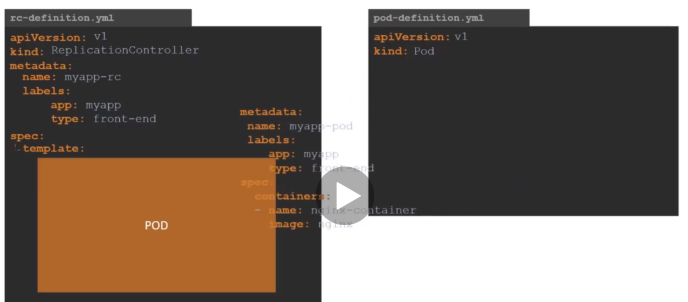

# ReplicaSets

## Replication Controller
### High Availability
pods가 오류가 났을 때 ( 혹은 fail ), replication controller는 새롭게 pod를 생성한다.


### Load Balancing & Scaling

  
## Replication Controller vs Replica Set
같은 목적으로 사용되지만, 같지않다.  

replication controller 는 예전 기술이다. replica Set으로 교체되고, 사용하길 권장함

## replication controller 생성
**kind** : ReplicationController  
**spec**의 **tempate children**,  
즉, 10 - 18번째 라인은 pods YAML파일에서 metadata 이후로 가져옴

```
1 apiVersion: v1
2 kind: ReplicationController
3 metadata:
4   name: myapp-rc
5   labels:
6     app: myapp
7     type: front-end
8 spec:
9   template:
10     metadata:
11       name: myapp-pod
12       labels:
13         app: myapp
14         type: front-end
15     spec:
16       containers:
17       - name: nginx-container
18         image: nginx
19   replicas: 3
```
```
$ kubectl create -f rc-definition.yml
$ kubectl get replictioncontroller
```

## Replica Set 생성
replication controller와 거의 동일하다.    
몇가지 다른점이 있다.  
**apiVersion** : apps/v1
**kind** : ReplicaSet
그리고, **selector**를 추가해주어야한다.
> selector : replica set을 생성하기 전에 선택된 labels과 일치하는 것에 대해 report를 생성한다.

>[replicaset-definition.yml](./demo/replication/replicaset-definition.yml)

## Labels and Selector
replica set은 pods를 모니터링하며, deploy fail되는 것을 찾는다.   
하지만, 수백개의 pods가 존재할 수 있다.  
이럴때 label을 통해서 관리하고자 하는 pod를 replica set은 알게 된다.  

## Scale
위에서 생성한 replicaset-definition.yml의 `replicas`를 3에서 6으로 수정해준다. 
`replicas: 6` 
아래 명령어로 replica를 6으로 update한다.
```
$ kubectl replace -f replicaset-definition.yml
replicaset.apps/myapp-replicaset replaced

$ kubectl get pods
NAME                     READY   STATUS              RESTARTS   AGE
myapp-replicaset-6264m   1/1     Running             0          13m
myapp-replicaset-glqx4   0/1     ContainerCreating   0          3s
myapp-replicaset-n7vmh   1/1     Running             0          13m
myapp-replicaset-pgdk2   1/1     Running             0          13m
myapp-replicaset-qcptl   0/1     ContainerCreating   0          3s
myapp-replicaset-wnbh2   0/1     ContainerCreating   0          3s

```
아래와 같이 사용할 수 도 있다. 모두 같은 기능을 한다.
```
$ kubectl scale --replicas=6 -f replicaset-definition.yml
$ kubectl scale --replicas=6 replicaset myapp-replicaset
```

자동으로 부하를 확인해서 autosacle이 가능하지만, 그것은 응용 분야이므로 추후에 알아본다.  

