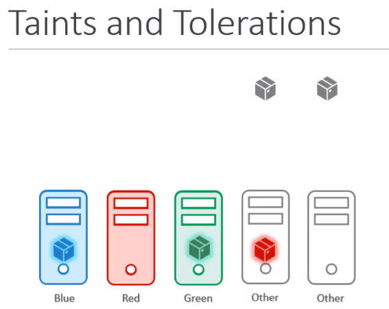
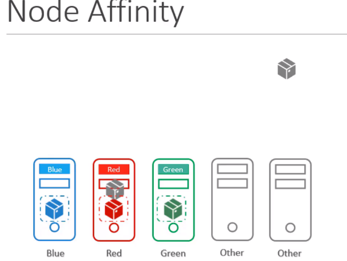
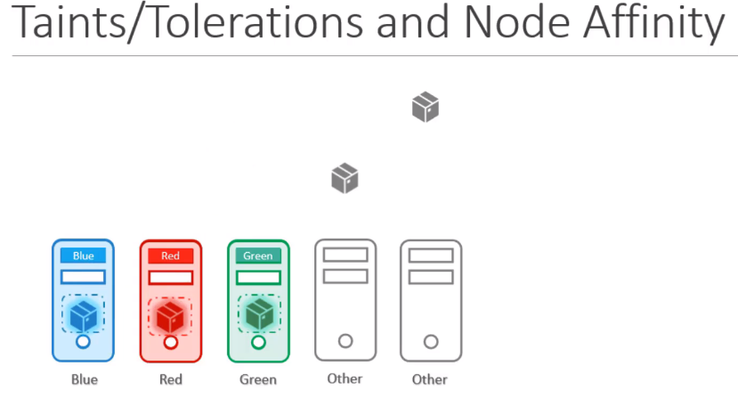

# Taints and Tolerations vs Node Affinity
## Test 내용
5개의 pod와 5개의 노드가 있다.  
green, blue, red 색상을 가진 3개의 pod와 색상이 없은 2개의 other pod이며,   
green, blue, red 색상에 가진 3개의 node와 색상이 없는 2개의 other node가 있다.  
색상이 있는 pod는 같은 색상의 node에 배치를 시키며, 색상이 없는 pod는 색상없는 node에 자유롭게 배치하게한다. (색상이 없는 node가 색상이 있는 node에 할당 X)

### Taints and Tolerations
* 각 색상에 맞게 Toleration을 node에 주고, 각 노드에 taint를 각 색상에 맞게 준다.
* 이렇게하면 각 색에 맞는 pod를 node에 할당할 수 있지만,
* 색이 있는 pod가 색없는 node에 할당되지 않는다는 보장은 없다.  

### Node Affinity
* Node Affinity를 사용하면 색이 있는 pod는 모두 색이 있는 node로 할당한다.
* 색이 없는 pod가 색이 있는 node로 할당되지 않는다는 보장은 없다  

### Taints and Tolerations & Node Affinity
* 이를 복합적으로 사용한다면 원하는 결과를 얻을 수 있다.  
 
