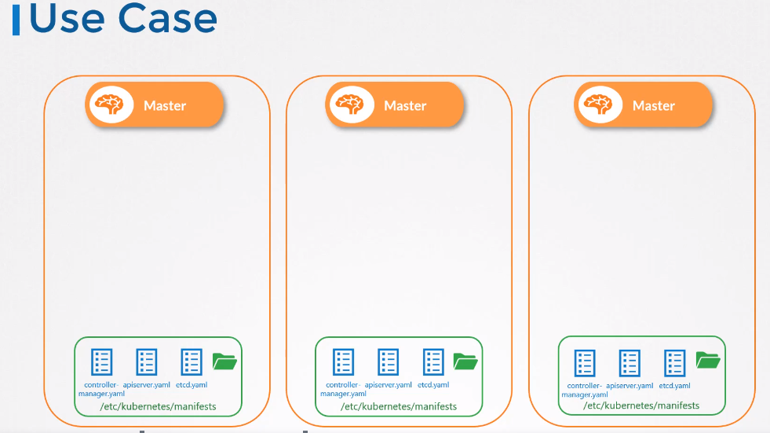

# Static Pods
Static pod는 클러스터가 없이 pod만 독립적으로 동작하는 것이다.

kubelet을 통해 직접적으로 만들어짐

## Static PODs 만드는 법
### 정해진 경로에 definition 파일을 위치
pod definition file을 정해진 directory 경로에 둔다.  
default : `/etc/kubernetes/manifests`

해당 경로는 kubelet.service 파일에서 수정하거나 /var/lib/kubelet/config.yaml에 static pod 경로에서 커스텀 가능

kubelet은 정기적으로 해당 디렉터리를 확인하여 host에 pods를 생성한다.  
pod를 만들뿐만아니라 관리도 한다.

디렉터리에서 definition 파일을 지우면 pod도 삭제됨

**하지만 PODs만 생성가능**   
replicaSet이나 deployment 또는 서비스는 생성할수 없다.

### HTTP API endpoint를 통해
kube-apiserver가 kubelet에 input을 제공하는 방법  
kubelet은 staticpod와 api server로 부터 생성되는 두가지 형태의 PODs 모두 생성할 수 있다.

## Use Case
static pod가 Kubernetes control plane에 종속되지 않으므로 정적 포드를 사용하여 control plane 컴포넌트 자체를 노드의 pod로 배포할 수 있다.  

모든 마스터 노드에 kubelet을 설치한다. 그리고 api-server, controller, etcd 등과 같은 control plane component를 도커 이미지를 이용하여 pod definition을 생성한다.  

  

그리고 그 manifest 파일들을 /etc/kubernetes/manifests 디렉터리에 둔다. 

그러면 kubelet은 control plane components를 클러스터 내부에서 POD로 관리하게 된다.

이렇게하면 binaries configure service를 다운받을 필요가없고, service가 충돌날일이 없다.
## Static PODs vs DaemonSets

|Static PODs|DaemonSets|
|---|---|
|Created by the Kubelet|Created by Kube-API server (DaemonSet Controller)|
|Deploy Control Plane components as Static Pods|Deploy Monitoring Agents, Logging Agents on nodes|
|Ignored by the Kube-Scheduler|

---
# Test
### What is the path of the directory holding the static pod definition files?
a. Run the command `ps -aux | grep kubelet` and identify the config file - `--config=/var/lib/kubelet/config.yaml`. Then check in the config file for staticPodPath.
