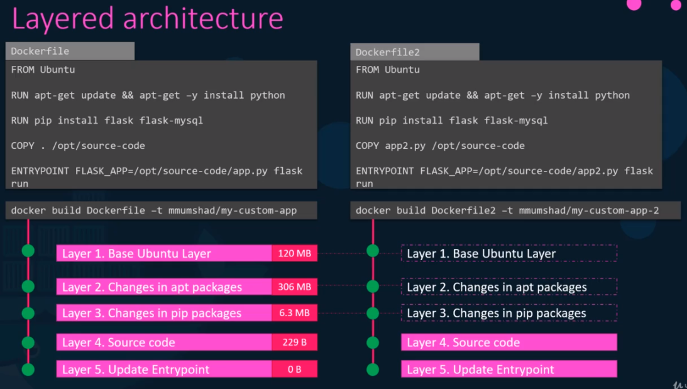

# Docker Storage
Docker가 어디에 데이터를 저장하고 컨테이너의 파일 시스템을 어떻게 관리하는지에 대해서 알아본다.

## File system
도커가 로컬 파일 시스템에 데이터를 어떻게 저장하는지에 대해서 알아본다.

도커를 시스템에 처음 설치하면, /var/lib/docker 폴더를 생성하고, 하위에 aufs, containers, images, volumes와 같은 폴더들이 생성된다.

데이터들은 여기에 저장이된다. 여기서 데이터라고 하면은 이미지와 컨테이너에 관련된 파일이다.

예를들어, 컨테이너와 관련된 모든 파일들은 containers 폴더에 저장된다. 또한 이미지 관련된 파일들은 모두 images 폴더에 저장된다.

컨테이너에서 생성한 볼륨은 volumes 폴더에 저장된다.

### Layered architecture
도커가 이미지와 컨테이너의 파일들을 어떻게 저장하는지에 대해서 알아본다.

도커가 이미지를 빌드할 때, layered architecture 빌드를 한다.

Dockerfile에서 각 명령줄은 이전 레이어의 변경사항 만으로 Docker 이미지에 새로운 레이러를 만든다.

```
From Ubuntu
Run apt-get update && apt-get -y install python
RUN pip install flask flask-mysql
COPY . /opt/source-code
ENTRYPOINT FLASK_APP=/opt/source-code/app.py flask
```
```docker build Dockerfile -t test1```

각 라인마다 레이어가 생기고, 레이어 마다 용량이 다르다.



좌측의 빌드 결과와 우측의 빌드 결과를 본다.

Dockerfile로 보면 좌측과 우측에서 layer3까지는 동일한 동작을한다.

그러므로 먼저 좌측의 도커 이미지를 생성하면, 우측 이미지를 빌드할 때는, layer3까지는 이미 빌드된 layer3를 재사용하여 도커가 이미지를 더 빠르게 빌드할 수 있도록 한다.

이러한 장점은 어플리케이션 코드를 변경할 때도 편리하다. 캐시에서 이전 layer의 내용을 간단하게 재사용하고 가장 최근의 소스코드를 업데이트하여 빠르게 다시 빌드할 수 있고, 많은 시간을 줄일 수 있다.

### Volumes
영속성있는 저장 공간을 가지려면 Docker volume을 생성해야한다. ( volume mounting)

`docker volume create data_volume`
data_volume을 생성하면, /var/lib/docker/volumes 하위에 데이터가 저장된다.

`docker run -v data_volume:/var/lib/mysql mysql`

volume create 명령으로 따로 volume을 생성하지 않아도 docker run -v 명령어를 썼을 때 volume이 없다면 자동으로 생성한다.
`docker run -v data_volume2:/var/lib/mysql mysql`

외부 저장소를 사용할 경우 (bind mounting)
`docker run -v /data/mysql:/var/lib/mysql mysql`

**`docker run -v`는 예전의 방식이다**


이제는 --mount 옵션을 사용한다.  
source : host  
target : container
```
docker run \
--mount type=bind,source=/data/mysql,target=/var/lib/mysql mysql
```

이 모든것을 동작 시키는 주체는 **Stroage Driver** 이다

## Storage Drivers
* AUFS
* ZFS
* BTRFS
* Device Mapper
* Overlay
* Overlay2

Storage driver를 선택하는 것은 사용하는 OS에 따라서 다르다.

Ubuntu의 경우 기본적으로 AUFS를 사용한다. 이는 다른 OS인 fedora나 CentOS에서는 사용불가하다.

Docker는 OS에 따라서 자동적으로 storage driver를 선택한다.


