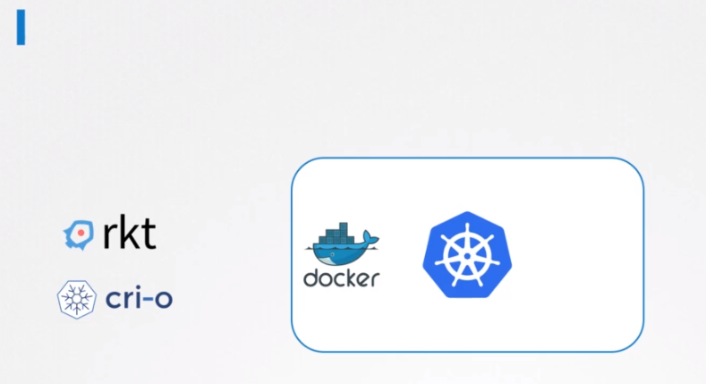
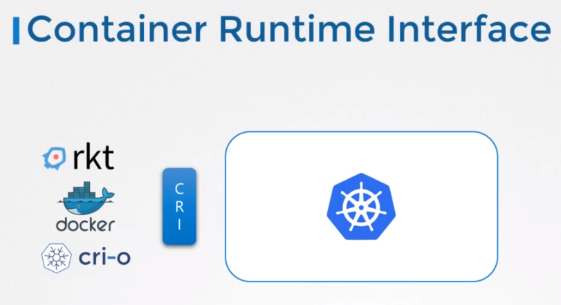
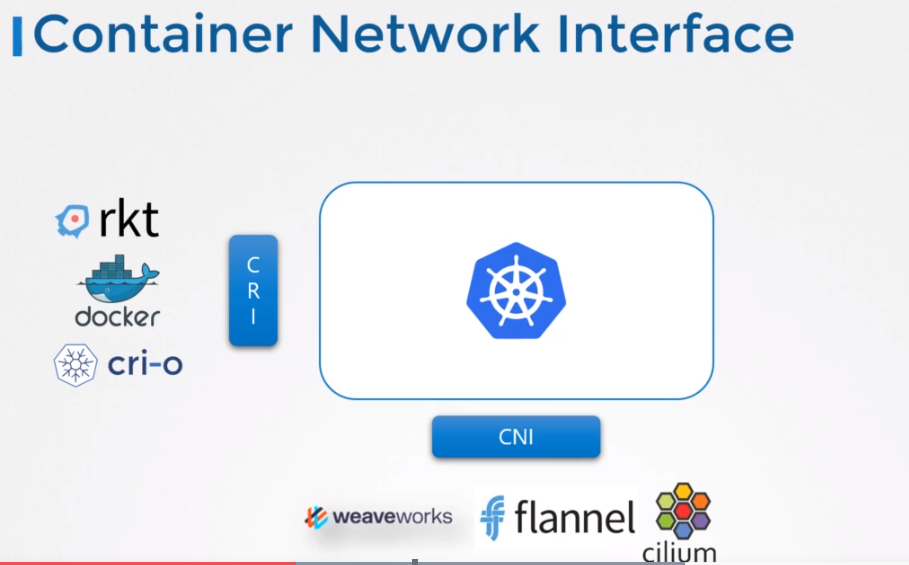
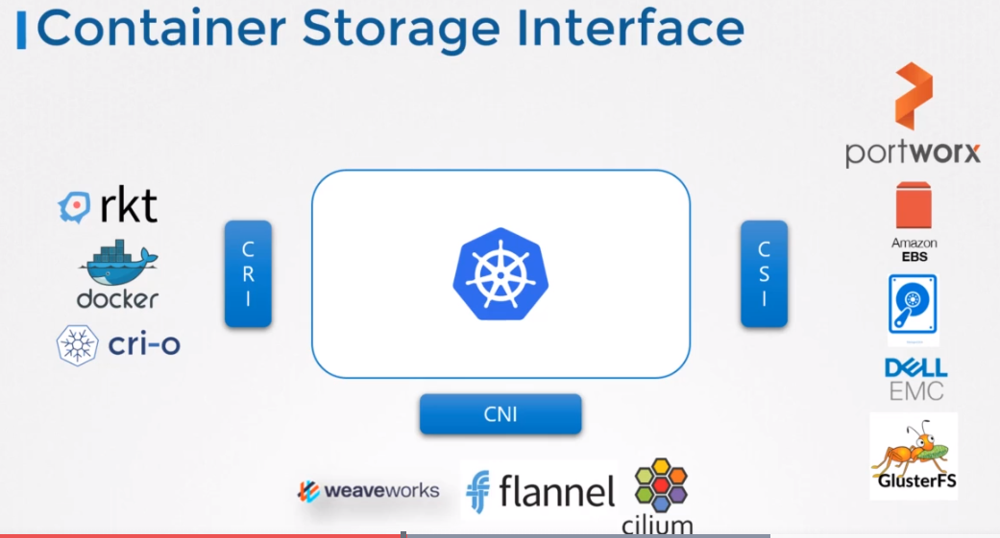
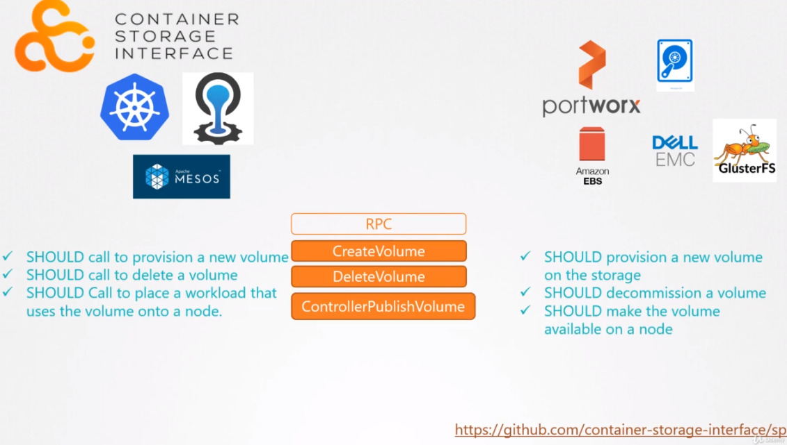

# Container Storage Interface (CSI)
과거 쿠버네티스는 단일 도커로 컨테이너 런타임 엔진으로 사용되었고, 모든 Docker를 동작시키는 코드는 쿠버네티스에 내장되어 있었다.

## CRI (Container Runtime Interface)
**Container Runtime 이란?**  
`Docker, cri-o, containerd, rkt, frakti 등이 있다.`

다른 rocker 또는 cri-o와 같은 다른 컨테이너가 런타임이 다가옴에 따라, Kubernetes 소스코드에 의존하지 않고 다른 컨테이너 실행 시간으로 작업할 수 있도록 지원을 열고 확장을 하는 것이 중요했다.

이것이 Container Runtime Interface가 만들어진 계기가 된다.

Container Runtime Interface는 어떻게 쿠버네티스와 같은 오케스트레이션 솔루션이 Docker와 같은 컨테이너 런타임과 통신하고 있을지에 대한 정의에 대한 표준이다.

그렇기 때문에 추후에 새로운 Container Runtime Interface가 개발된다면, CRI 표준에 따라야 한다.

새로운 container runtime은 쿠버네티스나, 쿠버네티스팀의 개발자와 또는 쿠버네티스 코드 변경 없이 개발을 할 수 있다.

## CNI (Container Network Interface)

Networking 에서 공부한 것과 비슷하게, 네트워킹 솔루션에 대한 지원을 확장하기 위해 Container Networking Interface가 소개되었다.
* weaveworks
* flannel
* cilium
## CSI (Container Storage Interface)

비슷하게 다중 storage 솔루션을 지원하기 위해서 CSI가 개발되었다.
* portworx
* Amazon EBS
* DELL EMC
* GlusterFS
* Nutanix
* 등
각자의 CSI driver를 가지고 있다.

알아야할점은 CSI는 쿠버네티스만을 위한 표준안이 아니다.

범용 표준이기때문에 쿠버네티스 뿐만 아니라 다른 오케스트레이션 툴에서도 사용 가능하다.

* RPC (Remote Procedure Call) - 컨테이너 오케스트레이션 에서 호출을 위함. 이것은 Storage Driver에 반드시 구현되어야 한다.

예를들면 CSI에서 pod가 생성되었고, container 오케스트레이터에게 volume을 요청할 경우, 쿠버네티스는 create volume RPC를 호출하고 volume명과 같은 상세 정보를 전송한다.

Storage driver는 반드시 RPC를 구현해야하며, 요청, 프로비저닝, 새로운 볼륨을 스토리지 어레이에서 관리 가능해야하며 명령에 대한 결과를 반환해준다.

비슷하게 삭제나 어레이에서 볼륨 해제와 같은 것들을 구현해야한다.

https://github.com/container-storage-interface/spec

