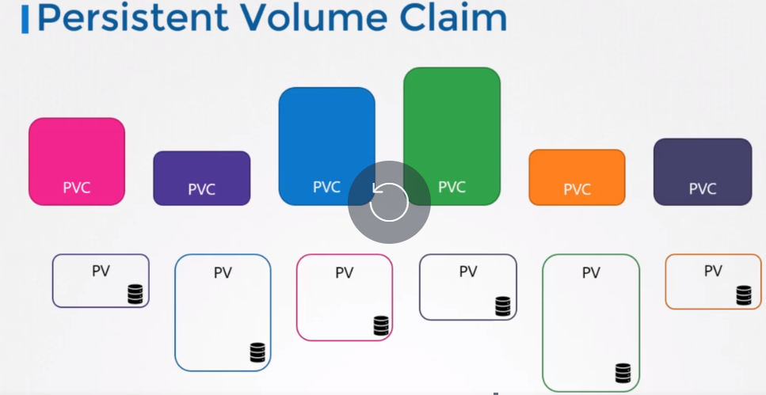
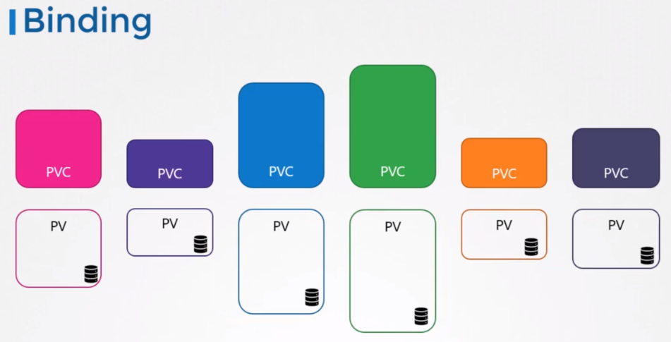
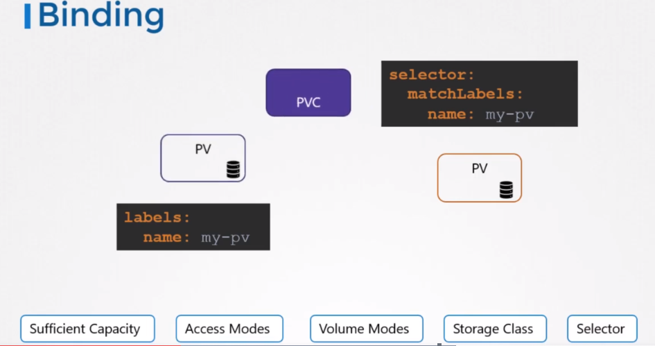
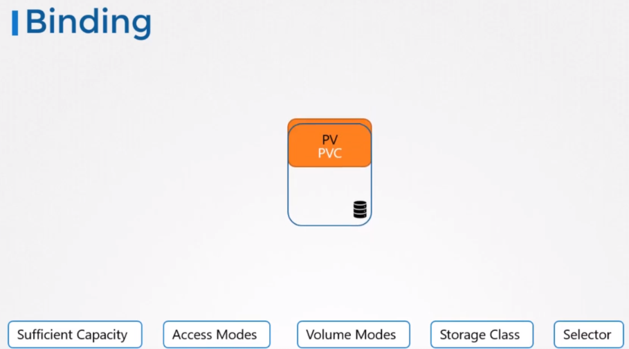

#Persistent Volume Claims
Node에서 Persistent volume을 사용할 수 있도록, persistent volume claims에 대해서 알아본다.

Persistent Volume과 Persistent Volume Claims는 쿠버네티스 네임스페이스에서 두개의 별개 오브젝트이다.

관리자는 Persistent Volume 세트를 생성하고 스토리지를 사용하기 위하여 Persistent Volume Claims를 생성한다.



Persistent volume claims가 한번 만들어지면, 쿠버네티스는 Persistent Volume을 요청과 volume의 속성셋을 기반으로하는 claim에 바인드한다.

모든 Persistent Volume Claims는 단일 Persistent volume에 바인딩된다. 바인딩 되는 프로세스동안 쿠버네티스는 충분한 claim 요청에 맞는 충분한 용량, 접근 모드와 같은 다른 설정 값들을 충족하는 persistent volume을 찾는다.



하지만 만약, single claim 에 대해 가능한 여러 일치 항목이 있고, 원하는 경우 특정 볼륨을 특별히 사용하려면 레이블과 셀렉터를 사용하면 정확한 볼륨을 바인딩할 수 있다.


```
lables:
  name: my-pv
```

```
selector:
  matchLabels:
    name: my-pv
```

마지막으로 다른 모든 기준이 일치하고 더 나은 조건이 없는 경우, 작은 claims 이 더 큰 volume에 바인딩 될 수 있다.

### Claims와 volume과의 관계
claim과 volume과의 관계는 one to one 관계이므로 다른 claims가 볼륨의 남은 공간을 사용할 수 는 없다.

만약 사용가능한 볼륨이 없을 경우, persistent volume claim 는 `pending` 상태가 되고, 클러스터에 새로 사용 가능한 volume가 생성되기 전까지 유지된다.

새로 사용 가능한 volume이 생성되면, 자동으로 바인딩이 되게 된다.

### Persistent volume claims
```apiVersion: v1
   kind: PersistentVolumeClaim
   metadata:
     name: myclaim
   spec:
     accessModes:
       - ReadWriteOnce
     resouces:
       requests:
         storage: 500Mi
```
```
kubectl create -f pvc-definition.yaml
```

claims가 생성되면, 쿠버네티스는 생성된 volume들을 확인한다.
```
apiVersion: v1
kind: PersistentVolume
metadata:
  name: pv-vol1
spec:
  accessModes:
    - ReadWriteOnce
  capacity:
    storage: 1Gi
  hostPath: ## volume type
    path: /tmp/data
```
access mode가 일치하고 요구하는 storage 사이즈보다 volume의 용량이 크다. 그리고 다른 사용가능한 볼륨이 없을 경우, 이 persistent volume claim은 해당 volume에 바인딩 된다.

## View PVCs
```
kubectl get persistentvolumeclaim
```

## delete PVCs
```
kubectl delete persistentvolmeclaims myclaim
```

클레임이 삭제된 후 어떻게 될까?

어떻게 처리될지는 선택 가능한다.

기본적으로는 다음과 같이 설정된다.
```
persistentVolumeReclaimPolicy: Retain
```
이 설정의 의미는, persistent volume을 관리자가 수동으로 삭제할 때까지 유지하겠다는 의미이다.

다른 claim에서 이것을 사용할 수 없게 되거나 자동적으로 삭제되게 된다.

```
persistentVolumeReclaimPolicy: Delete
```
claim이 삭제될 때 volume도 삭제처리된다.

```
persistentVolumeReclaimPolicy: Recycle
```
다른 claim에서 사용할 수 있도록, volume을 정리한다.

## 문제 풀이
pod 내부 /log/app.log 파일 보기
```
kubectl exec webapp -- cat /log/app.log
```

manifest 작성  
-> 참고 : https://kubernetes.io/docs/concepts/storage/volumes/

실행중인 pod yaml파일로 변경
```
kubectl get pod webapp -o yaml > pod.yaml
```

```
kubectl explain persistentvolume --recursive
```

