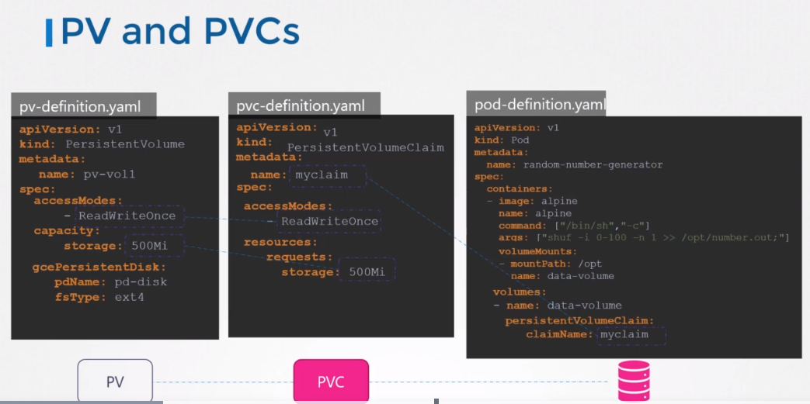
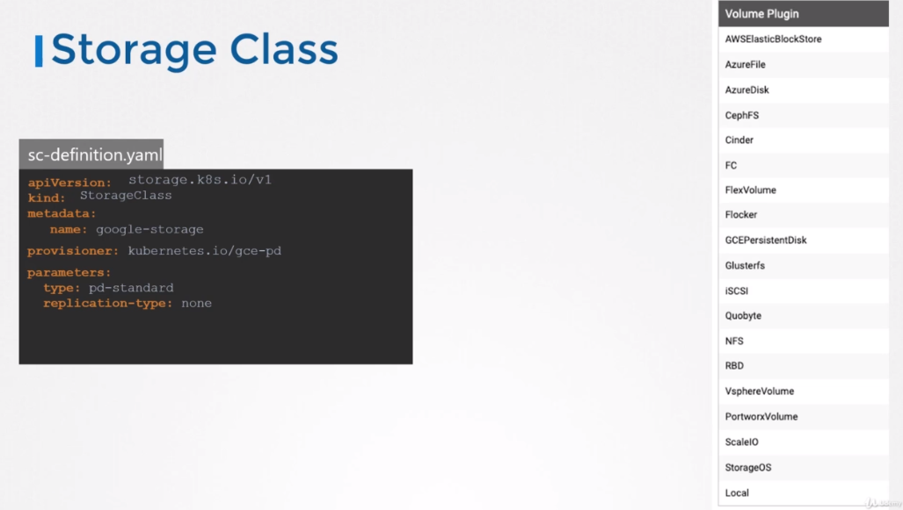
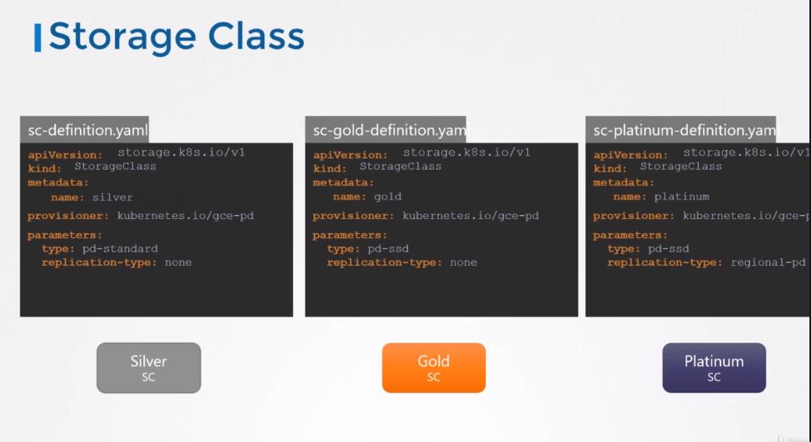

# Storage Classes
## PV and PVCs
아래 예시는 PV, PVCs를 정의하고, Google cloud persistent disk를 사용하는 예제이다.


여기서 문제는 PV를 생성하기전에 반드시 Google Cloud에 disk를 먼저 생성해야한다는 점이다.

## Static Provisioning
```
gcloud beta comput disks create \
  --size 1GB
  --region us-east1
  pd-disk
```

```
apiVersion: v1
kind: PersistentVolume
metadata:
  name: pv-vol1
spec:
  accessModes:
    - ReadWriteOnce
  capacity:
    storage: 500Mi
  gcePersistentDisk:
    pdName: pd-disk
    fsType: ext4
```

어플리케이션이 스토리지를 필요로할 때, Google Cloud에 disk를 먼저 수동으로 프로비저닝 해줘야 한다.  
그리고 수동으로 pv definition파일에 생성한 disk명을 수동으로 적어줘야한다.

=> 이러한 방법을 static provisioning volumes 라고 부른다.

어플리케이션이 필요로 할 때, 볼륨이 자동적으로 provisioned 된다면 좋을 것이다. 

여기서 storage class라는 것이 생성되게 된다.

## Dynamic Provisioning
storage class를 사용하면, Google Cloud 에 자동으로 프로비전이 될 수 있는 Google storage 같은 provisional을 선언할 수 있고 claim이 생성되면 POD에 연결된다.

=> 이러한 방법을 dynamic provisioning of volumes 라고 부른다.

```
apiVersion: storage.k8s.io/v1
kind: StorageClass
metadata:
  name: google-storage
provisioner: kubernetes.io/gce-pd
```

스토리지 클래스가 생성되면 스토리지 클래스가 PV와 연관된 스토리지를 자동으로 생성하기 때문에, pv-definition은 더이상 필요로 하지 않는다.

스토리지 클래스를 사용하기 위해서 PVC 의 storageClassName에 storage class name을 지정해준다.

```
apiVersion: v1
kind: PersistentVolumeClaim
metadata:
  name: myclaim
spec:
  accessModes:
    - ReadWriteOnce
  storageClassName: google-storage
  resources:
    requests:
      storage: 500Mi
```


위의 예제엇는 GCE를 사용했는데 다른 볼륨 플러그인도 많다.  
각 플러그인 마다 다른 파라미터 등을 사용하므로 사용하는 볼륨 플러그인 마다 연구를 한다.



위처럼 다른 타입의 disk로 storage class 를 선언할 수 있다.

실버, 골드, 플레티넘 등으로 다른 설정값을 주며 관리 가능하다.

그래서 이를 storage class라고 이름을 붙인 것이다.
