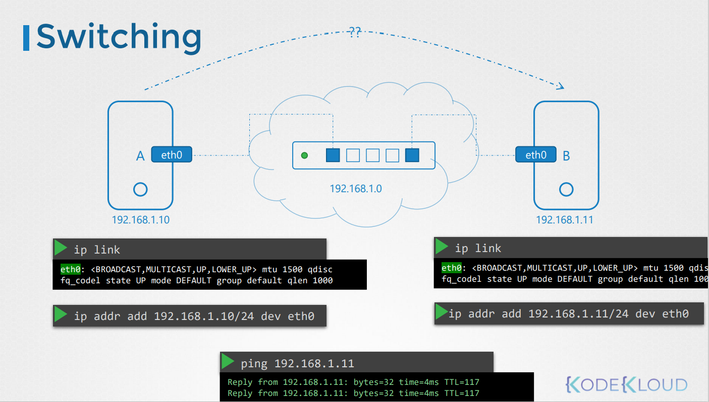
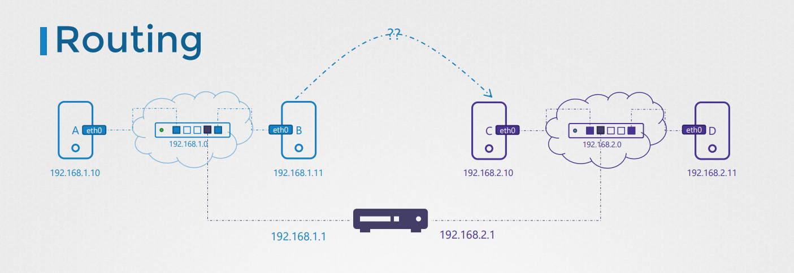
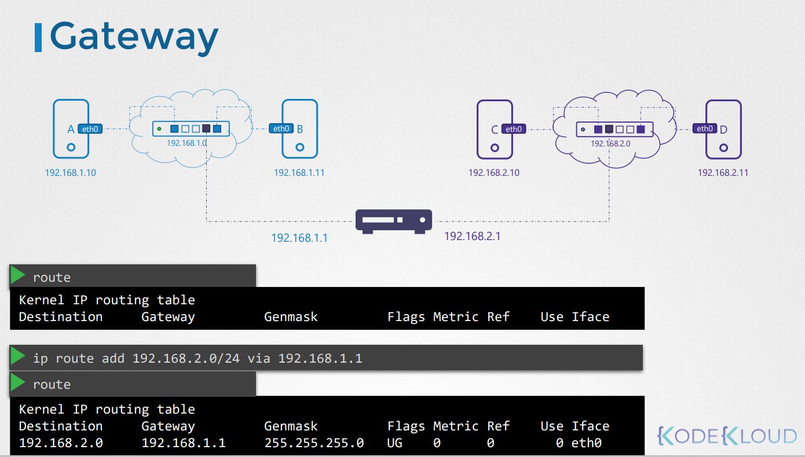
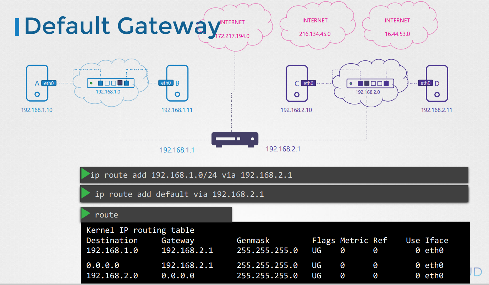
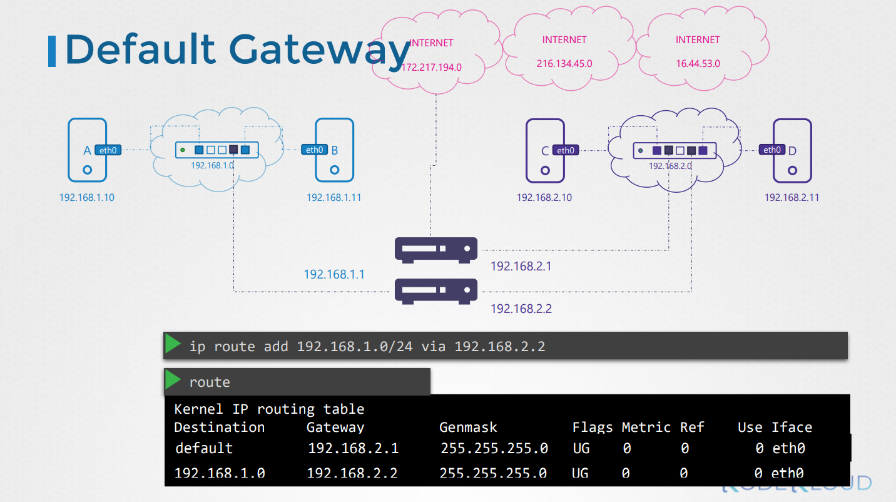
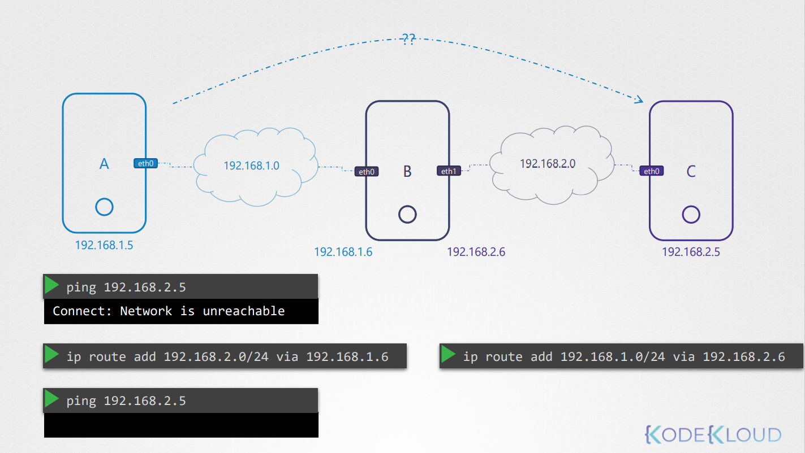
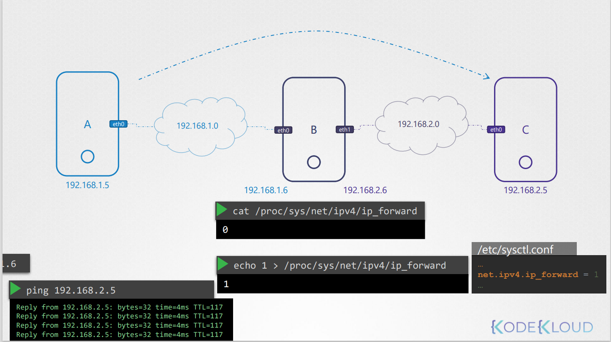

# Prerequisite - Switching Routing
네트워크 기초에 대해서 알아본다.

Switching, Routing, Gateways 등에 대해서 알아본다.

DNS에 대해서 이해하고, core DNS에 대한 기초 설명을 한다.

* Switching and Routing
  * Switching
  * Routing
  * Default Gateway
* DNS
  * DNS Configuration on Linux
  * CoreDNS Introduction
* Network Namespaces
* Docker Networking


## Network 기초
어떻게 두개의 컴퓨터 A, B (laptops, desktop, cloud의 VM 등) 가 연결될까? 


컴퓨터 A, B를 스위치에 연결하고, 스위치는 두개의 시스템을 포함하는 네트워크를 생성한다.

스위치에 연결하기 위해서는 각 호스트 서버에 인터페이스가 필요로 한다.  
호스트 머신에 따라 물리적이거나 가상화된 인터페이스를 가진다.

인터페이스를 확인하기 위해서는 다음 명령어를 사용한다.
```
ip link
```
위 예시의 경우, 스위치에 연결하기 위하여 etho0라는 인터페이스를 사용한다.

예를 들어, `192.168.1.0` 망의 네트워크라고 가정하자.

그리고 같은 네트워크에서 IP 주소로 시스템을 할당한다.

ip addr 명령을 사용
```
ip addr add 192.168.1.10/24 dev eth0
```

한번 링크가 연결되면 IP 주소가 할당되며, 컴퓨터들끼리 서로 스위치를 통해서 통신이 가능해진다.

스위치는 같은 네트워크에서만 통신이 가능하다. 즉, 호스트로 부터 패킷을 받고 같은 네트워크에 있는 다른 시스템으로 패킷을 전달해줄 수 있다.

### 이전 예시와 다른 네트워크에 존재하는 컴퓨터들
C와 D가 `192.168.2.0` 네트워크에 있다.


시스템은 각 `192.168.2.10`, `192.168.2.11`을 가지고 있다.

하나의 네트워크에서 다른 네트워크로 연결은 어떻게 할 수 있을까?  
예를 들어 `192.168.1.11` IP를 가진 B 서버에서 `192.168.2.10` IP를 가진 C 서버로 어떻게 통신을 할까??

여기서 라우터 계념이 나온다. 라우터는 두개의 네트워크를 연결해주는 역할을 한다.

라우터는 지능형 장치로, 네트워크 포트가 많은 또 다른 서버라고 생각하면된다.  
이는 두 개의 별도 네트워크에 연결되기 때문에 두 개의 IP가 할당된다.

`192.168.1.1`, `192.168.2.1` 두 개의 IP가 할당되었다고 치자.

B시스템에서 C 시스템으로 패킷을 보낼 때, 네트워크에서 라우터를 통해서 패킷을 보내기 위한 라우터가 어디에 있는지 어떻게 알까?

라우터는 네트워크에서 그저 다른 서버중 하나 일 뿐이다. 네트워크에서는 사실 많은 장비들이 존재한다.

그렇기 때문에 **gateway** 또는 **route**를 설정하는 것이다.

예를 들어, 네트워크가 `방`이라면, gateway는 외부 세상 (네트워크 또는 인터넷)으로 나가는 `문`이다.

시스템은 기존 라우팅 구성을 확인하기 위해 해당 `문`이 통과해야하는 위치를 알아야 한다.



아래 명령어는 커널의 라우팅 테이블을 보여준다.
```
route
```

만약, gateway 설정이 되어있지 않을 경우, B는 C 시스템과 통신할 수 없다.  
이 경우 같은 네트워크 내인 `192.168.1.0`에 있는 시스템과 통신할 수 있다.

시스템 B에 gateway 설정을 하여 192.168.2.0 네트워크에 있는 시스템에 접근하기 위해서는 
```
ip route add 192.168.2.0/24 via 192.168.1.1
```
명령어를 통해 설정한다.  
설정을 마치면 `route` 명령어를 통해서 192.168.1.1에서 192.168.2.0 시스템으로 접근이 가능한 것을 확인할 수 있다.

기억해야할 점은 이런식으로 모든 시스템에 설정을 해줘야한다.

예를 들어 C에서 B로 패킷을 보낸다.  
이 경우, `192.168.1.0`네트워크에 접근하기 위하여 C의 라우팅 테이블에 라우트를 추가해줘야한다.
```
ip route add 192.168.1.0/24 via 192.168.2.1
```

## Default Gateway

만약 구글에 접속한다고 생각해보자. 구글의 네트워크는 `172.217.194.0` 이라고 가정한다.

이를 추가하면, 인터넷에 있는 구글에 연결 가능하다. 인터넷 세상에는 매우 다양한 사이트들이 다양한 네트워크상에 있다.

이러한 같은 라우터 IP 주소를 가진 라우팅 테이블을 추가하는 대신에, 라우터에 대한 경로를 모르는 네트워크를 간단히 `default dateway`라고 한다.

이 방법은 당신의 네트워크의 외부의 어느 네트워크로 가는 요청이든 이 default router를 통하게 된다.

이러한 간단한 설정은 기본 게이트웨이가 라우터 IP 주소에 설정된 단일 라우팅 테이블 항목만 있으면 된다.

기억할 점은 default라고 부르는 대신 `0.0.0.0`으로 부를 수도 있다.   
이것은 아무 IP 목적지를 의미한다.



만약 두개 이상의 네트워크가 있다고 한다.  
하나는 인터넷망, 하나는 내부망으로 구성한다.

하나는 default로 다른 하나는 내부망에 연결되도록 설정한다.

```
ip route add 192.168.1.0/24 via 192.168.2.2
```

## router로서 linux host 설정


A와 C가 통신하려면 어떻게 해야할까??    
A-B B-C를 연결한다.
```
ip route add 192.168.2.0/24 via 192.168.1.6
```

```
ip route add 192.168.1.0/24 via 192.168.2.6
```

이렇게 할 경우, ping을 날렸을 때 오류 메시지는 없다. 즉, routing entries는 제대로 설정된 것이다.

하지만, 아직 아무 응답을 받지 못한다. 

기본적으로 리눅스는 하나의 인터페이스에서 다른 인터페이스로 패킷이 포워딩되지 못한다.

그림에서 보면 eth0에서 받은 패킷이 eth1으로 패킷을 포워딩 시켜줄 수 없다.  
이는 보안적인 이슈이다. 예를들어 etho0 이 내부망이고, eth1이 외부망일 경우 외부망 (eth1)에서 내부망으로 연결되는 것을 원하지 않을 것이다.

하지만 이것은 명시적으로 설정해 줄 수 있다.

위의 그림의 경우 두 네트워크 인터페이스 모두 사내망인 것을 알고 있기 떄문에 안전하게 통신이 가능하게 해도 된다.



`/proc/sys/net/ipv4/ip_forward`에서 이를 설정한다.

기본적으로 이 값으 0으로 forward를 막는다.
```
cat /proc/sys/net/ipv4/ip_forward
0
```

```
echo 1 > /proc/sys/net/ipv4/ip_forward
1
```

이 설정은 재시작하면 초기화가 되기 때문에, `/etc/sysctl.conf` 파일의 설정 값도 변경해줘야한다.

```
/etc/sysctl.conf
...
net.ipv4.ip_forward = 1
...
```

## 명령어 정리
`ip link` : 호스트 머신의 인터페이스의 리스트를 보여주고 수정
`ip addr` : 인터페이스에 할당된 ip 주소를 확인
`ip addr add 192.168.1.10/24 dev etho0` : 인터페이스에 IP 주소를 설정

위 설정은 재시작 전까지만 유효하며 재시작시 초기화 된다.  
영구적으로 설정하기 위해서는 `/etc/network/interface` 파일을 수정한다.

`ip route`, `route` : 라우팅 테이블 조회
`ip route add 192.168.1.0/24 via 192.168.2.1` : 라우팅 테이블에 항목 추가 
`cat /proc/sys/net/ipv4/ip_forward` : ip forward 가능 여부

