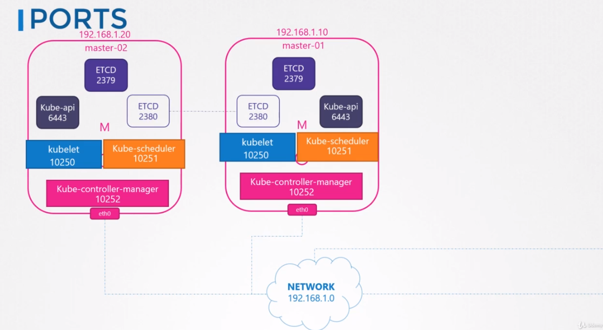

# Networking Cluaster Nodes
각 인터페이스는 반드시 주소 설정이 필요로 한다.

hosts는 반드시 MAC 주소와 같이 유니크한 hostname 셋을 가지고 있어야한다.
 
이미 존재하는 VM에서 복제를 할 경우 이를 더 유의해야한다.

또한 몇몇 포트도 오픈되어있어야한다.

포트들은 control plane에서 다양한 컴포넌트들로 인해 사용된다.

마스터는 API서버 연결을 위해서 6443 포트를 사용한다.

워커 노드, Kubectl 툴, 외부 사용자, 그리고 다른 컨트롤 플레인 컴포넌트는 kube-api서버를 6443 포트를 통해서 접근한다.

master와 worker node의 kubelet는 10250 포트를 사용한다.

kube-scheduler는 10251 포트를 사용한다. 

kube-controller-manager는 10252 포트를 사용한다.

워커노드가 외부 액세스를 위한 서비스를 제공하기 위해서 30000에서 32767 포트를 사용한다.

위의 포트들은 오픈되어 있어야한다.

최종적으로 ETCD 서버는 2379 포트를 사용한다.

여러개의 마스터 노드가 있다면, 이 모든 포트들은 다른 모든 마스터 노드에도 오픈되어있어야한다.

또한 ETCD 클라이언트가 서로 통신을 하기위해서 2380 포트를 추가적으로 오픈해야한다.

## Commands
`ip link`

`ip addr`

`ip addr add 192.168.1.10/24 dev eth0`

`ip route`

`ip route add 192.168.1.0/24 via 192.168.2.1`

`cat /proc/sys/net/ipv4/ip_forward`

`arp`

`netstat -plnt`

## 194. Practice Test
2. What is the network interface configured for cluster connectivity on the master node?
   node-to-node communication
     
A > `ip link` (master node == host 서버)
`ifconfig`, `cat /etc/network/interfaces`

4. What is the MAC address of the interface on the master node?

A> `ip link show ens3`

6. What is the MAC address assigned to node01?

A> `arp node01`

`ssh node01 ifconfig ens3`

9. If you were to ping google from the master node, which route does it take?  
What is the IP address of the Default Gateway?  

A> `ip route show default`

11. Notice that ETCD is listening on two ports. Which of these have more client connections established?

A> `netstat -anp | grep etcd`

Correct! That's because 2379 is the port of ETCD to which all control plane components connect to. 2380 is only for etcd peer-to-peer connectivity. When you have multiple master nodes. In this case we don't.

