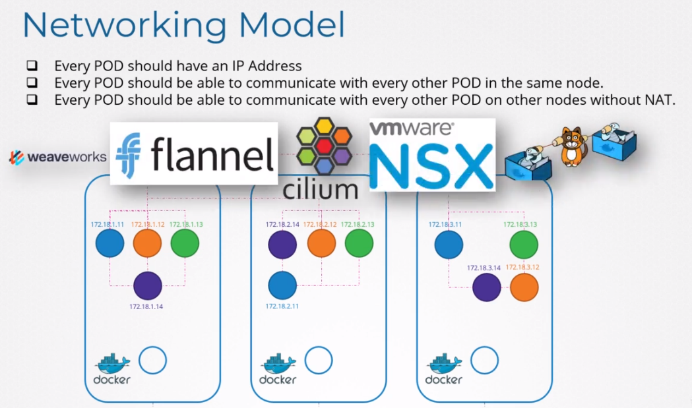
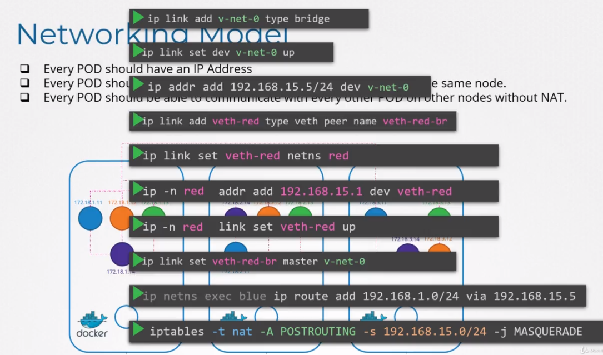
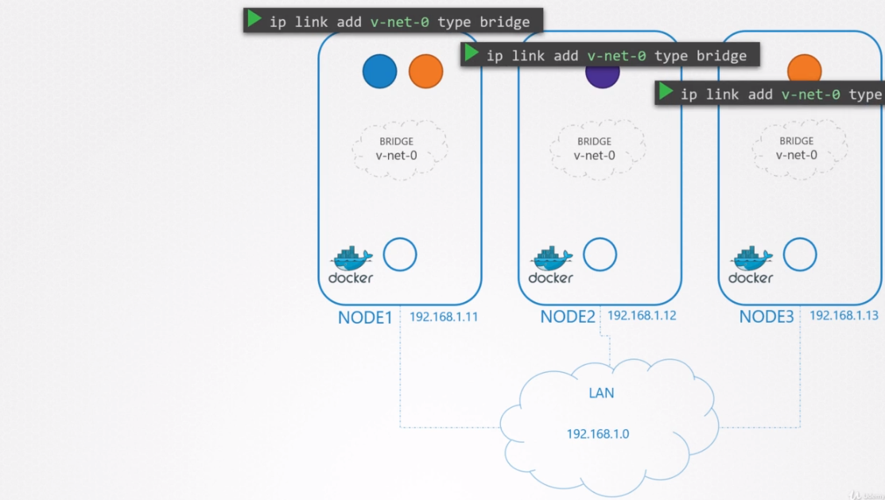
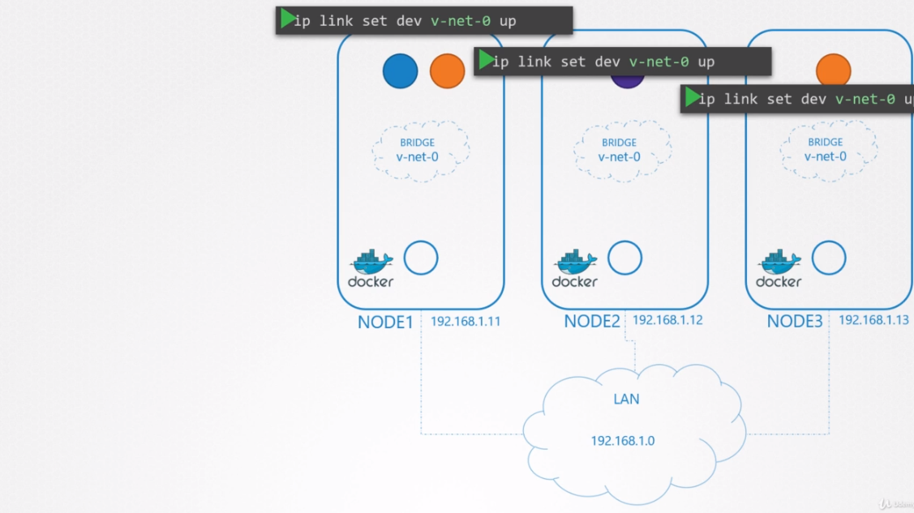
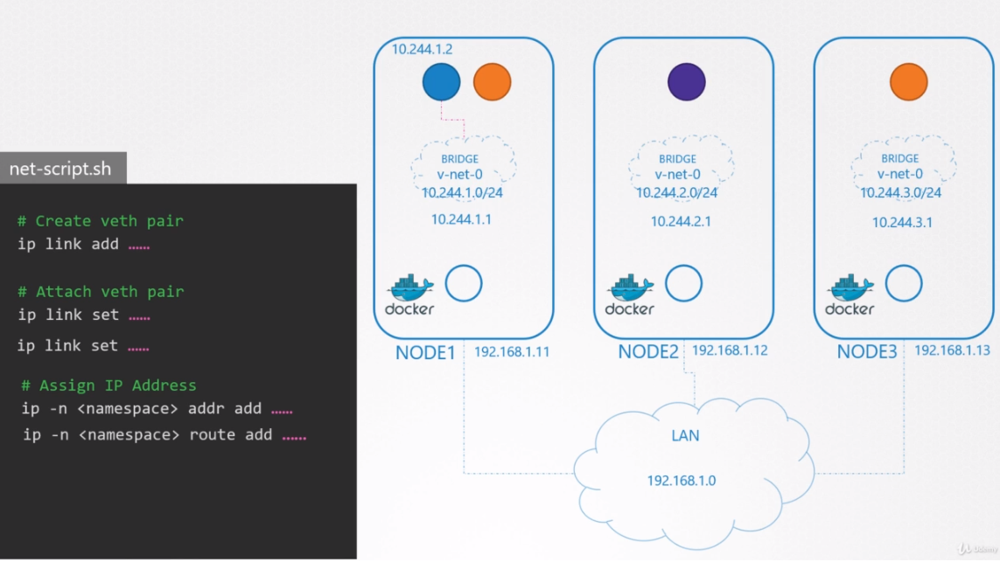
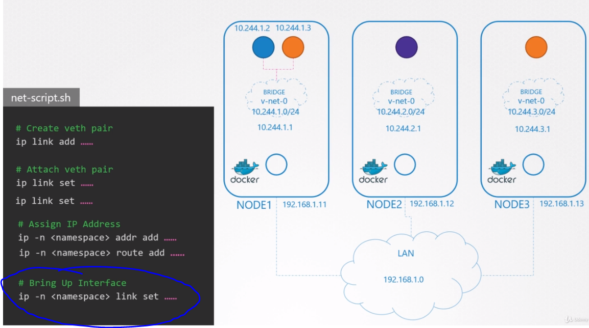
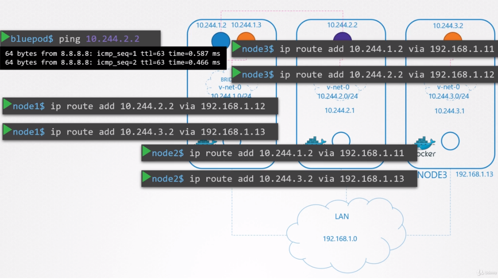
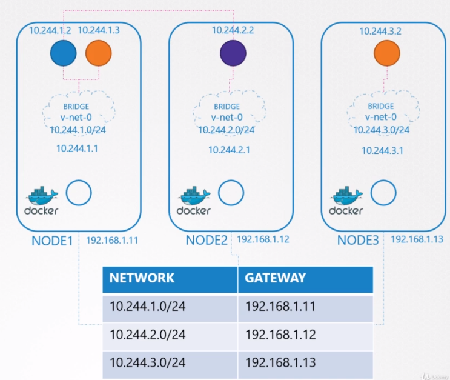
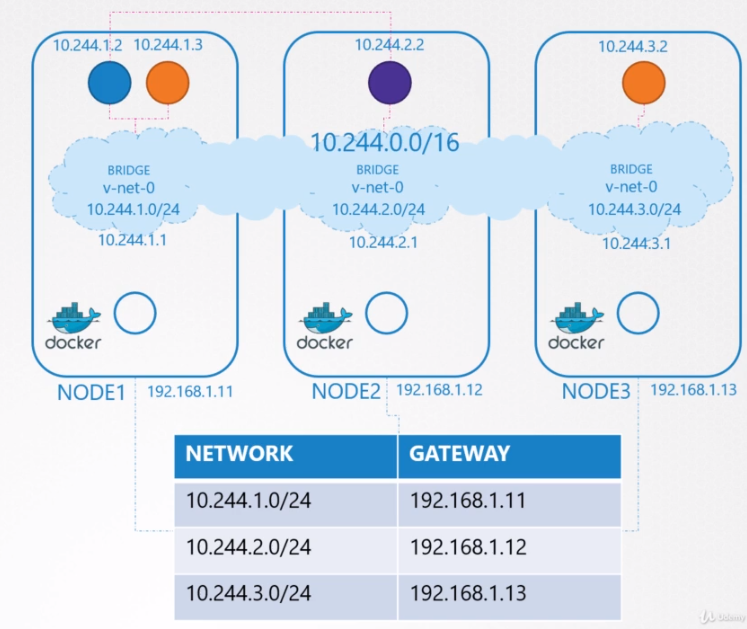
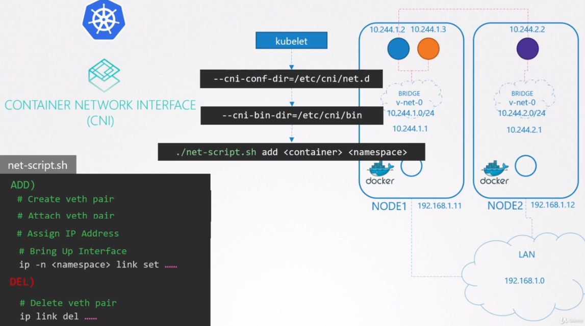

# Pod Networking
네트워크 노드가 서로 연결되는 것에 대해서 알아봤다.

하지만 클러스터가 동작하는데 중요한 또 다른 네트워크 레이어가 있다.

그것은 바로 `Pod layer`이다.

쿠버네티스 클러스터에는 많은 수의 파드가 서비스되고 있다.

파드에 주소를 어떻게 할당하며, 어떻게 서로 통신을 할까?

클러스터 내에서 내부적으로 이러한 POD에서 실행되는 서비스에 어떻게 접근할까? 또한 클러스터 외부에서는 어떻게 할까?

현재로선 쿠버네티스에서 빌트인 솔루션은 없다.

네트워킹 솔루션을 통해서 이것을 해결해야 한다.

쿠버네티스는 모든 POD가 고유의 IP 주소를 가지고 모든 POD는 IP 주소를 가지는 같은 노드에서는 서로 접근가능해야한다.

파드는 같은 주소로 다른 노드에 있는 다른 파드에 접근가능해야 한다.

IP 주소나 어떤 범위 혹은 서브넷에 포함되어있는지는 중요하지않다.

솔루션을 사용하면 솔루션이 자동적으로 IP주소를 할당하고 노드내에서 혹은 다른 노드와 통신 가능하도록 구축된다.


## 네트워크 공부할 지식으로 솔루션이 해주는 작업 시뮬레이션

1. 노드에 네트워크 할당 (노드는 192.168.1.0 대역에 있음, 노드는 각 11, 12, 13번 순으로 할당됨)
2. 컨테이너가 생성되면 쿠버네티스는 컨테이너들끼리 통신 가능하도록 네트워크 네임스페이스를 생성한다.
3. 브릿지 네트워크는 노드가 네임스페이스에 연결되도록 한다.  
    3.1 각 노드에 네트워크를 생성한다. (`ip link add v-net-0 type bridge`)
    
4. 브릿지 네트워크 시작 (`ip link set dev v-net-0 up`)
    
5. 브릿지 인터페이스나 네트워크에 IP 주소 할당하기  
    5.1 각 브릿지 네트워크 작업이 자체 서브넷에 있도록 결정하고, 개인 주소 범위를 정한다.  
    5.2 10.244.1.0/24, 10.244.2.0/24, 10.244.3.0/24  
    5.3 브릿지 인터페이스에 IP 주소를 할당한다. (`ip addr add 10.244.1.1/24 dev v-net-0`)  
    ![podNetwork(../contents/podnetwork5.PNG)]
6. 나머진 단계는 각 컨테이너에 대해 그리고 새 컨테이너가 생성될 때마다 수행된다. ( 반복되기때문에 스크립트로 작성한다. )  
    6.1 컨테이너가 네트워크에 접속하기 위해서는 pipe와 가상 네트워크 케이블이 필요로 한다.  
    6.2 `ip link add ..` 명령어를 통해서 가성 네트워크 케이블을 생성한다.  
    6.3 하나는 컨테이너에 하나는 브릿지 네트워크에 연결한다 `ip link set ...`  
    6.4 ip 주소를 할당하고 ( `ip addr add...` ) 기본 게이트웨이로 route를 추가해준다. (`ip route add ...`)  
    6.5 무슨 IP를 추가해줘야 할까???? 이 정보는 데이터베이스 같은 곳에 저장된다.  
    6.6 10.244.1.2 IP 주소를 할당 받았다고 가정하자.  
    
7. 최종적으로 인터페이스를 불러온다.    
    7.1 두번째 컨테이너의 정보를 이용하여 같은 스크립트를 동작시킨다. 네트워크가 연결되면, 두 컨테이너는 통신이 가능하게 된다.  
    7.2 스크립트를 다른 노드로 복사하여 IP주소를 할당시키고 각자의 네트워크에 연결 시킨다.  
    

**모든 Pod는 각자 IP주소를 가지고 각 노드에서 서로 통신이 가능하게 되었다.**

이제부터 다른 노드의 다른 Pod끼리 연결하는 것에 대해서 알아본다.

10.244.1.2 (Node1) -> 10.244.2.2 (Node2) 통신을 하고자 한다.  
`10.244.1.2 (Node1)에서`
```
10.244.1.2$ ping 10.244.2.2
```
이 경우, 10.244.2.2가 다른 네트워크에 있기 때문에 어디로 통신해야하는지 모른다.

그래서 기본 게이트웨이라고 하는 Node1 IP로 라우트한다.

Node1도 10.244.2.2가 사설망에서 어디있는지 모른다.

Node1에 라우팅 테이블에 10.244.2.2로 트래픽이 갈수 있도록 라우트를 추가해준다.
`Node1`
```
node1$ ip route add 10.244.2.2 via 192.168.1.12
```

라우트가 추가되면 10.244.1.2에서 10.244.2.2로 ping이 보내진다.

이와같이 모든 POD끼리 route를 추가해준다.


이것은 가장 간단한 방법으로 연결하는 하는 것이고, 네트워크 설계가 복잡해질수록 설정은 점점 많아 질것이다.

각 서버에 라우트 설정을 추가해주는 방법 대신에 네트워크에 하나의 라우터를 두고 모든 호스트에서 기본 게이트웨이로 그 라우터를 사용하는 방법이 있다.


이렇게 되면 10.244.0.0/16이라는 거대한 네트워크가 생성된다.


## CNI를 통해서 스크립트 자동 실행 

파드가 생성될때 쿠버네티스가 위 작업 (스크립트)를 자동으로 동작시켜줘야한다.

이를 CNI가 해준다. CNI는 쿠버네티스에게 컨테이너가 생성될때 어떻게 스크립트를 호출하는지에 대해 알려준다.

스크립트를 CNI표준에 맞게 수정해줘야한다.

`ADD` section
```
# Create veth pair
# Attach veth pair
# Assign IP Address
# Bring Up Interface
ip -n <namespace> link set ...
```

`DEL` section
```
# Delete veth pair
ip link del ...
```

Kubelet은 각 노드에서 컨테이너를 생성하는 역할을 한다.

컨테이너가 생성될때마다, kubelet은 동작할 때 커맨드 라인 속성으로 전달된 CNI 설정(`--cni-conf-dir=/etc/cni/net.d`)을 통해 스크립트 이름을 식별한다.

그러면 CNI bin directory를 참고하고, 스크립트를 정의하고 컨테이너의 이름과 네임스페이스 ID를 이용하여 ADD 명령을 실행한다. (`./net-script.sh add <container> <namespace>`)

