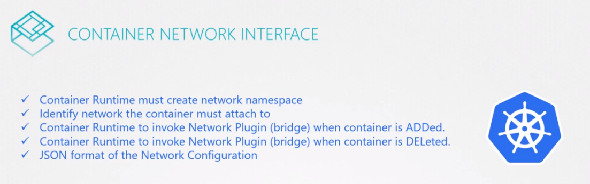
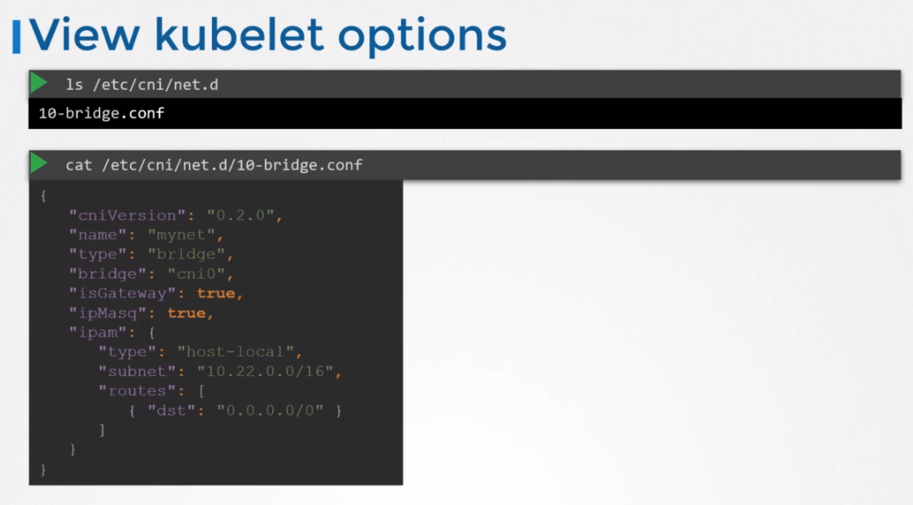

#CNI in Kubernetes


### Configuring CNI
cni 설정은 클러스터의 각 노드의 kubelet 서비스에 있다.

`kubelet.service`
```
ExecStart=/usr/local/bin/kubelet \\
    --config=/var/lib/kubelet/kubelet-config.yaml \\
    --container-runtime=remote  \\
    ...
    --network-plugin=cni    \\
    --cni-bin-dir=/opt/cni/bin  \\
    --cni-conf-dir=/etc/cni/net.d   \\
    ...
``` 

동작중인 kubelet service에서도 이 정보를 확인할 수 있다.
```
ps -aux | grep kubelet
```

CNI bin directory는 모든 지원가능한 CNI 플러그인들을 볼 수있다. 예를들면 bridge, dhcp, flannel, 등등
```
ls /opt/cni/bin
bridge dhcp ...
```

CNI config directory는 설정파일들의 모음이다.

어느 플러그인을 사용해야하는지 kubelet이 알아내는 곳이다.    
아래의 경우, 브릿지 설정 파일이다. 만약 이 디렉토리에 다중의 파일이 있다며 알파벳 순서로 선택된다.
```
ls /etc/cni/net.d
10-bridge.conf
```

브릿지 설정 파일을 보면 아래와 같다.


```
ls /etc/cni/net.d
10-bridge.conf
```

bridging, routing, Masquerading in NAT 설정등이 있다.

나머지 설정에는 bridging, routing, NAT에서 Masquerading하는 설정이 있다. 

* isGateway : 브리지 네트워크 인터페이스가 게이트웨이 역할을 할 수 있도록 할당 된 IP 주소를 가져와야하는지 여부를 정의
* isMasq : IP masquerading을 위해 NAT 규칙을 추가해야하는지 여부를 저의
* IPAM 섹션엔 IPAM 설정값을 정의한다.
    * 파드와 필요한 route에 할당할 IP 주소의 범위 또는 subnet을 정의한다.
    * host-local 타입은 ip 주소가 호스트에서 로컬로 관리됨을 나타낸다.

원격으로 유지관리하는 DHCP서버와는 다르다. 유형을 DHCP로 설정하여 외부 DHCP 서버를 구성할 수도 있다.
```
cat /etc/cni/net.d/10-bridge.conf
{
    "cniVersion": "0.2.0",
    "name": "mynet",
    "type": "bridge",
    "bridge": "cni0",
    "isGateway": true,
    "isMasq": true,
    "ipam": {
        "type": "host-local",
        "subnet": "10.22.0.0/16",
        "routes": [
            { "dst": "0.0.0.0/0" }
        ]
    }
}
```
