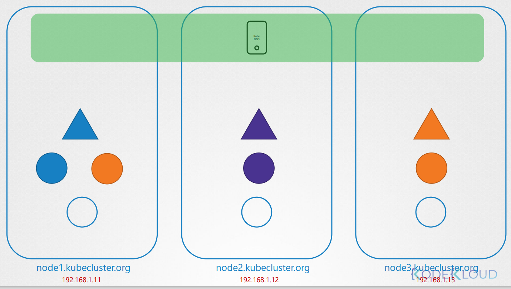

# Cluster DNS
* What names are assigned to what objects?
* Service DNS records
* POD DNS Records

하나의 POD에서 다른 PDO로 가는 다양한 방법을 알아본다.

  
3개의 node가 있는 클러스터가 있다.

클러스터 내부에는 몇가지 pod와 service가 있다.

DNS 서버는 클러스터를 처음 세팅하면 자동으로 생성되고, 각 노드의 이름과 IP주소를 DNS 서버에 저장하게 될것인다.

이 강의와 관련하여 포드가 클러스터 내의 다른 포드 및 서비스를 해결하는 데 어떻게 도움이되는지 살펴 보겠습니다.

Node에 대해서는 신경쓸 필요없이 클러스터 내부의 PDO와 service에 대해서 집중해서 알아본다.

클러스터 네트워킹이 제대로 설정되었다면, 이 섹션에서 지금까지 배운 모범 사례에 따라 모든 포드와 서비스가 자체 IP 주소를 가져와 서로 연결할 수 있다.


2개의 POD와 서비스를 예를들어보자.


왼쪽의 pod는 테스트 용도로 10.244.1.5를 가진다.

오른쪽은 10.244.2.5를 세팅한다. IP를 보면 다른 노드에서 설정된 pod라는 것을 알 수 있다.

그러나 DNS에 관한 한 그것은 중요하지 않다.

모든 POD와 서비스는 다른 IP주소를 사용하여 서로 통신이 가능하다.

서비스가 생성되면 kubernetes DNS 서비스는 서비스에 대한 record를 생성한다.  
이 record는 서비스 이름과 IP 주소를 매핑시킨다.

그러므로 이때부터 클러스터의 모든 pod는 서비스명을 가지고 서비스에 도달할 수 있다.


이전에 말했듯이 namespace라는 것이있다. 네임스페이스에서 같은 이름이지만 다른 성을 가진 네임스페이스가 있을 수 있다.


이번의 케이스는 test pod와 web pod와 서비스가 같은 네임스페이스에 있는 경우이다.

같은 default namespace에 있을 경우, 간단하게 test-pod에서 web-service로 접근할 수 있다.


web service가 apps라고 불리는 분리된 네임스페이스에 있다고 가정하자.

default 네임스페이스에서 이 apps 네임스페이스의 서비스에 접근하기 위해서는 .app를 붙여준다.
```
curl http://web-service.apps
```

여기서 web-service는 서비스명이고 apps는 네임스페이스 명이다.

각 네임스페이스에 대해서 DNS서버는 subdomain을 생성한다. 모든 서비스들은 SVC라고 불리는 다른 sub-domain으로 그룹화된다.

* web-service는 서비스의 이름이다.
* apps는 네임스페이스의 이름이다. 각 네임스페이스에서 DNS서버는 그 이름을 사용하여 sub-domain을 생성한다. 그러므로 네임스페이스에 대한 모든 pod와 서비스들은 네임스페이스의 이름에서 sub-domain으로 그룹화시킨다.
* 모든 서브도메인은 svc라고 불리는 다른 서브도메임으로 그룹화 된다. 그렇기 때문에 각 어플리케이션을 web-service.apps.svc로 접근 가능하다.
* 최종적으로 모든 서비스와 pod는 클러스터의 root domain으로 그룹화 된다. 기본값으로는 cluster.local으로 설정된다.
* 그렇기 때문에 서비스를 `web-service.apps.svc.cluster.local` 으로 접근할 수 있다.


PODs에 대한 record는 기본적으로 생성되지 않는다.

하지만 이를 명시적으로 설정할 수 있다.

이 설정이 되면, pods에 대한 records도 생성된다.

이것은 pod의 이름을 사용하지는 않지만, 각 pod의 ip 주소의 `.`(dots)를 `-`(dash)로 변경해서 저장한다.

namespace는 동일하게 남아있고, type은 pod로 저장한다.

root domain은 항상 `cluster.local`이다


비슷하게 default 네임스페이스에 있는 test POD도 DNS서버에 record를 저장한다.

이것이 POD의 IP 주소를 얻을 수 있도록 한다.


