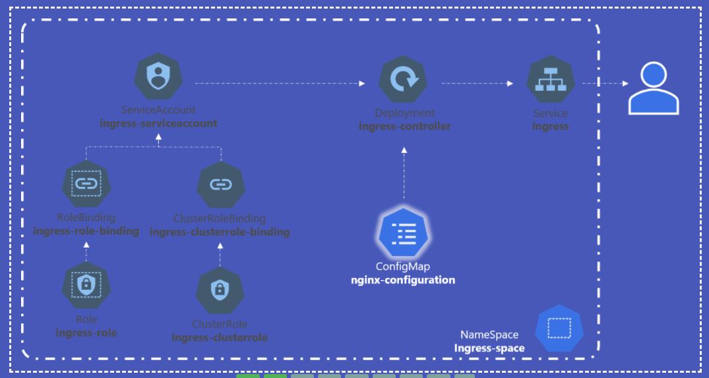

# Ingress - Annotations and rewrite-target

인그레스 컨트롤러 마다 작동 방식을 커스터마이즈 하는데 사용할 수 있는 다양한 옵션이 있다.

Nginx 인그레스 컨트롤러는 [here](https://kubernetes.github.io/ingress-nginx/examples/) 에나와있는 것 같이 다양한 옵션들이 있다.

그 중 하나의 옵션에 대해서 설명한다.

* `watch` app은 `http://<watch-service>:<port>/` 로 서비스
* `wear` app은 `http://<wear-service>:<port>/` 로 서비스


아래 내용을 하려면 Ingress 설정을 해야만 한다. 유저가 왼쪽의 URL로 접근하면 유청은 내부적으로 오른쪽 URL로 포워딩된다.

`/watch`와 `/wear` URL 경로는 사용자를 백엔드의 적절한 애플리케이션으로 전달할 수 있도록 인그레스 컨트롤러에서 구성한 것이다.

어플리케이션은 다음 URL/path가 구성되어 있지 않다.

좌 : `http://<ingress-service>:<ingress-port>/watch` -> 우 : `http://<watch-service>:<port>/`

좌 : `http://<ingress-service>:<ingress-port>/wear` -> 우 : `http://<wear-service>:<port>/`

`rewrite-target` 옵션이 없으면 다음과 같이 동작한다.

좌 : `http://<ingress-service>:<ingress-port>/watch` -> 우 : `http://<watch-service>:<port>/watch`

좌 : `http://<ingress-service>:<ingress-port>/wear` -> 우 : `http://<wear-service>:<port>/wear`

`watch`와 `wear`이 타겟 URL 마지막에 붙는다. 다겟 어플리케이션에는 `/watch`, `wear` 이 경로로 지정되어 있지 않다.

아마 404 오류를 떨어 트릴 것이다.

요청이 `watch` 또는 `wear` 어플리케이션에 전달 될 때 URL을 "ReWrite" 하도록 수정한다.

우리는 우리가 타이핑한 같은 경로를 전달하는 것을 원하지 않는다.

그렇기 때문에 `rewrite-target` 옵션을 적어준다. 이는 무엇이든 `rules -> http -> paths -> path` 하위에 있는 무엇이든 교체하여 URL을 재작성한다.

아래 예시에는 `/pay`가 들어오면 `reqrite-target`에 지정된 값으로 바꿔준다.

이것은 search하고 replace 함수를 쓰는것과 유사하다

> 예 : replace (path, rewrite-target)
> 아래 예 : replace ("/path", "/") 

```
apiVersion: extensions/v1beta1
kind: Ingress
metadata:
  name: test-ingress
  namespace: critical-space
  annotations:
    nginx.ingress.kubernetes.io/rewrite-target: /
spec:
  rules:
  - http:
      paths:
      - path: /pay
        backend:
          serviceName: pay-service
          servicePort: 8282
```

> 다른 예 : replace("/something(/|$)(.*)", "/$2")
> * rewrite.bar.com/something rewrites to rewrite.bar.com/
> * rewrite.bar.com/something/ rewrites to rewrite.bar.com/
> * rewrite.bar.com/something/new rewrites to rewrite.bar.com/new
```
apiVersion: extensions/v1beta1
kind: Ingress
metadata:
  annotations:
    nginx.ingress.kubernetes.io/rewrite-target: /$2
  name: rewrite
  namespace: default
spec:
  rules:
  - host: rewrite.bar.com
    http:
      paths:
      - backend:
          serviceName: http-svc
          servicePort: 80
        path: /something(/|$)(.*)
```

---
문제 2.



1. Let us now deploy an Ingress Controller. First, create a namespace called 'ingress-space'  
   We will isolate all ingress related objects into its own namespace.  
A. `kubectl create namespace ingress-space`

2. The NGINX Ingress Controller requires a ConfigMap object. Create a ConfigMap object in the ingress-space.  
   Use the given spec on the right. No data needs to be configured in the ConfigMap.    
A. `kubectl create configmap nginx-configuration --namespace ingress-space`

3. The NGINX Ingress Controller requires a ServiceAccount. Create a ServiceAccount in the ingress-space.  
   Use the given spec on the right.  
A. `$ kubectl describe serviceaccount -n ingress-space`

4. We have created the Roles and RoleBindings for the ServiceAccount. Check it out!  
A. `kubectl get roles,rolebindings -n ingress-space`

5. Let us now deploy the Ingress Controller. Create a deployment using the file given.  
   The Deployment configuration is given at /root/ingress-controller.yaml. There are several issues with it. Try to fix them.  
A. [ingress-controller.yaml](../demo/networks/ingress-controller.yaml)

6. Let us now create a service to make Ingress available to external users.    
   Create a service following the given specs.    
* Name: ingress
* Type: NodePort
* Port: 80
* TargetPort: 80
* NodePort: 30080
* Use the right selector
A. ` kubectl expose deployment -n ingress-space ingress-controller --type=NodePort --port=80 --name=ingress --dry-run -o yaml >ingress.yaml`  
[ingress-service.yaml](../demo/networks/ingress-service.yaml)

7. Create the ingress resource to make the applications available at /wear and /watch on the Ingress service.  
   Create the ingress in the app-space  
* Ingress Created
* Path: /wear
* Path: /watch
* Configure correct backend service for /wear
* Configure correct backend service for /watch
* Configure correct backend port for /wear service
* Configure correct backend port for /watch service

A. [ingres.yaml](../demo/networks/ingress.yaml)
