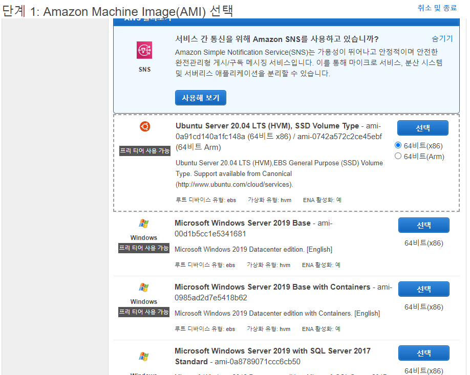

#EC2 인스턴스
>  https://jonnung.dev/kubernetes/2020/03/01/create-kubernetes-cluster-using-kubeadm-on-aws-ec2/


AMI은 Ubuntu 20.04 LTS를 선택한다.

위와 같은 AMI를 선택하는 화면에서 참고한 AMI ID를 `${IMAGE_ID}`변수에 넣어둔다.
```
export IMAGE_ID="ami-0a91cd140a1fc148a"
```
EC2 인스턴스에 SSH 접속을 위한 키페어를 만든다.
```
aws ec2 create-key-pair \
  --key-name k8s \
  --output text \
  --query 'KeyMaterial' > k8s.id_rsa

chmod 600 k8s.id_rsa
```

## 쿠버네티스 마스터 노드용 EC2 생성
```
export MASTER_INSTANCE_ID=$(aws ec2 run-instances \
    --associate-public-ip-address \
    --image-id ${IMAGE_ID} \
    --count 1 \
    --key-name k8s \
    --security-group-ids ${SECURITY_GROUP_ID} \
    --instance-type t2.micro \
    --private-ip-address 10.1.1.10 \
    --user-data "name=master" \
    --subnet-id ${SUBNET_ID} \
    --output text --query 'Instances[].InstanceId')
```
```
aws ec2 create-tags \
  --resources ${MASTER_INSTANCE_ID} \
  --tags "Key=Name,Value=k8s-master"
```

## 쿠버네티스 워크 노드용 EC2 생성
```
export WORKER_INSTANCE_ID=$(aws ec2 run-instances \
    --associate-public-ip-address \
    --image-id ${IMAGE_ID} \
    --count 1 \
    --key-name k8s \
    --security-group-ids ${SECURITY_GROUP_ID} \
    --instance-type t2.micro \
    --private-ip-address 10.1.1.20 \
    --user-data "name=worker" \
    --subnet-id ${SUBNET_ID} \
    --output text --query 'Instances[].InstanceId')
```
```
aws ec2 create-tags \
  --resources ${WORKER_INSTANCE_ID} \
  --tags "Key=Name,Value=k8s-worker01"
```
