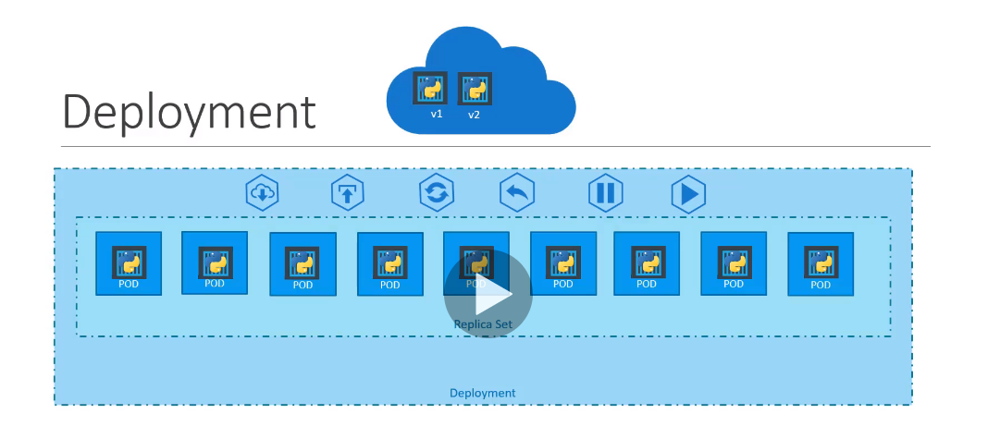

# Deployment
## Concept

From the left,
* deploy in a production environment
* upgrade instances seamlessly
* rolling updates
* roll back
* pause -> make the changes and then resume👇👇👇
* resume

## YAML
yaml형식은 replica-set과 거의 동일하다.  
kind만 Deployment로 변경하면된다.
[deployment-definition.yml](demo/deployment/deployment-definition.yml)

deployment는 replicaset보다 높은 상-하 관계에 있다
```
$ kubectl create -f deployment-definition.yml
$ kubectl get deployments
$ kubectl get replicaset
$ kubectl get pods
```
