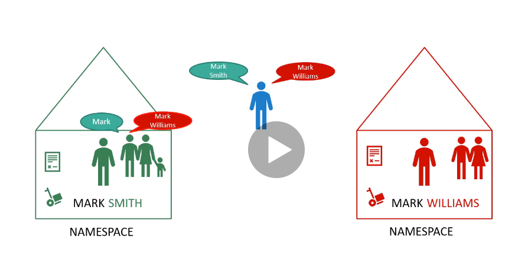
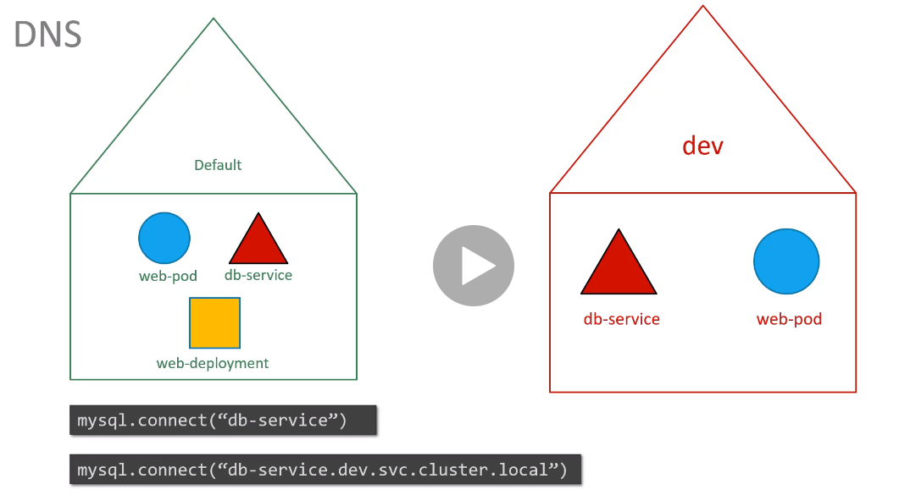
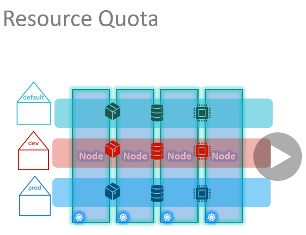

# Namespaces
동일한 이름을 가진 리소스의 중복을 방지하기위해서 namespace를 사용하여 공간을 나눔  


학습중이거나,작은 클러스터에서는 namespace를 신경쓸 필요없고, default를 사용해도 된다.  
예를 들어, dev / production namespace가 있다면, 실수로 production 환경의 리소스를 변경할 일이 생기지 않는다.  
그리고 각 namespace 별로 누가 무엇을 할 수 있을지에 대한 정책을 설정할 수 있다.  

namespace별로 다른 자원을 할당할 수 있다.  

## Kubernetes 기본 namespace
### Default
기본적으로 pod를 생성하면, 생성되는 공간

### Kube-system
DNS서버, network 등 사용자가 삭제하면 안되는 요소들

### Kube-public
모든 유저가 사용할 수 있는 요소들이 생성되어 있음

### DNS


예로 dev namespace에서 db-service에 접근하려면,  
mysql.connect("db-service")
만약 prod namespace의 db-service에 접근하려면,  
mysql.connect("**db-service.dev.svc.cluster.local**")  처럼하면 된다.

### CMD
```
$ kubectl create -f pod-definition.yml
$ kubectl create -f pod-definition.yml --namespace=dev
```
혹은, yaml에 추가
```
metadata:
  namesapce: dev
```
```
$ kubectl create -f namespace-dev.yml
```
```
$kubectl create namespace dev
```
### namespace switch
기본적으로 사용하는 namespace를 변경
```
$ kubectl config set-context $(kubectl config current-context) --namespace=dev
```

## Resource Quota

namespace별로 자원을 나눔  
[compute-quota.yaml](./demo/namespace/compute-quota.yaml)
```
$ kubectl create -f compute-quota.yaml
```
