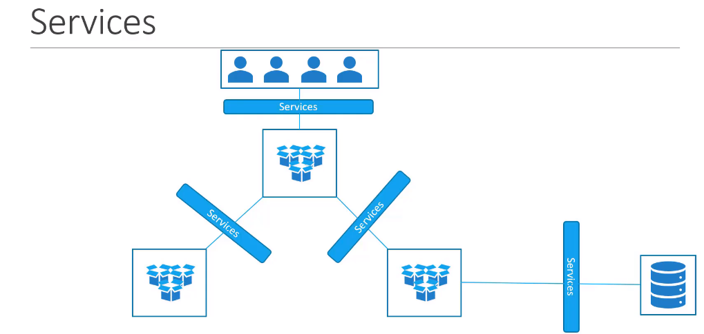
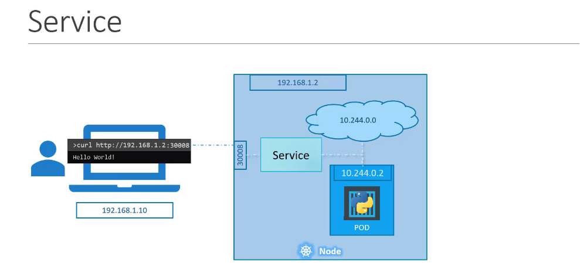
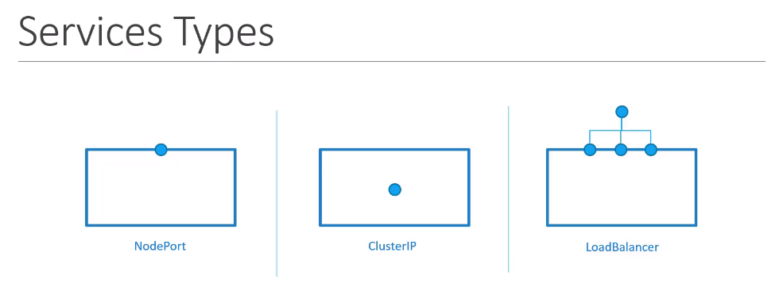
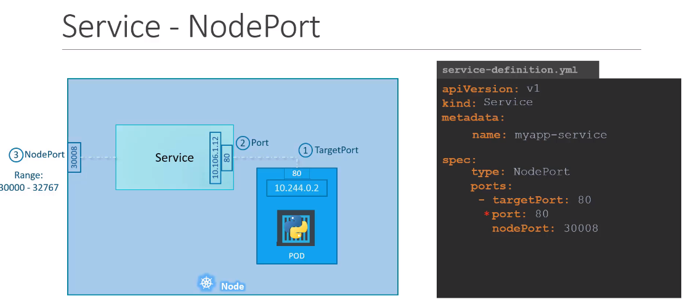
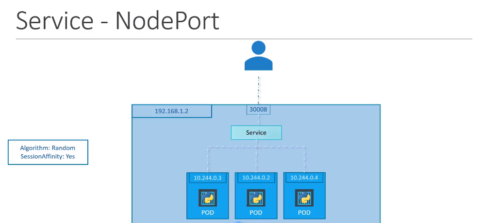
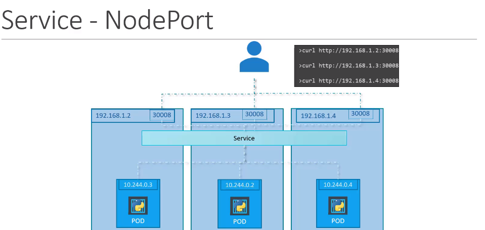

# Services
Service는 어플리케이션이 다른 어플리케이션이나 유저에게 연결하게 도와준다.  

예를 들어, 어플리케이션이 파드 그룹에 있고,  프론트엔드와 다른 그룹에서 백엔드 프로세스 그리고 서드파티 어플리케이션을 제공하기 위하여 다양한 섹션에서 동작중이면 서비스는 이를 연결해 준다.


## Services Types

* NodePort
내부 POD 가 노드의 포트에 접근할 수 있게 한다.
* ClusterIP
서비스가 프론트엔드나, 백엔드 서버와 같이 다른 서비스끼리 통신할 수 있도록 클러스터 내부터 가상 IP를 생성한다.
* LoadBalancer
지원하는 클라우드 provider 에서 우리의 서비스에 대한 로드밸런서를 규정한다.

## NodePort

3가지의 포트를 확인할 수 있다.  
1. 실제 웹서버가 동작하는 80 포트 ( targetPort )
2. 서비스 자체의 포트 ( port )
* 서비스는 고유한 IP 주소를 갖는다. IP 주소는 Cluster IP라고 부른다.
3. 노드가 가지고있는 포트, 외부에서 웹서버를 접근할 수 있는 포트 ( nodePort )

## Manifest
위 1, 2, 3번 포트는 각 targetPort, port, nodePort로 지정한다.  
문제는 targetPort (예시> 80)로 80포트를 사용하면 수백개의 파드에서 80포트를 사용하고 있을 수 있다.  
이 경우 label과 selector를 사용하여 지정한다.  
selector의 자식인자는 pod를 생성할 때 사용한 label의 자식값을 그대로 사용하면된다.
```
apiVersion: v1
kind: Service
metadata:
  name: myapp-service
spec:
  type: NodePort
  ports:
    - targetPort: 80
      port: 80
      nodePort: 30008
  selector:
    app: myapp
    type: front-end

``` 
```
$ kubectl create -f service/service-definition.yml
service/myapp-service created
$ kubectl get svc
NAME            TYPE       CLUSTER-IP    EXTERNAL-IP   PORT(S)        AGE
myapp-service   NodePort   10.96.63.21   <none>        80:30008/TCP   3s

```
### Nodeport for multiple pods
만약, 동일한 레이블을 가진 여러개의 pod가 있을 경우, 내부에 있는 로드밸런서로 외부의 요청을 알아서 처리해 준다.  


### Nodeport for multiple nodes

서비스는 클러스터 내부의 모든 노드에 걸쳐 생성된다.  
클러스터에 있는 노드는 동일한 포트를 사용하여 접근가능하다.
