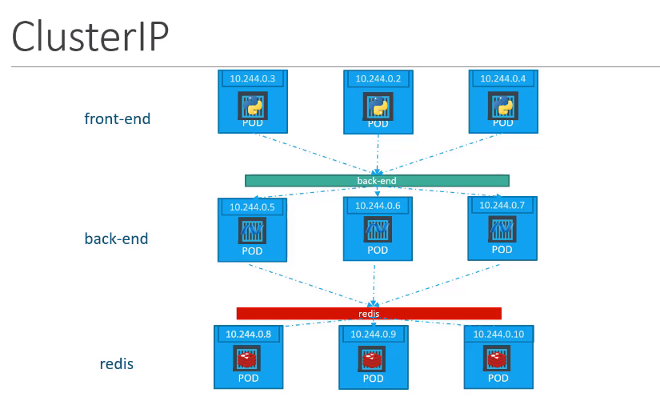

# ClusterIP
## 예시  

frontend에서 backend로 통신을 하고자 한다.  
pod마다 고유의 IP를 가지기 때문에, 통신을 할 수 있지만, POD의 IP는 고정 IP가 아니다.  
즉, POD의 IP에 의존을 한다면, POD가 다운되거나 재시작되었을 때, IP가 변경된다.  

쿠베네티스의 Service는 여러 pod에서 받은 요청을 받아서 다른 여러 pod로 요청을 보내는 기능을 제공한다.  

예를들어, 백엔드 POD를 위해 생성된 서비스는 모든 백엔드 POD가 그룹화하고, 다른 POD와 연동되는 단일 인터페이스를 제공한다.  
  
이러한점은 쿠버네티스 클러스터에서 운영되는 마이크로서비스 기반의 어플리케이션이 쉽고 효율적으로 배포하게 한다.  
 
각 서비스는 다른 pod에서 서비스를 접근하기 위해서 사용할 클러스터 내부에 할당된 IP 이름을 가진다.

이러한 타입의 서비스를 clusterIP라고 부른다.

```
apiVersion: v1
kind: Service
metadata:
  name: back-end
spec:
  type: ClusterIP
  ports:
    - targetPort: 80
      port: 80
  selector:
    app: myapp
    type: back-end

```
* targetPort : backend 서버 포트
* port : service 포트
