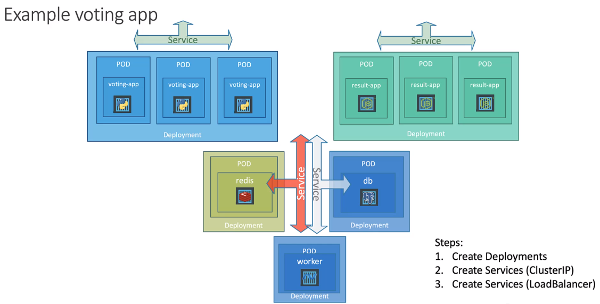
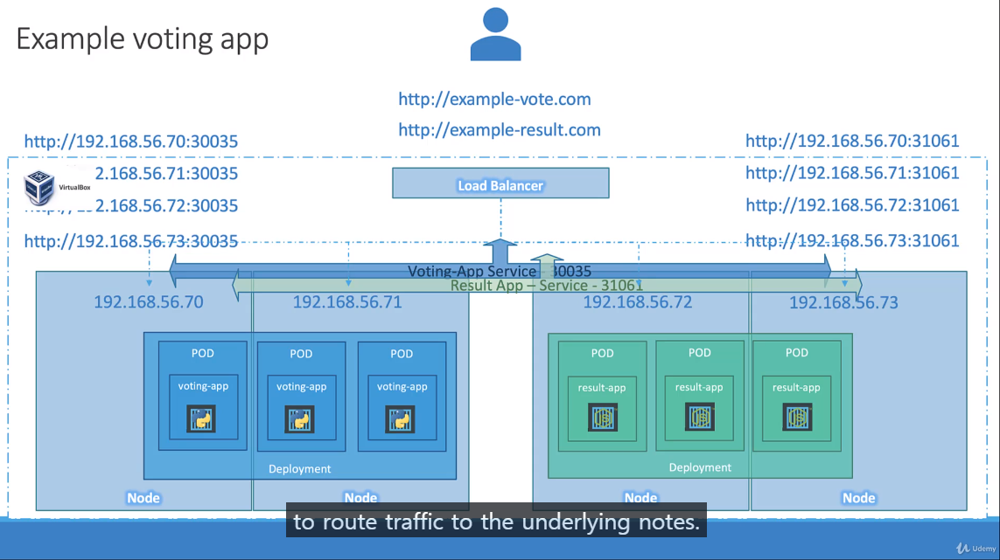

# Service - Load Balancer
## 예시


### Front-end

service는 전체 노드에 걸쳐 적용이 된다.  
그러므로 외부에서는 각 서버IP:port를 이용하여, 각 서비스에 접근을 할 수 있다.  
하지만 유저는 IP와 포트를 사용하여 접속하지를 않는다.  
하나의 URL에 매핑을 시키려면 어떻게 해야할까??
쿠버네티스의 로드밸런스가 이를 도와준다.  
하지만, 쿠버네티스의 로드밸런스는 GCP, AWS, AZURE와 같은 클라우드 제공자 ( Cloud Provider )에서만 적용 가능하다.  

즉, 개인 서버, 온프로미스, VMware같은 곳에서는 사용할 수 없다.  
그 대신 노드 포트 세팅을 통해서 동일한 효과를 기대할 수 있다.  

로드밸런서 세팅은 서비스 type을 LoadBalancer로 하면된다.

```
apiVersion: v1
kind: Service
metadata:
  name: myapp-service
spec:
  type: LoadBalancer
  ports:
    - targetPort: 80
      port: 80
      nodePort: 30008
```
