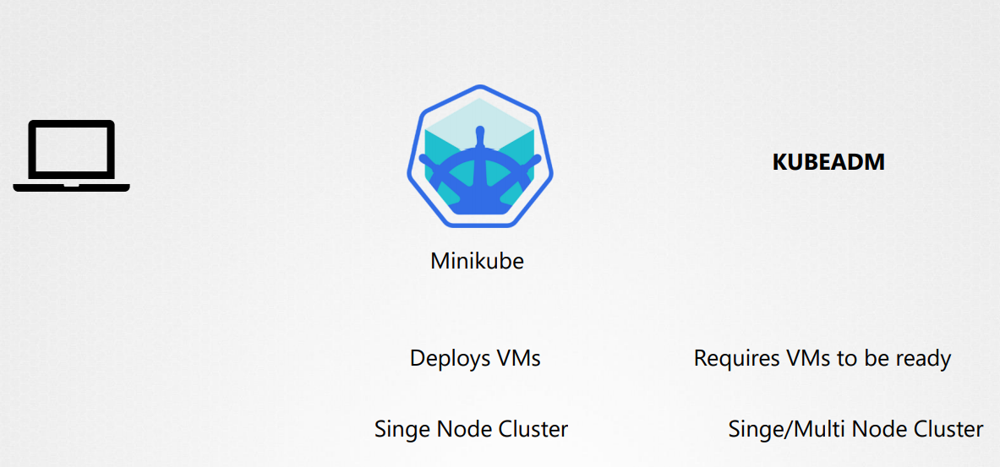
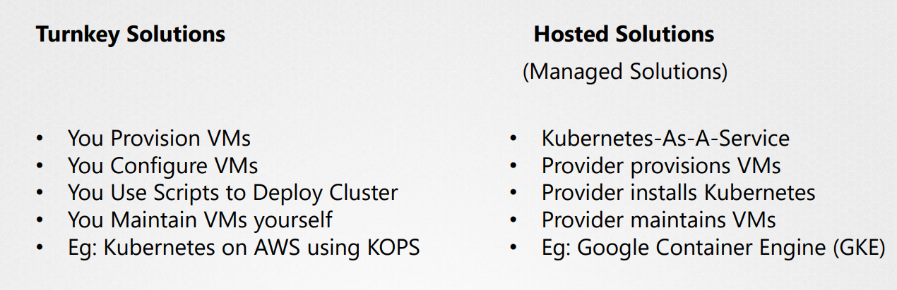
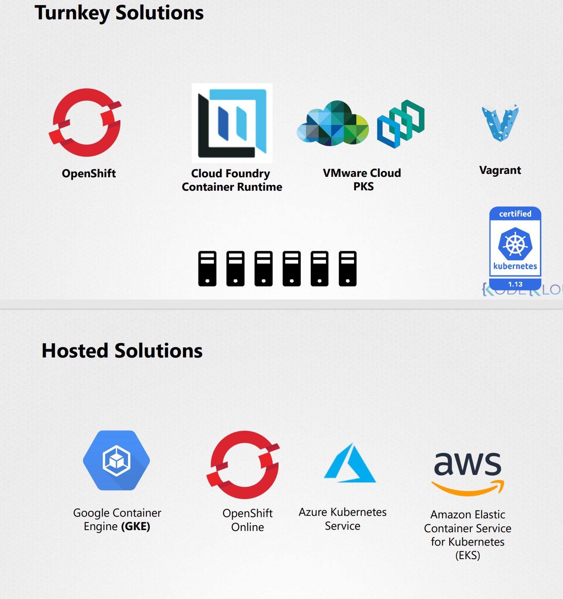

# Design a Kubernetes Cluster
쿠버네티스를 다양한 환경에서 구축할 수 있다.

## 시작하는 여러가지 방법
### 첫번쨰 조건 - Linux Machine
초기에 세팅을 도와주는 여러 솔루션을 사용하면 쉽게 구축할 수 있다.

* 윈도우즈를 지원하는 바이너리가 없다.

로컬머신에서 간단하게 쿠버네티스를 구축해 보려면 **Minikube** 가 적절하다.

싱글 노드 클러스터나 Minikube를 사용하면 쉽게 구축가능

kubeadm을 사용하여 싱글 노드 또는 멀티 노드 클러스터를 구축 가능

싱글 노드 클러스터 And Minikube VS kubeadm 멀티클러스터
* 싱글 노드 클러스터 또는 Minikube는 VM을 알아서 지원하는 설정대로 프로비전한다.
* kubeadm은 VM이 이미 프로비저닝 되어 있는 상태로 구축해야한다.

### Support Solutions
사설 그리고 public cloud 환경에서 구축하는 방법을 두가지 방법으로 카테고리화 할 수 있다.
* Turnkey Solutions
* Hosted Solutions

Openshift는 인기있는 온프로미스 쿠버네티스 플랫폼이다. by RedHat

오픈소스 컨테이너 어플리케이션 플랫폼이다. 

쿠버네티스 구조를 생서앟고 관리하는데 좋은 툴과 GUI를 제공하고 CI/CD 파이프라인과 쉽게 연동된다.

 
