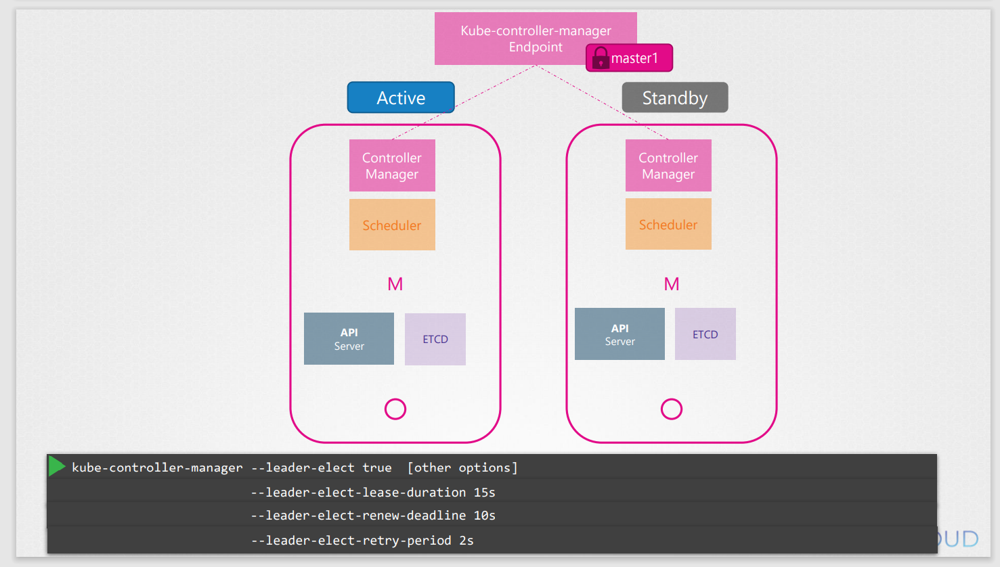
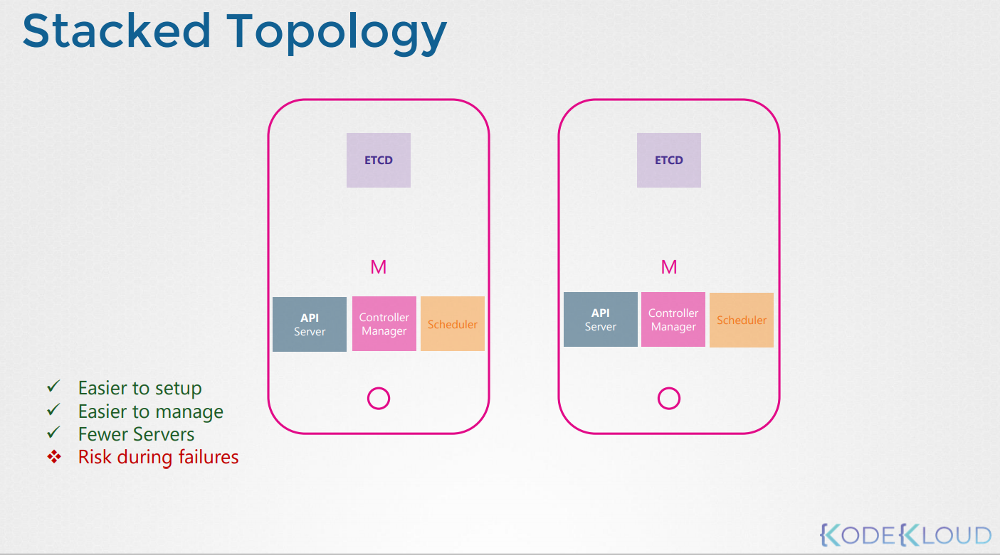
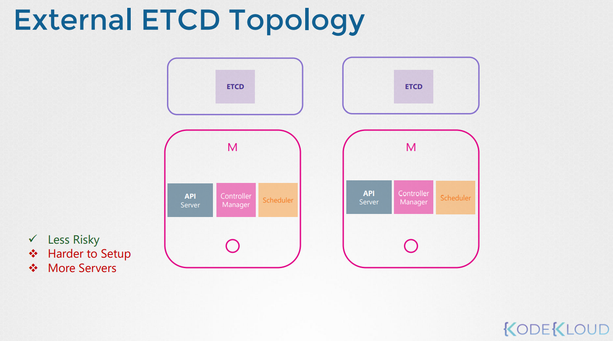
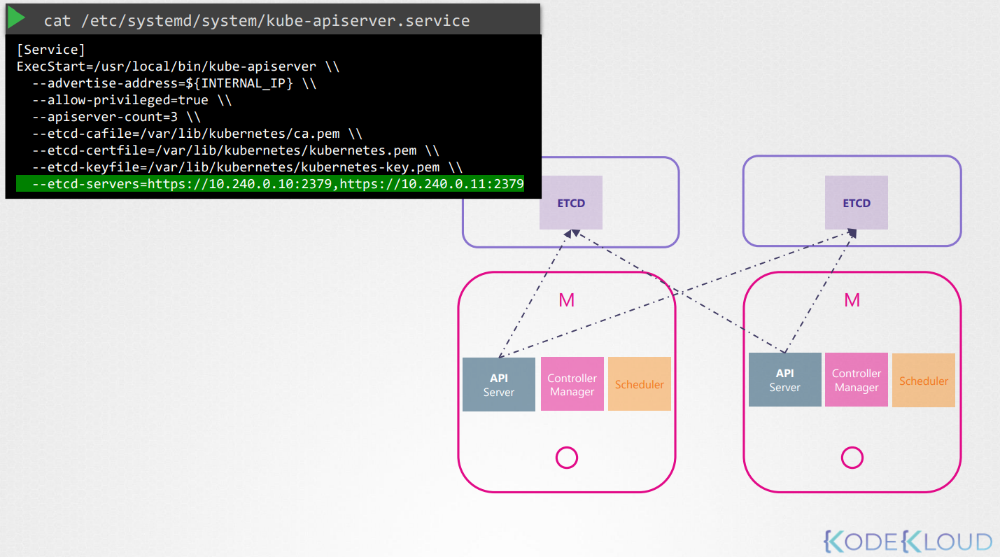
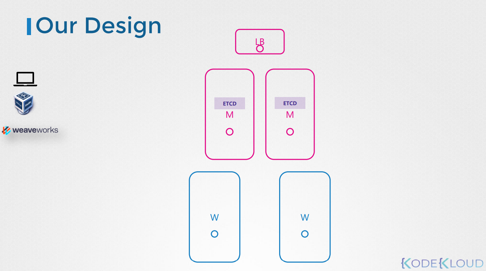

# Configure High Availability
고가용성에 대해서 알아본다.

만약 클러스터에서 마스터 노드가 장애가 나면 어떻게 될까?

워커노드가 살아있는한 컨테이너는 정상적으로 동작하고, 어플리케이션도 정상적으로 동작한다.

유저는 무언가 실패하기 전까지 어플리케이션에 접근 가능하다.

예를들어 워커노드에 있는 컨테이너 또는 POD가 crash가 났다고하자.

만약 파드가 리플리카셋의 일부일 경우, 마스터에 있는 리플리케이션 컨트롤러가 워커를 새로운 pod로 로드한다.

하지만 마스터가 사용할 수 없고 마스터에 있는 컨트롤러와 스케쥴러 또한 사용할 수 없게된다.

그렇게 되면 노드로 새로운 파드를 만들어주거나 스케쥴링해 줄 것이 없어진다.

비슷하게, kube-api 서버도 사용할 수 없게 되고, 외부에서 `kubectl` 또는 `API` 를 통해서 클러스터에 접근할 수 없게된다.

이것이 바로 왜 운영환경에서 다중 마스터 노드를 고가용성을 위해서 구축해야하는 이유이다.

고가용성 구성은 단일 장애 지점을 방지하기 위해 클러스터의 모든 구성 요소에 중복 포인트를 준다.

마스터노드, 워커노드, 컨트롤 플레인 컴포넌트, 어플리케이션 등 이미 리플리카셋과 서비스들의 형태로 다중 복제를 제공한다.

이번 강의에서는 마스터 노드와 컨트롤 플레인에 집중해서 학습한다.

## 마스터 노드 구성요소
마스터 노드의 구성요소는 이미 학습했다
* 컨트롤 플레인 컴포넌트
  * API
  * Controller Manager
  * Scheduler
  * ETCD

고 가용성을 위하여 추가적인 마스터노드를 사용하면 같은 컴포넌트다 새로운 마스터 노드에서도 동작하게 된다.

### 멀티 마스터 노드는 어떻게 동작하는가?
동일한 컴포넌트의 여러 인스턴스를 실행할 수 있는가?

같은 일을 두번 할까?

그들은 어떻게 그들 사이에서 일을 공유할까??

각 구성요소들이 무엇을 하느냐에 따라 다르다.

API서버가 요청을 받고 클러스터에 정보를 제공하는 처리를 하는 것은 안다.

한번에 하나의 요청을 처리한다. 그래서 모든 클러스터 노드들에 있는 API서버들은 active 모드에서 동시에 살아있고 동작한다.

`kubectl` 유틸리티가 작업을 완료하기 위하여 API server와 통신하는 것을 알고 있으면 `kubectl` 유틸리티가 포트 6443에서 마스터 노드로 도달하도록 지시한다.

API 서버가 수신하는 곳이며 kube-config 파일에서 구성된다.

이때 2개의 마스터 노드가 있는데 `kubectl`은 어느 마스터 노드로 가게될까?

요청을 2개의 마스터 노드중에 하나에 보낼 것이다. 동시에 두곳에 다 요청을 보내는 것은 불가능하다.

그래서 마스터 노드 앞단에 API 서버들 사이에서 트래픽을 분산시켜줄 로드밸런서를 두는 것이 좋다.

그러면 `kubectl` 유틸리티는 로드밸런서를 바라보게 하는 것이 좋다.

이러한 목적으로 NGINX나 HA proxy를 사용할 수 있다.

### Controller manager and Scheduler
이들은 클러스터의 상태를 확인하고 액션을 취한다.

예를 들어, POD의 상태를 항상 확인하고, pod가 fail날 떄 새로운 파드를 생성하는 것과 같은 행위를 하는 리플리케이션 컨트롤러같은 컨트롤러로 컨트롤러 매니저는 구성되어있다.

만약 다중 인스턴스로 병렬로 동작할 경우, 중복 동작되어 실제로 필요한 것보다 많은 파드가 생성될 것이다.

스케쥴러도 동일한 문제가 발생할 수 있다.

그러므로 이들은 병렬로 동작하면 안되고 **ACTIVE** 와 **STANDBY** 모드로 동작해야한다.

그럼 누가 둘중 하나가 ACTIVE고 PASSIVE인지 정할까?

이는 **leader election process**를 통해 이뤄진다.

그럼 어떻게 동작하는가?

컨트롤러 매너저를 예로 들어보자. 컨트롤러 매너저 프로세스가 설정되면, 기본으로 `true`로 설정되어있는 **leader elect option**을 명시해야한다.

컨트롤러 관리자 프로세스가 시작될 때, 이 옵션을 사용하면 kube-controller-manager 엔드 포인트라는 이름의 kubernetes 에서 엔드포인트 오프젝트에 대한 `lease` 또는 `lock`을 얻으려 한다.

어느쪽이든 먼저 endpoint를 업데이트 한다.

이 정보는 `lease`를 얻고 둘 중 하나를 선택한다.

다른 것은 `passive`가 되고 기본적으로 15초로 설정되어있는 `leader-elect-lease-duration` 옵션에 따라서 `lease duration`을 lock한다.

그후 active process는 `leader-elect-renew-dealine`에 기본값으로 지정된 10초마다 `lease`를 재생성한다.

두 프로세스 모두 `leader-elect-retry-period` 옵션에 기본값으로 지정된 2초마다 leader가 되기 위해서 시도한다.

이러한 방법으로 첫 번째가 크래쉬나도 두번째 프로세스가 lock을 획득하고 leader가 된다.

scheduler는 비슷한 접근을 하고 같은 command line 옵션을 가진다.

### ETCD
ETCD가 마스터 노드에 포함되어있는 형태는 Stacked Topology라고 부른다.
* 장애에 취약하다.

ETCD를 마스터 노드에서 분리된 형태를 External ETCD Topology라고 부른다.
* 장애에는 강하지만 구축이 힘들고, 서버가 stacked topology에 비해 2배로 필요로한다.

기억할 점은 API서버는 ETCD 서버와 통신하는 유일한 컴포넌트이고 api 서비스 설정 옵션을 보면 ETCD 서버를 설정하는 옵션이 있다.

따라서 사용하는 토폴로지에 관계없이, 같은 서버에 있든 외부에 있든 ETCD 서버에 대한 설정을 해야한다.

 
궁극적으로 API서버가 ETCD 서버로 정확한 주소를 가지는지에 대한 확신이 있으면된다.
 
기억할 점은 ETCD는 분산시스템이고 API서버 또는 이와 통신하려는 다른 컴포넌트는 모든 인스턴스에서 ETCD 서버에 도달할 수 있다.
 
가용한 ETCD 서버 인스턴스에 데이터를 쓰고 읽을 수 있다.

그것이 가능한것은 kube-apiserver설정에 etcd-servers 리스트를 명시했기 때문이다.

### 정리
초기에는 하나의 마스터 노드에 두개의 워커노드를 사용했으나,

이제는 두개의 마스터노드, 두개의 워커노드 그리고 하나의 로드밸런서를 사용하여 총 5개의 서버를 사용하여 쿠버네티스를 구축한다.

