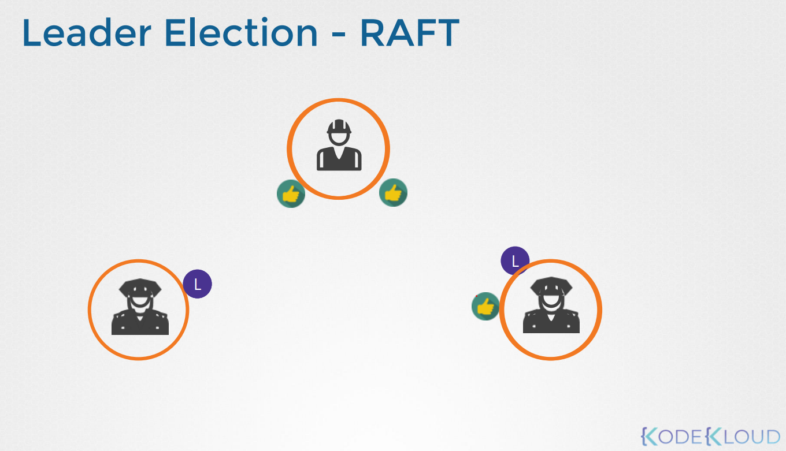
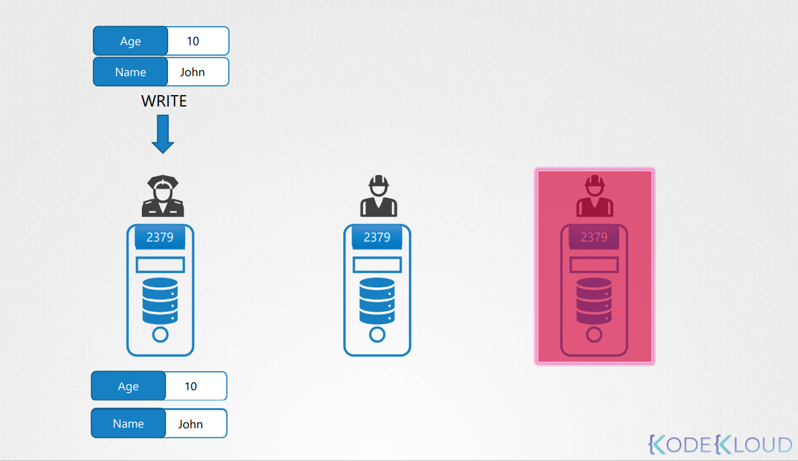
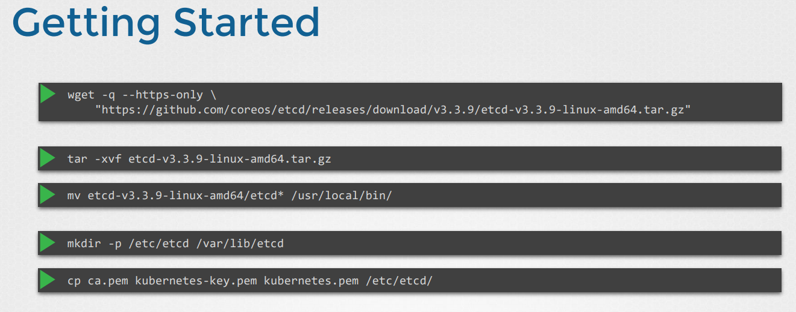
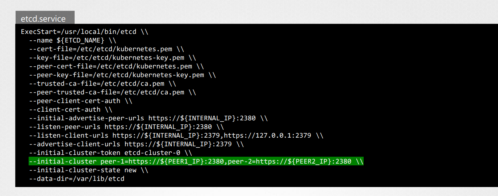
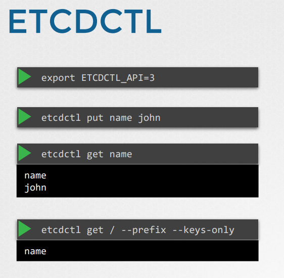

# ETCD in HA
## ETCD란?
간단하고 안전하고 빠른 분산된 신뢰할 수 있는 키-값 저장소이다.

ETCD 는 분산처리를 `RAFT` 프로토콜을 이용해서 구현했다.

클러스터가 설정되면 리더가 정해지지 않은 3개의 노드가 생긴다.

RAFT 알고리즘은 초기 요청을 처리하기위해서 랜덤 타이머를 사용한다.

  
예를 들어, 
* 랜덤 타이머는 3개의 관리자에서 시작된다. 
* 타이머를 완료한 첫번째 관리자는 리더가 될 권한을 요청하는 다른 노드에 요청을 보낸다.
* 요청을 받는 다른 관리자는 투표로 응답하고 노드는 리더 역할을 맡는다.
* 이제 리더로 선출되었으므로 정기적으로 다른 마스터에게 알림을 보내 리더의 역할을 계속 수행하고 있음을 알린다.
* 리더가 다운되거나 네트워크가 끊어져서 다른 노드가 리더로 부터 알림을 받지 못한 경우, 노드는 그들 사이에서 재 선출 프로세스를 시작하고 새로운 리더가 식별된다.

만약 데이터를 쓰는데, 3번째 노드가 죽었을 경우, 데이터 쓰는 것을 완료하였다고 해야할까 ? 아니면 세번째 노드가 살아날때까지 기다려야할까??

이 경우, Majority (주된) 케이스를 보고 성공 여부를 판단한다.

정확한 용어로 이를 `Quorum`이라고 부르고, 이는 `N/2 + 1`를 의미하낟.

Quorum 이하 값을 가지면, 쓰기는 진행되지 않는다.

만약 ETCD 노드가 2개의 경우, 2/2 +1 = 2 이기 때문에 Quorum값을 가지지 않는다.

그래서 최소 3개의 노드를 사용하라고 한다.

짝수 갯수보다는 홀수 갯수가 좋다.

그이유는 특정한 시나리오에서 네트워크가 분리되었을 때, Quorum숫자를 지켜주기 위해서이다.

> 그러나 네트워크가 다른 방식으로 분할되어 노드가 두 노드간에 균등하게 분산되면 이제 각 그룹에는 3 개의 노드 만 있습니다.  
>  하지만 원래 6 개의 관리자 노드가 있었기 때문에 클러스터가 활성 상태를 유지하기위한 쿼럼은 4입니다.  
>  그러나 여기에서 그룹을 살펴보면이 그룹에는 쿼럼을 충족 할 관리자가 4 명 없기 때문에 클러스터에 오류가 발생합니다.  

## 설치 방법

`initial-cluster` 옵션은 peer의 정보를 보내준다. 이 설정이 etcd 서비스가 클러스터의 포함된 줄을 인식하게 한다.

설치된 후 etcdctl 유틸리티를 사용하여 데이터를 저장하고 검색하도록 구성한다.
예제 >  

__

 
