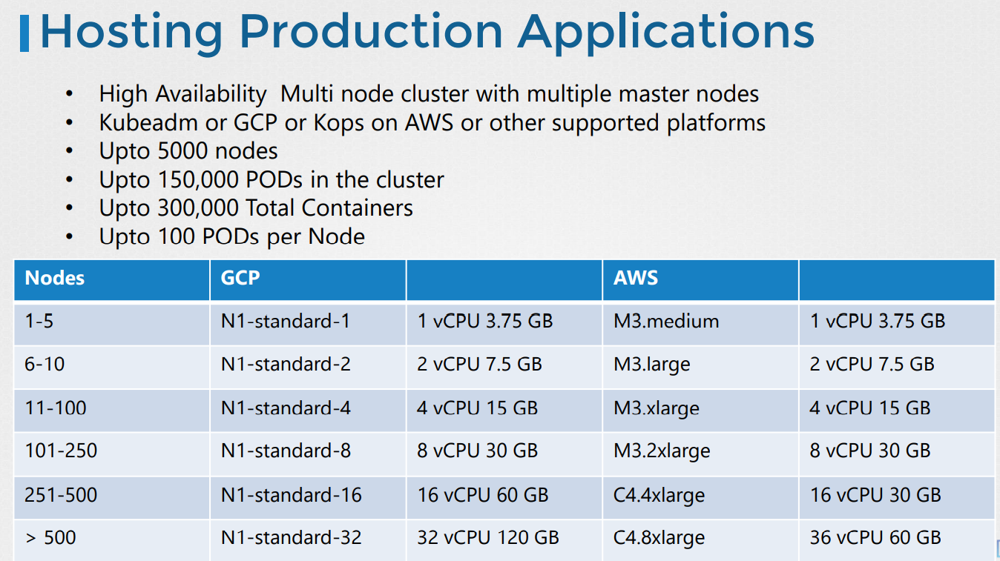

# Design A Kubernetes Cluster
클러스터를 설계하기전 조사해야할 점
* Purpose
  * Education
  * Development & Testing
  * Hosting Production Applications
* Cloud or OnPrem?
* Workloads
  * How many?
  * What kind?
    * Web
    * Big Data/Analytics
  * Application Resource Requirements
    * CPU Intensive
    * Memory Intensive
  * Traffic
    * Heavy traffic
    * Burst Traffic

## Purpose
### Eductaion
minikube 또는 로컬 vm에 kubeadm을 이용하여 single node cluster를 배포하거나 GCP 또는 AWS 와 같은 cloud provider를 사용한다.

### Development & Testing
Test 환경
* Single 마스터와 멀티 워커 노드를 가진 멀티 노드 클러스터 가지는 것이 좋다.
* 다시 kubeadm이 적절한 툴이다. 
* 또는 클라우드 환경에서 운영될 경우 빠르게 GCP, AWS 또는 에저의 AKS를 사용해서 클러스터를 프로비저닝 할 수 있다.

운영 환경
* 고가용성의 멀티 마스터 노드의 멀티 노드 클러스터가 추천됨
* 멀티 마스터 노드를 이용한 고가용성 셋업은 추후 이야기함
* 이것은 kubeadm 또는 GCP 와 같은 클러스터 환경에서 구축 가능
* 5000개가 넘는 노드를 가진 클러스터를 만들 수 있고, 150k 개의 pod가 클러스터에 있을 수 있으며
* 총 300,000 컨테이너가 각 노드에 100개 이상의 pod가 클러스터의 크기에 따라 배포될 수 있다.

* 노드의 숫자에 따라서 GCP나 AWS에서 가져야하는 자원의 수가 다르다.
* OnPrem에서 배포할 경우, 위의 자원을 참고하여 클러스터를 구축한다.

## Cloud or OnPrem
### OnPrem
* on-prem 환경에서 kubeadm은 매우 유용한 툴이다.

* Google Container Engine은 쿠버네티스 클러스터가 GCP에 매우 쉽게 프로비저닝 하도록 도와준다.
* 원 클릭 업그레이드는 클러스터를 유지관리하는데 매우 쉽게 해준다.

* Kops는 AWS에 쿠버네티스 클러스터를 배포하는데 좋은툴이다

* Azure Kubernetes Service (AKS)는 Azure에 배포하기 좋다.

워크로드 설정에 따라서 노드와 디스크 설정이 달라진다.

### Storage
* 고성능 워크로드는 SSD Backed 스토리지에 의존한다.

* 다중 병렬 접근은 스토리지 기반하여 네트워크를 고려한다.
* 다중 POD가 볼륨 접근을 공유할때, 스토리지 세션에서 다뤘던 **Persistent Storage** 사용을 고려해라.

* 다양한 스토리지 클래스를 정의하고 알맞은 어플리케이션에 알맞은 클래스를 할당하는 것을 고려한다.

* Label nodes with specific disk types
* Use Node Selectors to assign applications to nodes with specific disk types
### Node
* 쿠버네티스 클러스터를 구성하는 노드는 물리 머신을 수 도있고 가상 머신일 수도 있다.
* 하나의 마스터노드와 두개의 워커노드로 총 3개의 노드를 보통 구성할 것이다.
* 우리는 마스터노드가 kube-api서버, etcd 와 같은 control plane 컴포넌트를 호스팅하는 것을 안다.
* 워커노드는 워크로드를 호스팅한다.
* 하지만 이것은 엄격하게 정해진 것은 아니다.
* 마스터 노드도 노드로서 워커로드를 호스트할 수 있다.
* 제일 좋은 방법은 운영환경에서 특히 마스터 노드는 컨트롤 플레인 컴포넌트를 위한 용도로만 사용하는 것이다.

* kubeadm와 같은 디플로이먼트 툴은 마스터 노드에 taint를 추가하여 마스터노드에서 워크로드가 동작하지 않게 보호한다.

* 64 비트의 리눅스 시스템을 노드로 사용해야한다.

* 하지만 대규모 클러스터에서는 ETCD 클러스터를 마스터노드에서 자체 클러스터 노드로 분리하도록 선택할 수 있다.
* 자세한 것은 다음 강의에서 설명 
* 고가용성 클러스터를 디자인하는데 고려할 점이다.

* 

