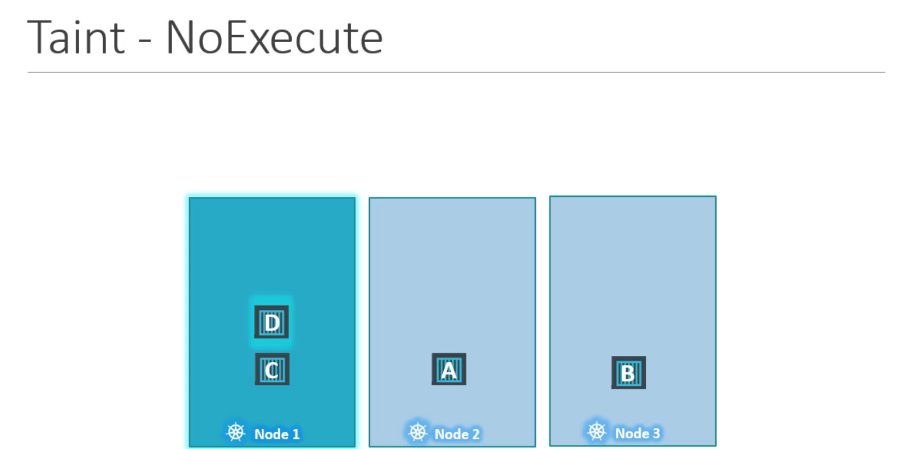
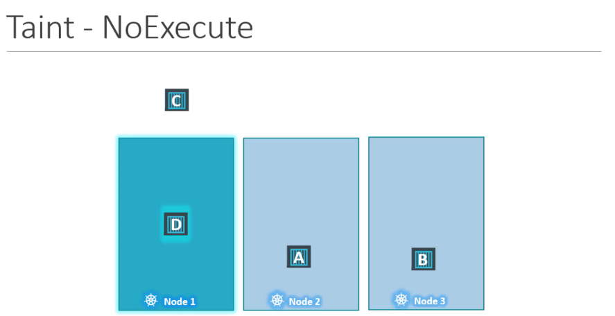

# Taints and Tolerations
* Taint -> node에 설정  
* Toleration -> Pod에 설정

intoleration -> Taint된 노드에 접근 불가  
toleration 이 있으면 Taint된 노드에 접근 가능

## Taints - Node
`kubectl taint nodes node-name key=value:taint-effect` 
POD가 위 설정(value:taint-effect)에 tolerate가 없으면 생기는 케이스
* NoSchedule : pod가 노드에 스케듈 되지 않음. 
* PreferNoSchedule : 시스템이 노드에 pod를 위치하는 것을 피하려는 상태. 하지만 이것은 보장(guaranteed)되지 않는다.
* NoExecute : 새로운 pod는 노드에 스케쥴되지 않고, 이미 노드에 존재하던 pod는 taint에 tolerate가 없는 pod라면 퇴거(evicted)된다.
`kubectl taint nodes node1 app=blue:NoSchedule`

### Taint 제거하기
`kubectl taint nodes master/controlplane node-role.kubernetes.io/master:NoSchedule-`

## Tolerations - PODs
`kubectl taint nodes node1 app=blue:NoSchedule`  
👇
[pod-definition.yml](../demo/taint_and_tolerations/pod-definition.yml)  
value 값을 모두 ""(double quotation)으로 감싸줘야한다. 
```
...
  tolerations:
    - key: "app"
      operator: "Equal"
      value: "blue"
      effect: "NoSchedule"
```

### Taint - NoExecute
  
**C pod will be killed.**  

 
 
Pod D가 node1에 toleration은 있지만 항상 D가 node1에 위치한다는 보장은 없다.  
pod가 어느 node에만 할당되게 하려면 `affinity`라는 계념을 사용한다.

지금까지는 worker node에 대해서만 알아봤는데, master node에도 pod가 할당될 수 있다.  
하지만 마스터 노드는 초기에 자동으로 pod가 스케쥴되지 않게 설정된다. 필요시 설정 변경이 가능하다.
```
$ kubectl describe node kubemaster | grep Taint
Taints:             node-role.kubernetes.io/master:NoSchedule
```
Taint 제거하기  
`kubectl taint nodes master/controlplane node-role.kubernetes.io/master:NoSchedule-`

---
# Test
### taint 생성
`kubectl taint node node01 spray=morpein:NoSchedule'
