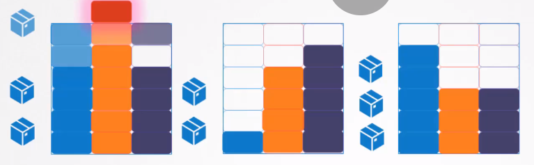

# Resource Limits
> https://www.udemy.com/course/certified-kubernetes-administrator-with-practice-tests/learn/lecture/14298678#overview

NODE 마다 CPU, MEM, DISK 자원이 할당 된다.  
pod는 각자 자신들이 사용하는 자원의 양을 가지고 node에 할당된다.  


node가 pod들을 먼저 할당하고 난 후, 다른 pod를 할당할 때 자원이 충분하지 않을 경우, 자원이 충분한 node로 스케쥴러가 할당한다.



아무 노드에도 할당할 수 있는 자원이 충족되지 않을 경우, pod를 pending 상태로 둔다. 그리고 오류 상태로 부족한 자원 상태를 알려준다.

## Resource Requests
최소로 요구되는 CPU와 Memory 스펙  
  
|CPU|MEM|DISK|
|:---:|:---:|:---:|
|0.5|256Mi||

pod에 자원 할당하는 방법
[pod-definition.yaml](../demo/resource/pod-definition.yaml)
```
...
spec:
  resources:
      requests:
        memory: "1Gi"
        cpu: 1
```

### Resource - CPU
1으로 지정되는 cpu 값의 진짜 의미는?

이 블록은 설명 목적으로만 사용됩니다. 반드시 0.5 아상의 값을 가질 필요는 없다. 0.1같은 값으로 설정 가능하다.  
0.1 CPU는 100m (millisecond)로 표현할 수 있다.
1m 보다 낮은 값을 설정할 수 있지만, 그렇게 하지 않는다. CPU 1개는 vCPU 1개와 동일하다.   
**( AWS에서 1vCPU, GCP에서 1Core, Azure에서 1Hyperthread)**

노드에 충분한 자원이 있을 경우, 컨테이너를 위하여 더 높은 CPU값을 요청할 수 있습니다.

### Resource - Memory
마찬가지로 메모리 또한 Mi 를 뒤에 붙여주는 방법으로 256 Mebibyte로 설정할 수 있다. 또는 상수값(268435356)을 모두 적어서 사용 가능  (bype단위로)  


|단위|값|
|---|---:|
|1G (Gigabyte)|1,000,000,000 bytes|
|1M (Megabyte)|1,000,000 bytes|
|1K (Kilobyte)|1,000 bytes|
|1Gi (Gibibyte)|1,073,741,824 bytes|
|1Mi (Mebibyte)|1,048m576 bytes|
|1Ki (Kibibyte)|1,024 bytes|

## Resource Limits
도커 컨테이너에서는 node의 자원을 사용하는데에 있어 한계가 없다. 1개의 CPU를 할당하더라도, 필요로 하면 최대한 자원을 사용한다.
다시 말해, 다른 노드나 기타 컨테이너의 자원도 사용하여, 문제를 발생시킬 수 있다는 것이다.  

하지만 pod는 기본적으로 리소스 사용에 제한을 둘 수 있다.
pod는 기본적으로 1 vCPU를 제한으로 둔다. 따로 설정하지 않으면 1 vCPU로 제한이 걸린다.
Memory는 512 Mi로 제한을 둔다.

pod에 자원 제한하는 방법 ( pod에 있는 각 container에 자원 제한을 둠)
[pod-definition.yaml](../demo/resource/pod-definition.yaml)
```
...
spec:
  resources:
      requests:
        memory: "1Gi"
        cpu: 1
      limits:
        memory: "2Gi"
        cpu: 2
```

pod가 제한한 자원 이상을 사용하면 어떻게 될까?   
CPU의 경우 쿠버네티스가 CPU가 지정된 제한을 초과하지 않도록 CPU를 조절한다.  
컨테이너는 제한된 자원 이상의 CPU를 사용할 수 없다.

하지만 메모리의 경우는 제한된 자원 이상의 값을 사용할 수 있다. 그래서 pod가 제한된 자원 이상의 값을 사용하려 한다면, pod는 중지(terminated)될것이다.  

