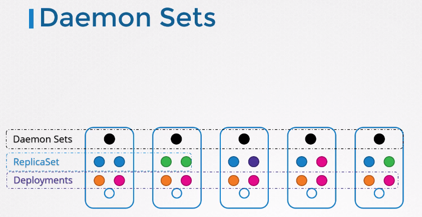
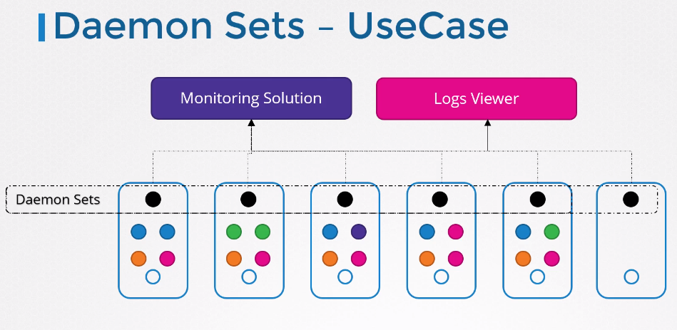

#DaemonSets
지금까지 replica sets와 deployments를 사용하여 클러스터내에 다른 노드들에 다양한 pod를 배포하였다.  
우리는 다양한 worker node에서 어플리케이션의 다수의 복제본을 사용할 수 있도록 하였다.  

## 설명
  
daemon Set은 replica Set과 비슷하다. pod의 여러 인스턴스를 배포하는 역할을 한다.  
하지만, 클러스터내의 각 노드들에 pod의 하나의 복제본을 실행시킨다.


클러스터에 새로운 노드가 추가된다고하여도, pod의 복제본은 자동으로 node에 추가된다. 그리고 노드가 사라지면, pod도 사라진다.  
Daemon Set은 파드의 하나의 복제본이 반드시 클러스터내 모든 노드에 존재하는것을 보장한다.

## 사용 예시
  
예로, 모니터링 에이전트나 로그 콜렉터같이 클러스터내 모든 노드에서 사용되야할 경우 사용된다.  
모니터링 에이전트를 배포하기에 최적이다.

클러스터의 모든 워커 노드에서 반드시 필요한 컴포넌트가 kube-proxy가 있다. kube-proxy가 demon set의 좋은 예이다.

네트워크 솔루션들(예. weave-net)도 좋은 예시이다.

## DaemonSet Definition
예제 > [daemonset-definition.yaml](../demo/daemonset/daemonset-definition.yaml)
```
apiVersion: apps/v1
kind: DaemonSet
metadata:
  name: monioring-daemon
spec:
  selector:
    matchLabels:
      app: monitoring-agent
  template:
    metadata:
      labels:
        app: monitoring-agent
    spec:
      containers:
        - name: monitoring-agent
          image: monitoring-agent

```

`kubectl create -f daemon-set-definition.yaml`

## Vuew DaenibSets
`kubectl get daemonsets`

`kubectl describe daemonsets monitoring-daemon`


## How does it work?
pod를 노드에 어떻게 스케쥴 하고 모든 노드에 pod가 있는 것을 어떻게 알 수있을까?

> Q. 만약 모든 노드에 pod를 스케쥴해라고 한다면 어떻게 하면 될가??

A. 노드 이름 속성을 사용하여 스케쥴러를 넘기고 pod를 적절한 노드에 바로 위치시키는 것에 대해서 배웠었다.  
각 pod가 생성되기 전에 node name property를 모든 pod에 설정하는 것이다.

위 방법은 1.12 버전때 까지 사용했었던 방법이다.  

v1.12 버전 부터는 기본 스케쥴러를 사용하고 node affinity 룰을 사용하여 pod를 node에 스케쥴링 시켜준다.


## TIP
**DaemonSet yaml 파일을 만들 경우 팁!!**  
1. 쿠버네티스 공식 홈페이지에서 DaemonSet yaml 형식을 복사해서 사용한다.
2. `kubectl create deployment <name> --image=<image_name> --dry-run -o yaml > <file_name>.yaml`  
그 후, kind를 DaemonSet으로 변경해준다. 
