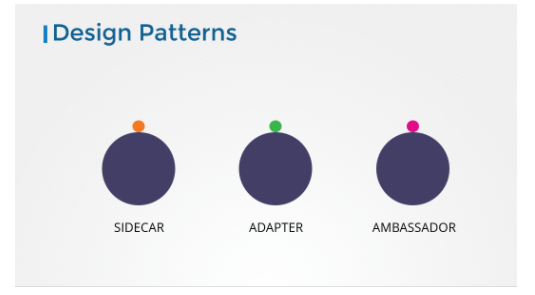

# Multi-container PODs Design Patterns
multi-container POD를 설계하는데, 3가지의 디자인 패턴이 있다.
1. Side car pattern : logging 서비스와 같은 형태
2. Adapter pattern
3. Ambassador patther

자세한 내용은 CKA에서 묻지않고 CKAD에서 물으므로 CKAD공부때 학습하기로함  

