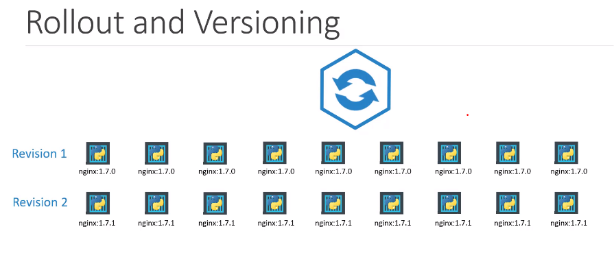
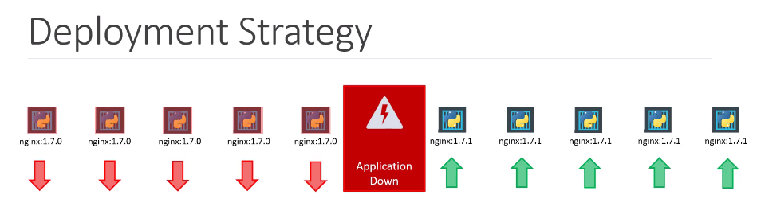
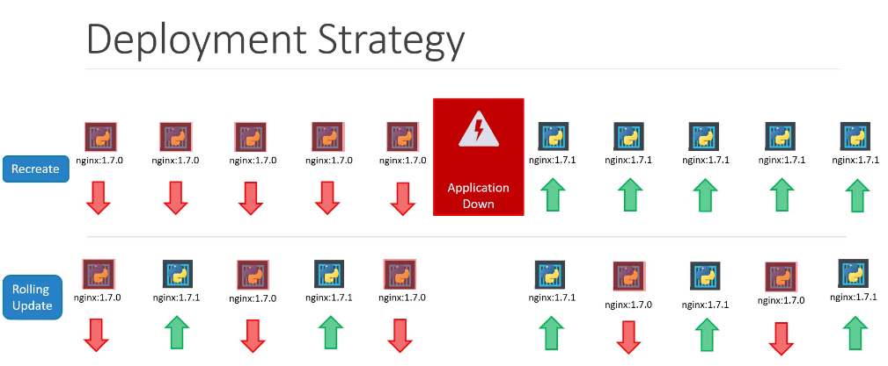

# Rolling Updates and Rollbacks
## Deployment Updates and Rollback
deployment에서 update와 rollback에 대해서 알아본다.

### Rollout and Versioning



처음으로 deployment를 생성하면 롤아웃이 트리거되고 새 롤아웃은 새 deployment 리비전을 만든다. 이것을 리비전 1이라고 부른다.

어플리케이션이 업그레이드될 때, 즉 어플리케이션의 버전이 올라갈 때, 새로운 롤아웃이 트리거 되고 새로운 디플로이먼트 리비전이 생성된다.  
이 새로운 리비전은 디플로이먼트에 변화가 생긴것을 감지하고 필요시 디플로이먼트를 롤백하도록 돕는다.

### Rollout Command
kubectl rollout status 명령어를 통해서 동작 중인 rollout 상태를 확인할 수 있다.  
kubectl rollout history 명령어를 통해서 리비전 정보와 디플로이먼트의 기록을 확인할 수 있다.
```
$ kubectl rollout status deployment/myapp-deployment
$ kubectl rollout history deployment/myapp-deployment
```

## Deployment Strategy
Deployment 전략에는 두가지 방법이 있다.  
예를들어, 5개의 웹어플리케이션 인스턴스의 리플리카가 배포되었다고 하자.

### Recreate Strategy
첫번째 방법으로, 모든 인스턴스를 제거하고 새로운 버전의 어플리케이션 인스턴스를 생성하는 방법이다.


첫번째 방법의 문제점은 인스턴스를 제거하는 동안에 서비스 다운이 생긴다는 것이다.  
이를 recreate strategy라고 부르고, 기본적용 deployment는 아니다.

### Rolling Update
두번째 방법으로, 하나씩 예전의 버전을 다운시키고, 새로운 버전을 올리는 방법이 있다.

  
이 경우 어플리케이션에 서비스 다운이 생기지 않는다.

따로 deployment strategy를 설정하지않으면, rolling update가 기본적으로 적용된다.

## Update deployment
어떻게 deployment를 업데이트할까?  
여기서 말하는 update는 다음과 같은 것이다.
* Updating your application version by updating the version of docker containers
* updating their labels or updating the number of replicas
* etc

이미 [deployment definition file](../demo/application_lifecycle_management/deployment-definition.yml) 이 존재할때, 이 파일을 수정하는 것은 쉽다.  
변경하고자하는 버전으로 변경  한 뒤 (nginx -> nginx:1.7.1)
```
    spec:
      containers:
        - image: nginx:1.7.1
          name: nginx-container
          resources: {}
```
kubectl appy를 사용한다.
```
kubectl apply -f deployment-definition.yml

```
kubectl set을 이용해서도 동일한 작업을 할 수 있다.  
**중요한 점은 이 경우, deployment definition file과 파일 구성이 달라진다.**  
그렇기 때문에, 변경을 할 때 조심해야 한다.
```
kubectl set image deployment/myapp-deployment \
               nginx=nginx:1.9.1
```

## Upgrades
새로운 deployment가 생성되었을 때, 배포가 내부적으로 업그레이드를 수행하는 방법을 살펴본다.

5개의 리플리카를 배포하기위해서 먼저 리플리카셋을 자동적으로 생성한다.
리플리카셋은 필요로하는 숫자만큼의 리플리카를 생성한다.

애플리케이션을 업그레이드 할 때 deployment 객체는 내부에 새 레플리카셋을 생성하고, 롤링 업데이트 전략에 따라 이전 레플리카 셋의 부분을 제거하는 동시에 컨테이너 배포를 시작한다.

아래 명령어로 확인할 수 있다.
```
kubectl get replicasets
```
### Rollback
업그레이드 후 롤백을 해야할 수 도 있다.

Deployment는 이전의 리비전으로 롤백이 가증하게 한다.
```
kubectl rollout undo deployment/myapp-deployment
```

확인하는 방법은 실행 전후로 replicasets을 확인하면된다.
```
kubectl get replicasets
```

