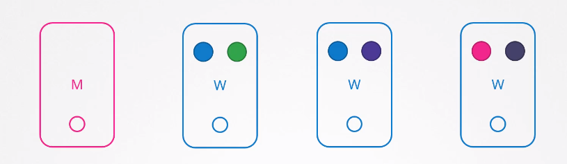
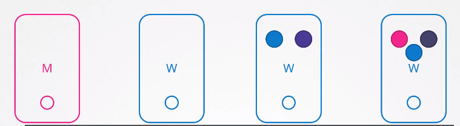
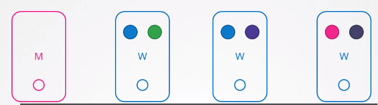
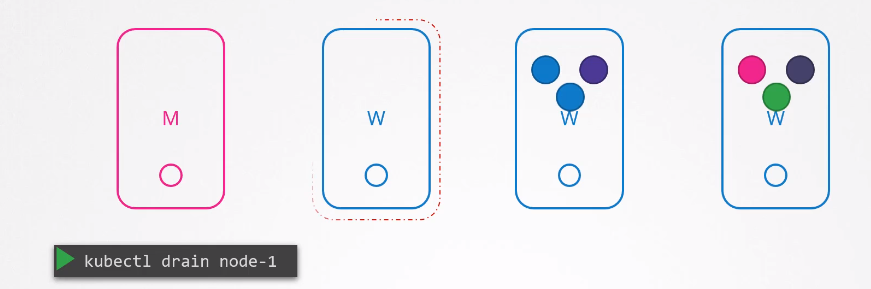

# OS Upgrades
클러스터에 기본 소프트웨어를 업그레이드하거나 보안 패치등을 하는 목적의 유지보수를 하는 법을 알아본다.

이러한 경우, 할 수 있는 몇가지 방법에 대해 알아본다.



이떄 하나의 노드가 동작을 하지 않을 경우 어떻게 될까??

예를들어, blue application에 접근하기 위하여 blue pod의 레플리키가 다중으로 있기 때문에 다른 blue pod에서 요청을 처리할 수 있기 때문에 하나의 노드가 죽어도 상관이 없다.

만약 green application으로 접근하기 위한 green pod가 하나만 존재할 경우, green pod가 포함된 노드가 죽을 경우, 서비스 제공읋 하지 못한다.

이 경우, 쿠버네티스는 어떻게 할까??  
이 경우 쿠버네티스는 노드를 즉시 online으로 복귀시키고, kubelet은 pod가 정상적으로 돌아오는 프로세스를 시작한다.

하지만 만약 노드가 5분이상 중지될 경우, pod가 node에서 종료처리된다.  
그러면 쿠버네티스는 그 pod가 죽은 것으로 간주한다. 

만약 레플리카셋에 있는 파드의 경우 다른 노드에 재생성된다.

pod eviction timeout이라 불리는 pod가 온라인으로 돌아오는데 기다리는 걸리는 시간은 kube-controller-manager가 기본값으로 5를 설정한다.
```
kube-controller-manager --pod-eviction-timeout=5m0s ...
```

즉, 노드가 오프라인 상태가 되면 마스터 노드는 5분간 대기하였다가, 오프라인 상태의 노드가 죽은 것으로 간주한다. 

pod eviction timeout이 지난 후 노드가 온라인으로 복귀하였을 때, 스케쥴된 파드가 없는 빈 상태로 돌아온다.



blue pod 같은 경우 replica set에 있는 것이기 때문에 다른 node에 재생성된다.

반면에 greed pod는 replica set으로 설정되어 있지 않아 그냥 죽은 상태가 된다.

그렇기 다른 노드에서 동작하고 있는 pod가 있거나 replica set에 포함이 되거나 node가 다운되는 시간이 짧을 경우에는 노드들에 대해 유지 보수 작업을 수행하여도 된다.

그리고 만약 node가 5분안에 온라인 상태로 돌아올 것에 대한 확신이 있다면 빠르게 upgrade를 하고 재시작을 하면된다.

하지만 5분안에 노드가 복귀하는 것에 대해 확신이 없을 것이다.  
**5분안에 모든 노드가 복구될 수 있다고 확신하지 말아라**


안전한 방법이 있다.
## 클러스터에서 노드 작업 방법 (drain)

모든 워크로의 노드를 의도적으로 **drain**하여 클러스터 내부의 다른 노드로 워크로드들을 이동시키는 것이다.

```
kubectl drain node-1
```
### Before

### After


기술적으로 워크로드들이 움직이는 것은 아니다. Node를 drain할 경우 pod들은 노드에서 정상적으로 종료되고 다른 노드에서 재생성된다.

노드는 스케쥴이 되지않도록 코드화 또는 마크된다. 즉, 제한을 풀때 까지 해당 노드에는 아무 파드도 스케쥴될 수 없다.

이렇게 하면 파드는 다른 노드에서 안전하게 실행되고, 첫번째 노드를 재시작할 수 있게 된다.  
이 노드가 온라인 되었을 경우에도, 해당 노드는 여전히 스케쥴될 수 없는 상태이다.

이 경우 코드환 된 것을 제거하고(uncoden) 다시 파드가 스케쥴될 수 있도록 한다.
```
kubectl uncordon node-1
```

### 중요
중요한 점은 다른 노드로 이동한 파드는 자동으로 돌아오지 않는다.  
클러스터 내부에서 삭제되거나 새로운 파드가 생성될 경우, 작업이 완료되고 uncoden된 노드에 파드가 생성된다.

a pod from drain and uncorden, cordon이라고 불리는 명령어가 있다.
```
kubectl cordon node-2
```
cordon 명령어는 간단하게 노드가 unschedulable 상태로 마크한다.

drain과 다르게, cordon은 파드를 종료처리하거나 다른 존재하고있는 노드로 이동시키지 않는다.

이 것은 그저 새로 생성되는 pod가 해당 노드로 스케쥴되지 않도록 하는 것이다.


## 문제풀기 TIP
host하는 application 갯수 세기
```
kubectl get deployments
```

node drain 시키기
```
kubectl drain node01 --ignore-daemonsets
```

What nodes are the apps on now?
```
kubectl get pods -o wide
```

How many pods are scheduled on node01 now?
```
kubectl get deployments
```


13번 풀이
ReplicationController, ReplicaSet, Job, DaemonSet 또는 StatefulSet으로 관리되고 있지 않기 때문에 영원히 삭제된다.
