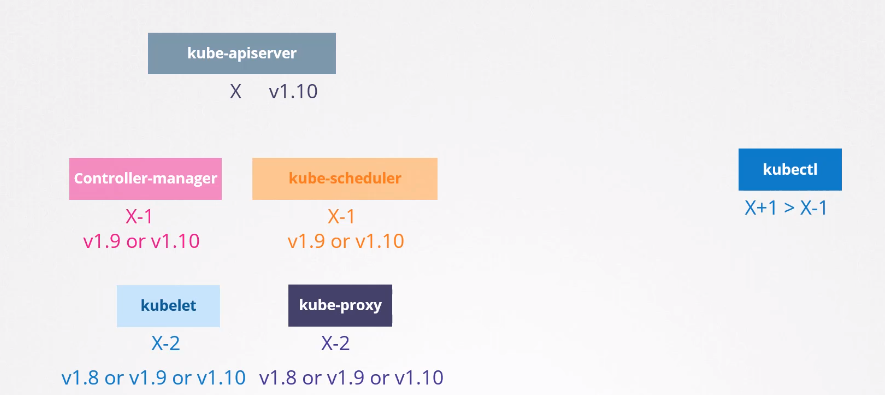

# Kubernetes Releases
쿠버네티스를 설치할 때 특정 버전의 쿠버네티스를 설치하게 된다.
```
kubectl get nodes
```
에서 버전을 확인할 수 있다.

처음 설치 버전을 받으면,
kube-apiserver, controller-manager, kube-scheduler, kubelet, kube-proxy 은 같은 버전
external components : kubectl, ETCD CLUSTER, CoreDNS등은 다른 버전을 가질 수 있음

쿠버네티스를 구성하는데에 있어 필수적인 요소들의 버전은 다 똑같을 필요는 없다.

하지만 마스터 서버의 kube-apiserver가 표준이 되는 버전이며, 다른 컴포넌트는 kube-apiserver보다 높은 버전을 가질 수 없다.

Controller manager와 scheduler는 한 버전 낮은 버전을 사용할 수 있다. 

kubelet과 kube-porxy 컴포넌트는 두버전 낮은 버전까지 사용 가능하다.

kubectl은 kube-api 버전보다 한 버전 높거나 같거나 낮을 수 있다.



## 업그레이드 시기
언제 업그레이드를 하면될까?

쿠버네티스는 최근의 3개의 마이너 버전을 지원한다. 12버전이 가장 최근의 버전이라면 v1.11과 v1.10를 지원하게된다.

이때 v1.13버전이 출시되면 v1.10버전은 un-supported 상태가된다.

만약 v1.10버전에서 v1.13버전으로 업그레이드할 때, 한번에 업그레이드 하는 것이 아니고, 1 개의 마이너 버전씩 업그레이드를 해야한다.  
즉, v1.10 -> v1.11 -> v1.12 -> v1.13

GKE 등 클라우드를 사용하면 손쉽게 업그레이드가 가능하다.

##kubeadm
```
$ kubectl upgrade plan
$ kubectl upgrade apply
```
### Master Node 업그레이드
master node를 먼저 업그레이드 한 후 워커 노드를 업그레이드한다.

마스터 노드가 업그레이드 되는 동안, API-server, scheduler 그리고 controller manager 같은 control plane components는 잠시 중단된다.

마스터 노드가 중단되었다고 하여, 클러스터의 워커 노드와 어플리케이션에 영향을 주는 것은 아니다. 

커버 노드에서 호스팅되고 있는 워크로드는 보통처럼 유저에게 서비스가 제공된다.

마스터가 다운되고부터, 다른 모든 관리 기능들은 다운된다.

kubectl 또는 다른 component API를 통해서 클러스터에 접근할 수 없다. 

새로운 어플리케이션을 배포하거나 기존에 있는 것을 삭제 또는 수정할 수 없다.

controller manager 또한 동작하지 않는다.

만약 pod가 fail되면, 이 경우에는 자동으로 재생성되지 않는다.

하지만, 노드나 pod가 장애가 나지않고 정상적으로 동작한다면, 어플리케이션은 정상적으로 동작할 것이며, 유저에게는 아무 영향이 없다.

업그레이드가 완료되고, 클러스터에 정상적으로 복구되면, 정상적으로 동작을 시작한다.

### Worker Node 업그레이드
Worker 노드를 업그레이드하는데는 다양한 전략들이 있다.

첫 번째는 워커노드 전체를 한번에 업그레이드 하는 것이다. 하지만, 이 경우에는 모든 pod가 종료되어 유저가 어플리케이션에 접근할 수 없게 된다.

업그레이드가 종료되면, 클러스터에 노드들이 복귀하게 되고, 새로운 파드들이 schedule 되고 유저들이 다시 접근 가능하게 된다.

다운타임을 가지는 하나의 전략이다.

두 번째는 하나의 노드씩 업그레이드 하는 것이다. 마스터가 업그레이드가 된 상태이며 워커노드가 업그레이드 되기를 기다리는 상황을 가정한다.  
첫 노드를 먼저 업그레이드 한다. 이 때 워커로드를 두번째와 세번째 노드로 이동시킨다. 이렇게하면 유저 접근에는 문제가 없다.  
첫 노드의 업그레이드가 완료되고 클러스터로 복귀하게 되면 두번째 노드의 워크로드를 첫번째와 세번째 노드로 이동시키고 업그레이드를 진행한다.    
최종적으로 세번째 노드도 같은 방법으로 워크노드를 첫번쨰와 두번째 노드로 이동시키고 업그레이드를 진행한다.

세번째 방법은 새로운 노드를 클러스터에 새로운 버전으로 생성하는 것이다.  
새로운 노드를 쉽게 프로비저닝할 수 있는 환경이라면 ( cloud 환경과 같이 ) 가장 편리하고 쉬운 방법이다.
새로운 노드를 생성하고 예전 버전의 노드에서 새로운 버전의 노드로 워크노드를 이동시키고 옛버전의 노드는 삭제한다.

### kubeadm - upgrade
kubeadm에는 클러스터 업그레이드를 돕는 명령어가 있다.
```
kubeadm upgrade plan
```
다양한 정보를 확인할 수있다.

현재의 cluster 버전, kubeadm 툴 버전, 그리고 가장 최근의 가정버전 등

control plane component를 업그레이드 한 후 수동으로 kubelet 버전을 각 노드에서 업그레이드 해줘야한다.  
**kubeadm은 kubelet을 설치하거나 업그레이드 하지 않는다.**

최종적으로 cluster를 업그레이드하는 명령어를 제공해준다.

kubeadm 버전은 쿠버네티스 버전과 같은 소프트웨어 버전을 따른다.

업그레이드 예시 v1.11 -> v1.12 -> v1.13
### Master Node upgrade
```
apt-get upgrade -y kubeadm=1.12.0-00
#### master 노드 업그레이드
kubeadm upgrade apply v1.12.0
```

master 노드가 업그레이드 한 후
```
kubectl get nodes
```
명령을 보냈을 때, VERSION은 여전히 1.11버전일 것이다.

이 이유는 명령어의 결과로 API server 자체의 버전을 보여주는 것이 아니고, API서버에 등록된 각 노드의 kubelet 버전을 보여준다.

### kubelet 업그레이드
다음 단계는 kubelet을 업그레이드 하는 것이다.

기억해야할 점은, 설정값에 따라 마스터 노드에서 kubelet이 동작할 수도, 동작하고 있지 않을 수도 있다.

이 경우, kubeadm으로 배포된 클러스터에는 마스터 노드에 kubelet이 있으며 마스터 노드의 일부로 컨트롤 플레인 구성 요소를 실행하는데 사용된다.

만약에 scratch (추후에 배움)를 통해 클러스터에 컴포넌트를 설치하였다면 마스터노드에 kubelet이 설치되어 있지 않다.  
이 경우, kubectl get nodes 명령어 결과로 master node가 출력되지 않을 것이다.

다음 단계는 마스터 노드의 kubelet을 업그레이드 하는 것이다.

kubelet이 있다면, kubelet을 업그레이드 한다.
```
apt-get upgrade -y kubelet=1.12.0-00
```

패키지가 업그레이드 된다면 kubelet 서비스를 재시작 시킨다.
```
systemctl restart kubelet
```

```
kubectl get nodes
```
명령을 날렸을 때, 이제야 12버전으로 업그레이드되는 것을 확인할 수 있다.

아직 워커 노드는 여전히 11버전이다.

### Worker Node
한번에 하나씩 업그레이드하는 방법으로 업그레이드를 진행한다.

첫 번쨰로, 첫 노드에서 다른 노드로 워크로드들을 이동시킨다.  
drain 명령을 통해 안전하게 pod들을 종료시키고 다른 노드로 pod를 재스캐쥴한다.
```
kubectl drain node-1
```
마스터 노드에서 했던것과 같이 워커노드에서도 kubeadm과 kubelet 업그레이드를 한다.  
그리고 node 설정에 새로운 kubelet 버전으로 업데이트 하고 kubelet서비스를 재시작한다.
```
apt-get upgrade -y kubeadm=1.12.0-00
apt-get upgrade -y kubelet=1.12.0-00
kubeadm upgrade node config --kubelet-version v1.12.0
systemctl restart kubelet
```
그 후 노드가 새로운 버전으로 업그레이드 되고 정상적으로 클러스터로 돌아오게되면, uncordon 명령을 통해 cordon상태를 풀어준다.
```
kubectl uncordon node-1
```
두번째 세번째 노드에서 동일한 작업을 진행한다.


