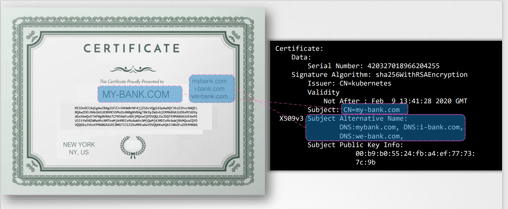

# TLS Certificates ( PRE-REQ )
Certificate란 트랜젝션 중 두개의 연결 사이에서 신뢰를 보장해주는 것이다.

예를 들면, 유저가 TLS 웹서버에 접근할 때, 통신이 안전하다는 것을 증명해준다.

### SYMMETRIC ENCRYPTION
* 유저가 서버에 plain text로 전송 한다 ( 해커가 스니핑 )
* 유저가 암호화된 text 를 전송 ( 해커가 스니핑해도 해석을 할 수 없다. 하지만 서버도 해석을 못한다.)
* 유저가 서버에 암호화된 text를 해석할수 있는 key를 같은 네트워크를 통해 보낸다 (해커가 키를 스니핑할 수 있다.)
* 같은 키를 가지고 암호화하고 복호화하는 것을 Symmetric encryption이라고 한다.
* Asymmetric encryption은 한쌍의 키를 가진다 (private key, public key)

 
### ASYMMETRIC ENCRYPTION
* public 키는 자물쇠와 같이 모두가 접근 가능
* 자물쇠를 열 수 있는 private key는 오직 나만 가지고 있어야함
* private key는 남들과 공유해서는 안된다.

### SSH에서 asymmetric encryption
```
$ ssh-keygen
```
을 이용하여 id_rsa id_rsa.pub 한 쌍의 private / public 키를 생성한다.

그리고 타겟 서버의 ~/.ssh/authorized 로 id_rsb.pub을 복사.

### 웹 통신에서 asymmetric encryption
```
$ openssl genrsa -out my-bank.key 1024
my-bank.key
$ openssl rsa -in my-bank.key -pubout > mybank.pem
my-bank.key mybank.pem
```
유저가 https를 통해 웹서버에 첫 접근을 할 경우, 유저는 서버로부터 public 키를 제공받는다.

해커가 모든것을 스니핑하고있다면 해커도 public key를 획득할 것이다.

사실 유저의 브라우저는 서버로 부터 제공된 public 키를 사용하여 symmetric key를 압호화 한다.

symeetric key는 안전한 상태이며 서버로 이것을 전송한다.

이때 해커 또한 전송하려는 키의 복제본을 획득한다.

서버는 private key를 이용하여 메세지를 복호화하고 symmetric key를 검색한다.

하지만 해커는 복호화하기 위한 private key 가 없고 메세지로 부터 symmetric key를 검색할 수 없다.
 
해커는 메시지를 복호화 하지는 못하고, 오직 메시지 암호화를 하는 용도로 쓰이는 public key를 가지고 있다.
 
Symmetric key는 이제 유저와 서버 사이에서만 안전하게 사용될 수 있다.

이때부터 유저와 서버는 symmetric key를 가지고 데이터를 암호화하고 그것을 서로 공유할 수 있다.

수신자는 같은 symmetric key를 데이터 복호화 및 정보 검색용도로 사용할 수 있다.
 
해커는 이제 다른 방법으로 공격을 하려 한다.

해커가 보여주는 폼에 유저가 입력하는 방식으로 자격증명을 얻으려고 한다.

해커는 실제 홈페이지와 동일하게 생긴 다른 홈페이지를 만든다.

이러한 가짜 홈페이지에 유저가 정보를 입력하므로서 해킹을 당할 수가 있다.

### 인증서
서버에서 받은 키를 보고 실제 은행 서버에서 받은 합법적인 키인지를 확인할 수 있으면 이러한 해킹을 당하지 않을 수 있다.

서버가 키를 보낼때 키만 보내는 것이 아니다. 증명서도 키와 함꼐 전송하게 된다.

증명서를 자세히보면 이게 실제 증명서인지 확인할 수 있다.

디지털 형식에는 해당 서버의 공개 키에 인증서가 발급된 사람, 해당 서버의 위치 등에 대한 정보가 있다.

인증서에 있는 이러한 정보가 유저가 접속하고자했던 사이트정보과 일치해야한다.


인증서에서 가장 중요한 것은 누가 사인을 하였느냐 이다.

만약, 본인이 인증서를 생성한다면, self signed certifiacte가 된다.

인증서 확인은 브라우저에서 기본적으로 한다.

브라우저에서 인가되지않은 인증서를 받게된다면, 경고 메시지를 준다.

### CERTIFICATE AUTHORITY (CA)
이러한 이유로 CA가 나타나게 된 것이다. 모두가 인정하는 단체에서 인증서를 증명해주는 것이다.

Symantec Digicert, Comodo ,GlobalSign 등이 있다.

그럼 어떻게 브라우저가 인가된 CA에서 받은 인증서인지 가짜 인증서인지를 알수 있을까??

CA는 각 회사마다 다른 public - private key-pair를 가진다.

CA에서 private key를 가지고 인증서에 사인을 한다. public key들은 브라우저에 built-in으로 들어가 있다.

브라우저는 public key를 가지고 살제 CA에서 사인된 인증서인가를 확인한다.

## 내부망에서 사용할 경우
외부망에서는 위의 방법이 효과적이지만, 내부망에서는 도움이 되지 않는다.

이 경우에는 자체 private CA서버를 구축한다.

이 경우 내부 CA서버의 public key를 브라우저에 설치한다.

## 정리
* 서버가 CA에 인증서 발급을 요청
* CA에서 인증서를 주면 서버에 설정
* 유저가 서버에 접근하면 인증서와 public key를 전송
* 유저나 유저의 브라우저가 인증서를 읽고 CA의 public key를 서버가 유효하고 서버의 public key 검색을 목적으로 사용한다.
* symmetric 키를 생성하고 앞으로의 통신에 이것을 사용한다.
* symmetric 키는 server의 public key를 사용하여 암호화하고 서버로 전송한다.
* 서버는 private key를 사용하여 메시지를 복호화하고 symmetric key를 검색한다.


### 만약 서버가 초기에 연결된 클라이언트인지 확인하는 방법이 있을까?
서버는 클라이언트로부터 인증서를 요청할 수 있으므로 클라이언트는 유효한 CA에서 키 쌍과 서명 된 인증서를 생성해야합니다.

그런 다음 클라이언트는 클라이언트가 자신이 말하는 사람인지 확인하기 위해 인증서를 서버로 보냅니다.

이제 웹 사이트에 액세스하기 위해 클라이언트의 인증서를 생성 한 적이 없다고 생각할 것이다.

그 이유는 TLS 클라이언트 인증서는 일반적으로 웹 서버에서 구현되지 않기 때문입니다. 모든 것이 내부적으로 구현 된 경우에도 마찬가지입니다.

따라서 일반 사용자는 인증서를 수동으로 생성하고 관리 할 필요가 없습니다.

이것이 CA를 포함한 전체 인프라의 클라이언트 인증서에 대한 마지막 부분이었습니다.

### PKI
디지털 인증서를 배포하고 유지 관리하는 사람과 프로세스를 공개 키 인프라 (PKI)라고합니다.
