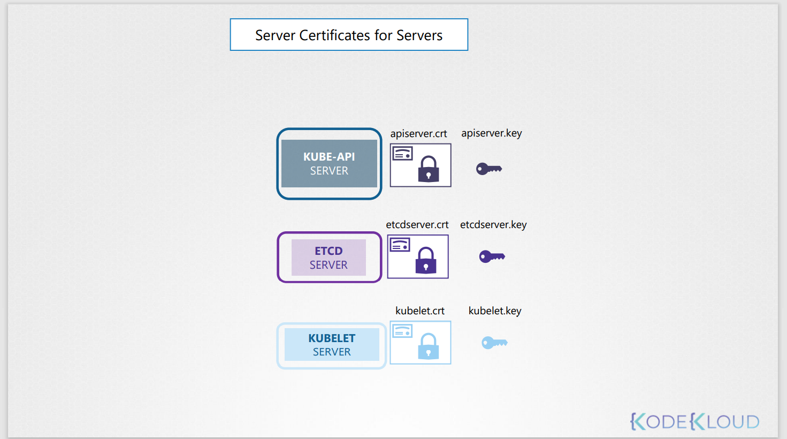
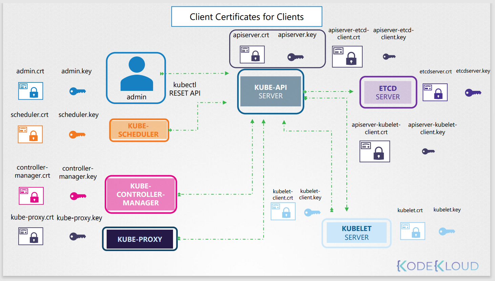

# TLS Certificates in Kubernetes
## What Certificates?
* Server Certificate ( private, public key )
* Root Certificate ( CA )
* Client Certificate

||Certificate ( public key) |Private Key|
|---|---|---|
|확장자|*.crt, *.pem|*.key, *-key.pem|
|예시|server.crt, server.pem|server.key, server-key.pem|

## 쿠버네티스에서 인증
쿠버네티스 클러스터는 마스터 서버와 워커 노드들로 구성되어있다.  
당연하게도, 마스터 노드와 워커노드 사이에서 통신할 때 보안이 필요하고 암호화가 필요로 한다.

예를들어, 관리자가 kubectl을 사용하거나, kube-apiserver를 통해 쿠버네티스와 통신을 하고자 할때, 반드시 Secure TLS connection을 사용해야 한다.

두 가지의 필수 조건이 있다
* Server Certificates for Servers
* Client Certificates for Clients

### Server Certificates for Servers
쿠버네티스 내의 다양한 구성요소를 클러스터로 살펴보고 다양한 서버와 클라이언트를 식별하고 누가 누구와 대화하는지 알아본다.

#### kube-api

kube-api서버를 먼저 알아본다.

이미 아시다시피, kube-api서버는 외부 사용자 뿐만 아니라 구성 요소가 쿠버네티스 클러스터를 사용하는 https 서비스를 노출한다.

즉, 이것은 서버이며 클라이언트와의 모든 통신에서 보안을 위한 인증서를 요구한다.

그리하여 우리는 인증서를 생성하고 보관한다.  
* apiserver.crt 
* apiserver.key  
(**파일 이름은 시스템을 구축한 사람에 따라 달라질수 있다.**)

#### ETCD Server

ETCD 서버도 클러스터에 대한 정보를 가지고 있기 때문에, 인증서와 키가 필요하다.
* etcdserver.crt
* etcdserver.key

#### kubelet server

워커노드와 kube-apiserver가 통신을하기위한 API endpoint이다.
* kubelet.crt
* kubelet.key

### Client Certificates for Client
클라이언트라고 하면,관리자가 kubectl을 사용하거나 rest api를 사용하는 경우가 있다.

이 경우 인증서와 서버에 인증을 유지해야한다.

#### 관리자
이것을 admin.crt, admin.key라고 부른다.

#### 스케쥴러
스케쥴러는 kube-apiserver 스케쥴 되어야할 pod를 찾기 위해서 kube-apiserver와 통신한다.  
그리고 api서버는 적절한 워커 노드에 pod를 스케쥴한다.
* scheduler.crt
* scheduler.key

#### kube-controller-manager
* controller-manager.crt
* controller-manager.key

#### kube-proxy
* kube-proxy.crt
* kube-proxy.key

#### kube-api-server

만약 kube-apiserver가 ETCD server와 통신하게 된다면 kube-apiserver도 클라이언트가된다.
* apiserver-etcd-client.crt
* apiserver-etcd-client.key

kubelet과 통신할 때도 있다. 워커노드의 상태를 확인하는 경우 등

* apiserver-kubelet-client.crt
* apiserver-kubelet-client.key

### 인증서를 생성하는 방법
쿠버네티스는 클러스터에 적어도 하나의 CA가 필요로 한다.

사실 하나 이상의 CA를 가질 수 있다. 예를 들면 다른 컴포넌트는 A라는 CA에서 ETCD는 B라는 CA에서 인증받을 수 있다.

CA에는 ca.crt, ca.key라는 이름의 인증서 / 키 쌍이 있다. 이것이 클러스터 사용된 모든 인증서를 요약한다.
