# TLS in Kubernetes - Generate Certificate
인증서를 어떻게 생성하는지에 대해서 알아본다.

인증서를 생성하는데에 다양한 툴들이 사용가능하다.
예를 들어, 아래와 같은 것들이 있다.
* EASYRSA
* OPENSSL
* CFSSL

그중 OPENSSL을 사용하여 인증서를 생성하는 방법에 대해서 알아본다.

## OPENSSL
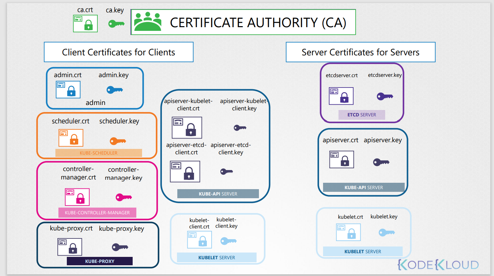

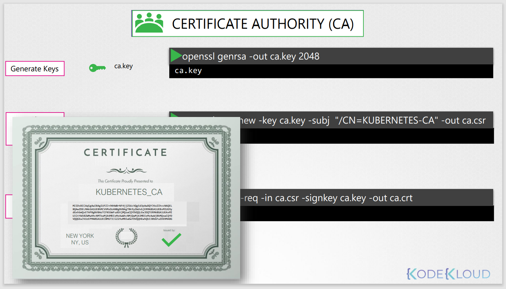
먼저 openssl 명령어를 사용하여, private key를 생성한다.
```
$ openssl genrsa -out ca.key 2048
ca.key
```

인증서 서명 요청을 생성하기 위해 방금 생성 한 인증서 서명 요청은 모든 세부 정보가 포함 된 인증서와 같지만 구성 요소 이름이 지정된 인증서 서명 요청에 서명이 없습니다.    
이 인증서는 일반 이름 또는 CN 필드에 사용된다.

이 경우 인증서를 kubernetes-CA를 위해서 생성하였기 떄문에 이름을 KUBERNETES-CA로 지정한다.

```
$ openssl req -new -key ca.key -subj "/CN=KUBERNETES-CA" -out ca.csr
ca.csr
```

최종적으로 openssl x509 명령을 사용하여 이전 명령에서 생성한 인증서 서명 요청을 지정하여 인증서에 서명을 한다. 
```
openssl x509 -req -in ca.csr -signkey ca.key -out ca.crt
```

이는 CA 자체를위한 것이므로 첫 번째 단계에서 생성 한 자체 개인 키를 사용하여 CA가 자체 서명합니다.

다른 모든 인증서에서 서명을 위하여 지금 생성한 ca key쌍을 사용할 것이다.

### Client Sertificate - admin
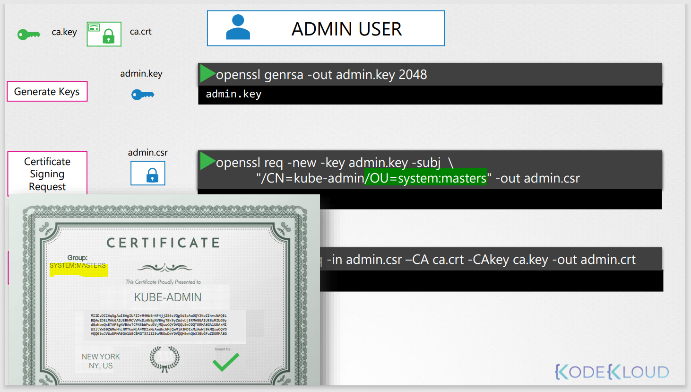
OPEN SSL 명령어를 통해서 관리자를 위한 private key를 동일하게 만들어준다.
```
$ openssl genrsa -out ca.key 2048
ca.key
```
그런 다음 CSR을 생성하고 여기서 관리 사용자의 이름 인 kube-admin을 지정합니다.
```
$openssl req -new -key admin.key -subj \
    "/CN=kube-admin" -out admin.csr
```
굳이 kube-admin이 아니어도된다. 하지만 이 이름으로 kubectl 명령어를 날릴때 kubectl을 인증할때 쓰이게된다.

audit로그에서 볼수있는 이름이 된다.

마지막으로 서명된 인증서를 openssl x509를 통해서 생성한다.

이때 CA 인증서와 CA key를 명시해줘야한다.  
이렇게하면 인증서가 클러스터에 유효하게 만들어준다.
```
openssl x509 -req -in admin.csr -CA ca.crt -CAkey ca.key -out admin.crt
```
출력되는 인증서의 형태는 admin.crt가 되고 이 인증서를 통해서 관리자가 쿠버네티스 클러스터에 인증을 할 수 있다.


지금까지는 관리자를 위한 설정이었고, 다른 유저들의 설정은 어떻게 하는지 알아본다.

유저 계정은 다른 기본 사용자가 아닌 관리자로 식별되어야 한다.  
이런한 것을 그룹에 추가하는 방식으로 한다.

이 경우 쿠버네티스에 관리자 권한 그룹으로 SYSTEM:MASTERS ( 위 첨부 파일 확인 )가 존재한다.

서명 요청을 생성하는 동안 OU 매개 변수로 그룹 세부 정보를 추가하여 이를 수행 할 수 있습니다.

한번 서명을 하면, 인증서는 관리자의 권한을 갖게된다.

이러한 프로세스로 다른 컴포넌트들이 kube-apiserver로 접근하기위한 클라이언트 인증서를 생성하게 된다.

### kube-scheduler
kube-scheduler는 kubernetes의 control plane의 시스템 컴포넌트이므로 "system"이라는 prefix를 사용한다.
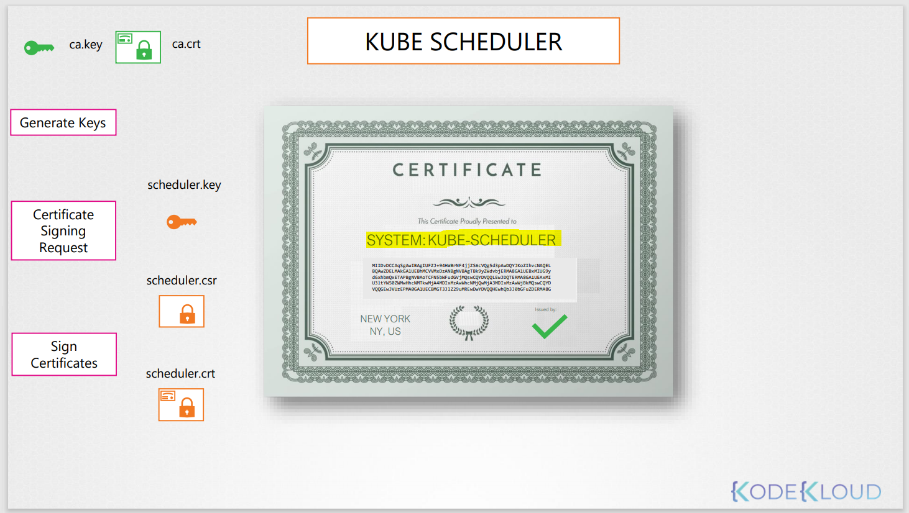
### kube-controller-manager
kube-controller-manager는 kubernetes의 control plane의 시스템 컴포넌트이므로 "system"이라는 prefix를 사용한다.
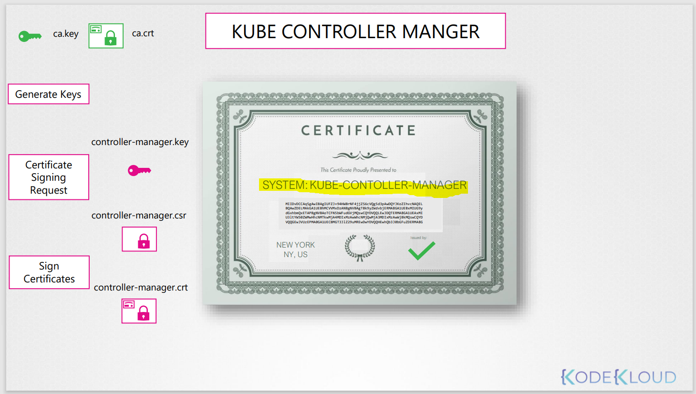

## Kube proxy
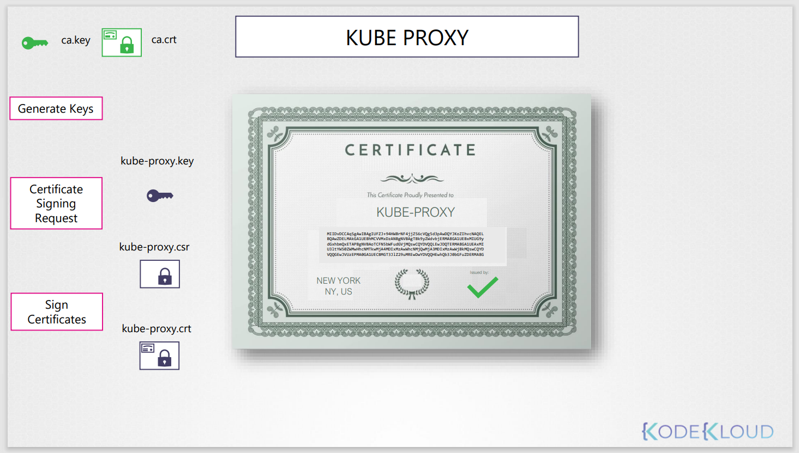

지금까지 CA 인증서를 만든 후 다른 클라이언트 인증서를 생성하였다. (admin user, shceduler, controller-manager, kube-proxy)

나머지 3가지의 인증서도 동일한 프로세스로 생성한다
* kube apiserver ( apiserver-kubelet-client, apiserver-etcd-client)
* kubelet server ( kubelet-client )

지금까지 생성한 인증서롤 무엇을 할 수 있는지 알아본다.
관리자 인증서를 통해 rest api로 클러스터에 접근 가능하다.
```
curl https://kube-apiserver:6443/api/v1/pods \
  --key admin.key
  --cert admin.crt
  --cacert ca.crt
```
다른 방법은 이 모든 파라미터를 **kube-config**라고 불리는 설정 파일로 이동시킨다.

kube-config.yaml
```
apiVersion: v1
clusters:
- cluster:
    certificate-authority: ca.crt
    server: https://kube-apiserver:6443
  name: kubernetes
kind: Config
users:
- name: kubernetes-admin
  user:
    client-certificate: admin.crt
    client-key: admin.key
```

## 알아둘점
웹 통신에서 브라우저가 CA public certificate를 저장하고 있다고 하였다.

쿠버네티스도 동일하게 다양한 모든 컴포넌트는 CA의 root certifiacte를 가지게 된다.
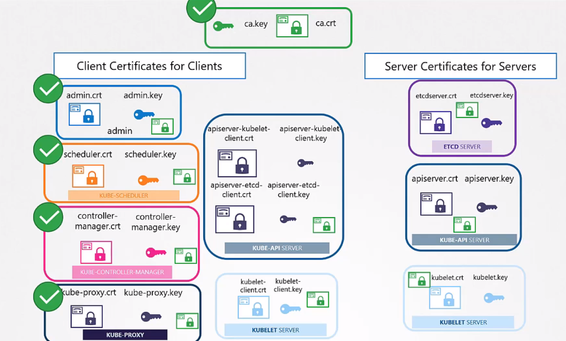

즉, 인증서를 이용하여 서버 또는 클라이언트를 설정할 때, CA root certificate를 명시해줘야한다.

 
## Server side Certificate
### ETCD SERVER 
ETCD서버도 동일하게 인증서를 생성한다.

ETCD 서버는 고가용성 환경에서와 같이 여러 서버에 클러스터로 배포할 수 있다.  
이 경우, 클러스터 내부의 다른 멤버들 사이에서 보안 통신을 하라면 반드시 추가적인 peer certifiacte가 필요하다.
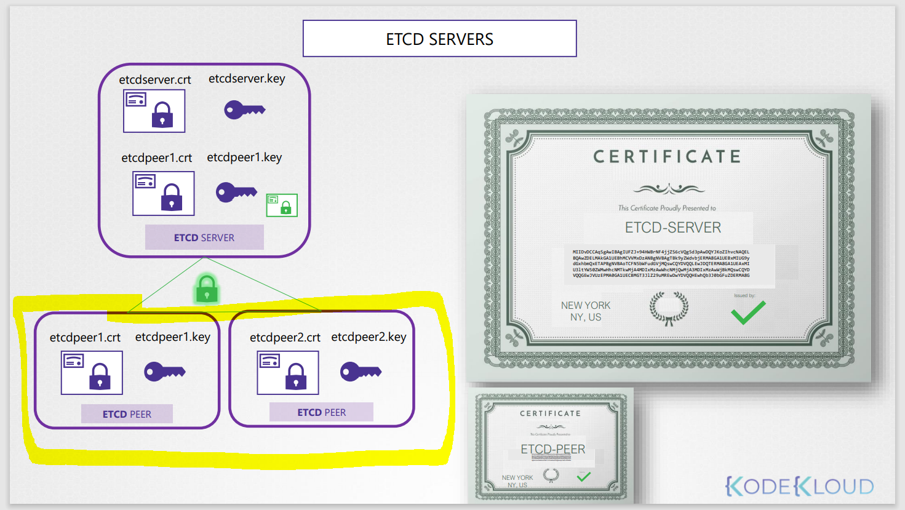

```
cat etcd.yaml
```
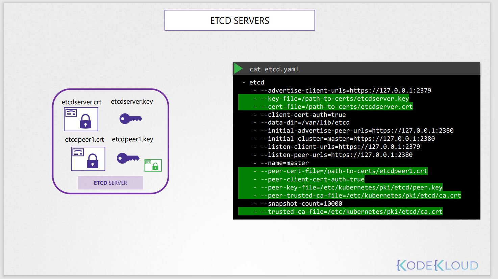

### kube-apiserver
kube-apiserver 같은 경우 모든 컴포넌트에서 접근하기 때문에 다양한 이름을 가졌다.

쿠버네티스에 대해 공부하지않은 사람들은 kube-apiserver 자체가 kubernetes로 지칭하곤 한다.  
예를들면,
* kubernetes
* kubernetes.default
* kubernetes.default.svc
* kubernetes.default.svc.cluster.local
* ip address ( 10.96.0.1, 172.17.0.87 )

그리하면 이 모든 이름을 포함하는 인증서를 생성해야한다.

```
$ openssl genrsa -out apiserver.key 2048
```

아래 명령어를 실행하기 전, openssl.conf 설정을 변경하여 위에서 언급한 모든 이름을 포괄시키는 설정을 한다.
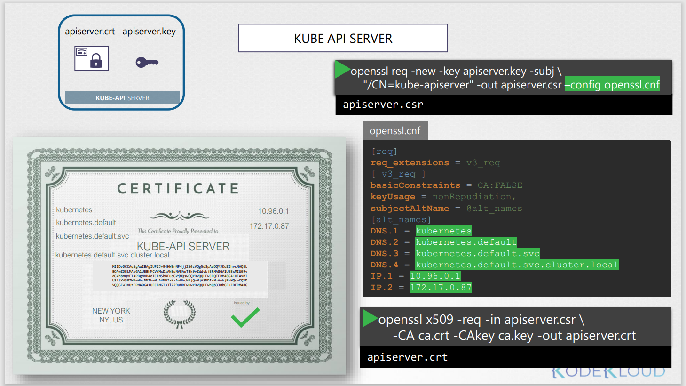
```
openssl req -nre -key apiserver.key -subj \
"/CN=kube-apiserver" -out apiserver.csr --config openssl.cnf
```
openssl x509로 ca와 cakey를 인증서에 서명한다.
```
$ openssl x509 -req -in apiserver.csr \
-CA ca.crt -CAkey ca.key -out apiserver.crt
```

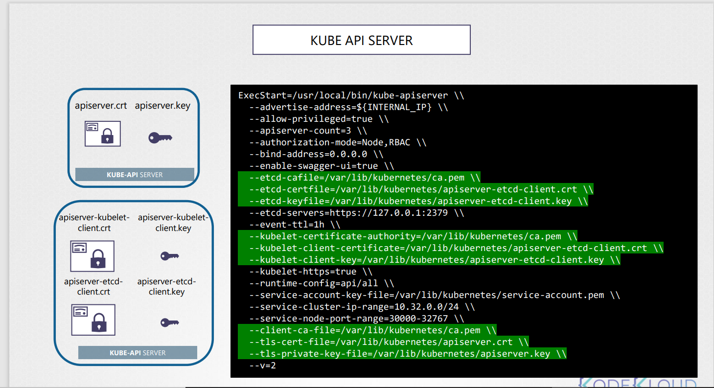
* 먼저, 클라이언트를 인증하기 위해서 CA 인증서가 필요로한다. (--client-ca-file)
* apiserver 인증서를 설정한다 (--tls-cert-file, --tls-private-key-file)
* 클라이언트로서 etcd서버에 접속하기 위해 설정한다 (--etcd-cafile, --etcd-certfile, --etcd-keyfile)
* kuebelet에 접속하기 위한 인증서를 설정 (--kubelet-certificate-authority, --kubelet-client-certificate, --kubelet-client-key)

### kubelet
kubelet서버는 각 노드에서 동작 중인 https 서버이다.

클라서터내의 각 노드에 인증서-key쌍이 있어야한다.  

인증서의 이름은 node의 이름으로 설정한다 예(node01, node02, node03)

인증서를 생성하고나면, kubelet-config.yaml (node01)에 설정해준다.
```
kind: KubeletConfiguration
apiVersion: kubelet.config.k8s.io/v1beta1
authentication:
  x509:
    cleintCAFile: "/var/lib/kubernetes/ca.pem"
authorization:
  mode: Webhook
clusterDomain: "cluster.local"
clusterDNS:
  - "10.32.0.10"
podCIDR: "${POD_CIDR}"
resolvConf: "/run/systemd/resolve/resolve.conf"
runtimeRequestTimeout: "15m"
tlsCertFile: "/var/lib/kubelet/node01.crt"
tlsPrivateKeyFile: "/var/lib/kubelet/node01.key"
```

kube-apiserver에 kubelet을 인증시키려면 client 인증서가 또 필요로한다.

이때 인증서의 이름은 "system:node" prefix를 사용하여 이름을 짓는다.

예> system:node:node01, system:node:node02

