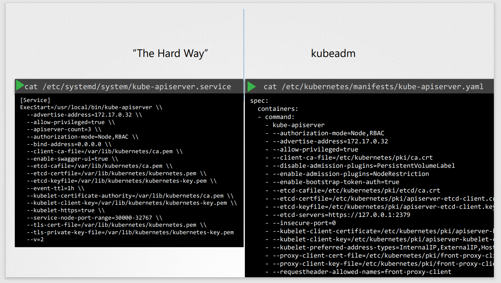
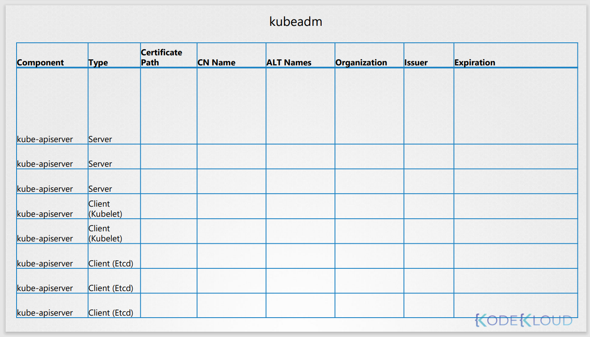

# TLS Certificates
## View Certificate Details
이미 존재하는 클러스터에서 인증서를 확인하는 방법에 대해서 알아본다.

새로운 팀에 참여하여 쿠버네티스 환경을 관리한다고 가정한다.

이때, 새로운 팀의 관리자가 운영환경에서 인증서 관련한 이슈가 있다고 한다.  
그리고 전반적인 클러스터에 대한 성능 상태 확인을 요청받는다.

첫번쨰로, 어떻게 클러스터가 구축되었는지를 먼저 아는게 중요하다.



인증서 확인 리스트


## 확인하는 방법
kubeadm을 사용해서 구축되었다면 kube-apiserver의 definition file을 확인한다.
```
cat /etc/kubernetes/manifests/kube-apiserver.yaml
```

## 상세내용
위 definition file에서 확인한 인증서의 상세 내용을 확인한다.
### apiserver certificate file
openssl x509 명령을 통해서 확인한다.
```
openssl x509 -in /etc/kubernetes/pki/apiserver.crt -text -noout
```
* subject : CN=kube-apiserver ,
* Subject Alternative Name
  * kube-apiserver는 많은 다른 이름을 가진다.
  * 반드시 인증서의 issuer(CA)와 만기일 (expiry date)를 확인한다.
  
### Inspect Service Logs
아래와 같은 인증서 로그를 확인한다.

scratch를 사용하여 구축했을 경우
```
journalctl -u etcd.service -l
2019-02-13 02:53:28.185588 I | embed: ClientTLS: cert = /etc/kubernetes/pki/etcd/server.crt, key = 
/etc/kubernetes/pki/etcd/server.key, ca = , trusted-ca = /etc/kubernetes/pki/etcd/old-ca.crt, client-cert-auth = 
true
2019-02-13 02:53:30.080017 I | embed: ready to serve client requests
2019-02-13 02:53:30.080130 I | etcdserver: published {Name:master ClientURLs:[https://127.0.0.1:2379]} to cluster 
c9be114fc2da2776
2019-02-13 02:53:30.080281 I | embed: serving client requests on 127.0.0.1:2379
WARNING: 2019/02/13 02:53:30 Failed to dial 127.0.0.1:2379: connection
```

kubeadm을 통해 구축했을 경우
```
kubectl logs etcd-master

2019-02-13 02:53:28.185588 I | embed: ClientTLS: cert = /etc/kubernetes/pki/etcd/server.crt, key = 
/etc/kubernetes/pki/etcd/server.key, ca = , trusted-ca = /etc/kubernetes/pki/etcd/old-ca.crt, client-cert-auth = 
true
2019-02-13 02:53:30.080017 I | embed: ready to serve client requests
2019-02-13 02:53:30.080130 I | etcdserver: published {Name:master ClientURLs:[https://127.0.0.1:2379]} to cluster 
c9be114fc2da2776
2019-02-13 02:53:30.080281 I | embed: serving client requests on 127.0.0.1:2379
WARNING: 2019/02/13 02:53:30 Failed to dial 127.0.0.1:2379: connection error: desc = "transport: authentication 
handshake failed: remote error: tls: bad certificate"; please retry.
```

만약 etcd service나 kubectl이 죽었을 경우, kubectl이 동작하지 않는다. 이 경우 더 낮은 단계를 이용하여 이를 확인한다.

```
docker ps -a

docker log 87fc
```

https://github.com/mmumshad/kubernetes-the-hard-way/blob/master/tools/kubernetes-certs-checker.xlsx

[체크리스트_엑셀파일](../contents/kubernetes-certs-checker.xlsx)
