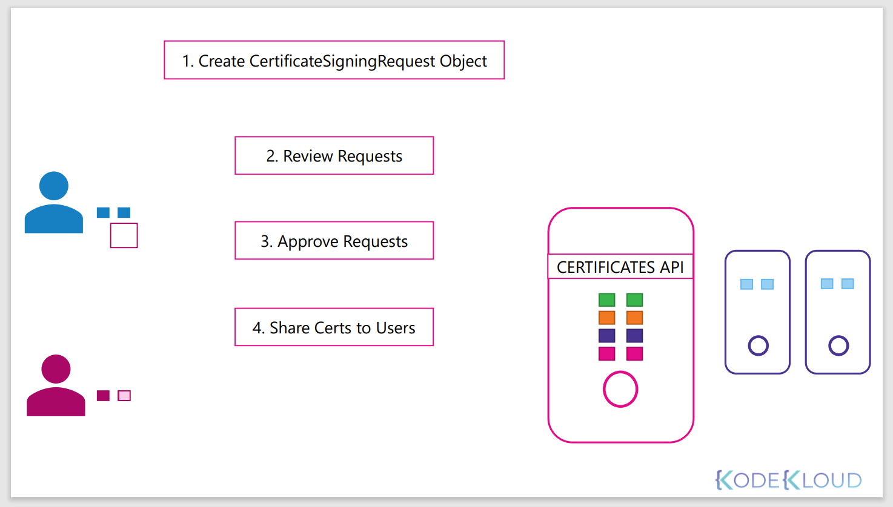
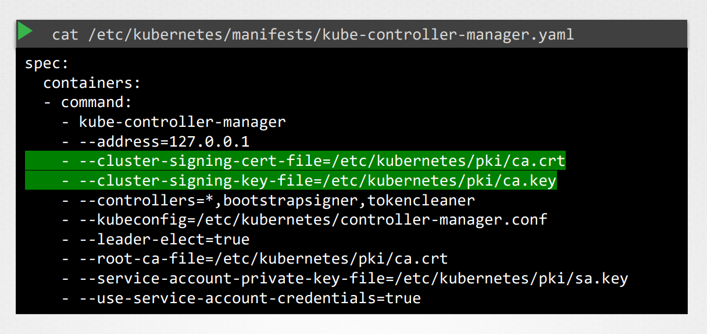

# TLS Certificates
## Certificate Workflow & API
인증서를 어떻게 관리하고 쿠버네티스에서 certificate API가 무엇이 있는지 알아본다.

쿠버네티스 서버에서 CA서버는 어디에 있을까? 

CA는 그저 우리가 생성한 key와 인증서 파일 쌍이다.

이 파일과 키 쌍의 접근 가능한 누구나 쿠버네티스 환경의 어느 인증서에도 서명을 할 수 있다.

그렇게 때문에 이 파일들은 보호되어야하며 안전한 저장소에 저장되어야 한다.

이 보호되어야할 파일이 저장된 서버를 CA 서버라고 한다.

인증서와 키파일을 서버에 안전하게 보관되며, 서버에 로그인하면서 인증서에 서명을 하고싶을 떄마다 접근한다.

Master 서버에 인증서를 저장하게된다면 마스터 서버도 CA서버가 되는 것이다.

kubeadm 툴도 동일하게 동작한다.

이것은 CA쌍을 만들고 마스터 노드에 자체적으로 저장을 한다.

관리자 인원이 증가하면 인증서 서명 요청 관리를 자동화하는 것이 낫다.  
쿠버네티스는 이러한 것을 해주는 내장 certificate API가 있다.

Certificate API 호출으로 쿠버네티스에 직접적으로 Create CertificateSigningRequest 요청을 보낼 수 있다.

관리자가 마스터노드에 로그인하는 대신에 certificate signing 요청을 받게되고, 자체적으로 인증서에 사인을 한다.

이때, CertificateSigningRequest 라는 API 호출을 사용한다.


### 실제로 어떻게 하는지 확인
```
## key 생성
openssl genrsa -out jane.key 2048

## certificate sigining request 생성
openssl req -new -key jane.key -subj "/CN=jane" -out jane.csr
```

그 후 관리자에게 요청을 보낸다. 관리자는 키를 받고 certificatesigningrequest 객체를 생성한다.

CertificateSigingRequest를 생성하는것은 다른 쿠버네티스의 객체가 manifest 파일을 사용해서 만드는것과 비슷하게 만어진다.
jane-csr.yaml
```
apiVersion: certificates.k8s.io/v1beta1
kind: CertificateSigningRequest
metadata:
  name: jane
spec:
  groups:
  - system:authenticated
  usages:
  - digital signature
  - key encipherment
  - server auth
  request:
    ASJKDNKLASND0293SASD
    blah blah....
    ...
    ...
```
request 필드는 certificate signing request를 보낸 유저를 기록한다.  
하지만 이것은 평문으로 따로 기록하지 않는다. 그대신 반드시 BASE63 명령을 사용해서 인코딩한 값을 적는다.

아래의 값을 request에 넣어준다.
```
cat jane.csr | base64
ASJKDNKLASND0293SASD
blah blah....
...
...
```

모든 certificate signing request (csr)은 관리자의 명령으로 확인할 수 있다.
```
kubectl get csr
```

새로운 요청을 확인하고 요청을 승인하는 것은 kubectl certificate approve 명령어를 통해 한다.  
쿠버네티스는 CA key쌍을 가지고 서명을 하고 유저를 위한 인증서를 생성한다.
```
kubectl certificate approve jane
jane approved!!
```

그런 다음 이 인증서를 추출하여 사용자와 공유할 수 있다.

YAML 포맷으로 인증서를 볼 수 있다.
```
kubectl get csr jane -o yaml
```
인증서가 BASE64 형태로 인코딩되어있다.

base6 유틸리티의 decode 옵션으로 암호화 된 것을 평문으로 볼 수 있게 한다.
```
echo "ASKNLAWDL" | base64 --decode
```
decode된 값을 다른 end user에게 공유한다.

이제 어떤 컴포넌트들이 이러한 일을 하는지 알아본다.

쿠버네티스의 control plane을 보면, kube-apiserver, scheduler, controller manager, etcd server 등 이있다.

인증서 관련 모든 일들은 controller manager에 의해서 이뤄진다.

### Controller manager
controller manager를 자세히 보면 아래 두개의 요소를 확인할 수 있다. 
* CSR-APPROVING
* CSR-SIGNING

위 두개의 요소는 위에서 설명한 작업들을 수행한다.

누구나 서명된 certificate를 가지고 있다면, CA 서버의 root 인증서와 private key를 가져야하는 것을 안다.

```
cat /etc/kubernetes/manifexts/kube-controller-manager.yaml
```
contoller manager 서비스 설정에 보면 아래와 같이 두개의 설정을 하는 곳을 확인할 수 있다.

