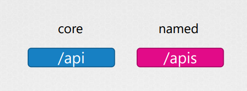
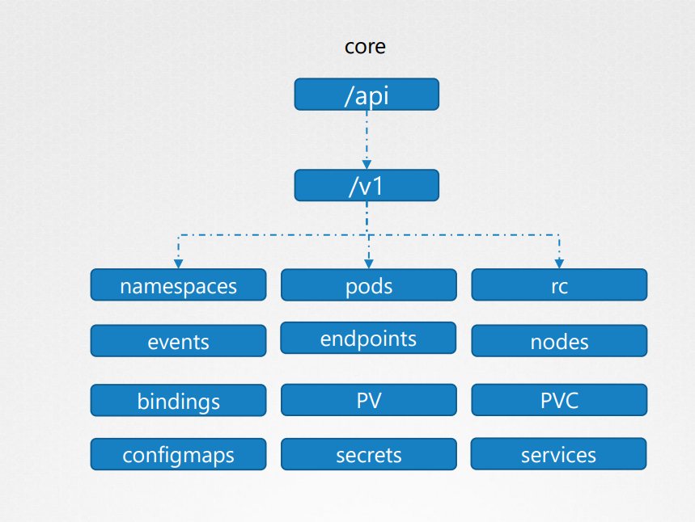
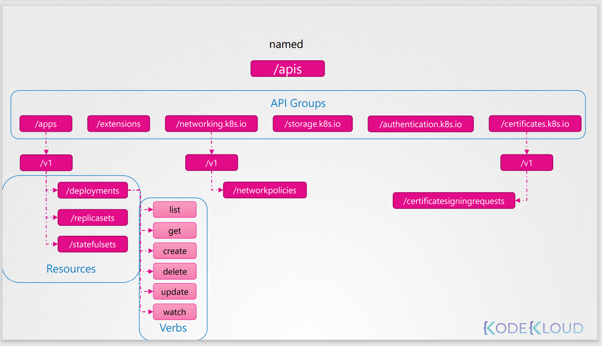

# API Groups
Authorization을 학습하기전에, 쿠버네티스에서 API Group이라는 것을 이해해야한다.

먼저 쿠버네티스 API란 무엇일가??

kube-apiserver를 kubectl로 통신하거나 직접적으로 접근을 하였다.

예를들어, 마스터 노드의 버전을 확인하려면
```
curl https://kube-master:6443/version
```

pods 정보를 확인하려면
```
curl https://kube-master:6443/api/v1/pods
```

쿠버네티스의 api는 용도에 따라 그룹을 짓는다

예를들면,
* /metrics
* /healthz
* /version
* /api
* /apis
* /logs

이 비디오에서는 기능 클러스터를 담당하는 API에 초점을 맞출 것입니다.

이런 API는 두종류로 나뉩니다.
* Core group : core functionality
* named Group : 보다 체계적으로 구성되어 있으며, 앞으로 이러한 named 그룹에서 모든 최신 기능을 사용할 수 있다.







named
 - api groups
   - resources
     - verbs

https://kubernetes.io/docs/reference/generated/kubernetes-api/v1.19

kubernetes 클러스터에서도 이것을 확인할 수 있다.

사용가능한 api group을 보여준다
```
curl http://localhost:6443 -k
```

named api그룹과 함께 사용하면 모든 지원하는 api group을 확인할 수 있다.
```
curl http://localhost:6443/apis -k | grep "name"
``` 

만약 curl을 사용했을 때 권한 문제로 오류가 발생할 경우 다음과 같이 대처한다.
* 이전에 했던것과 같이 인증서와 키를 넘겨준다.
```
curl http://localhost:6443 -k
  --key admin.key
  --cert admin.crt
  --cacert ca.crt
```
* kubectl proxy 사용
kubectl proxy를 사용하면, 8001 포트에 proxy 서비스를 시작한다. 그리고 클러스터에 걸쳐 kubeconfig file로부터 인증서를 받아와 자격증명을 얻게된다.
```
$ kubectl proxy
Starting to serve on 127.0.0.1:8001

$ curl http://localhost:8001 -k
```
* 
