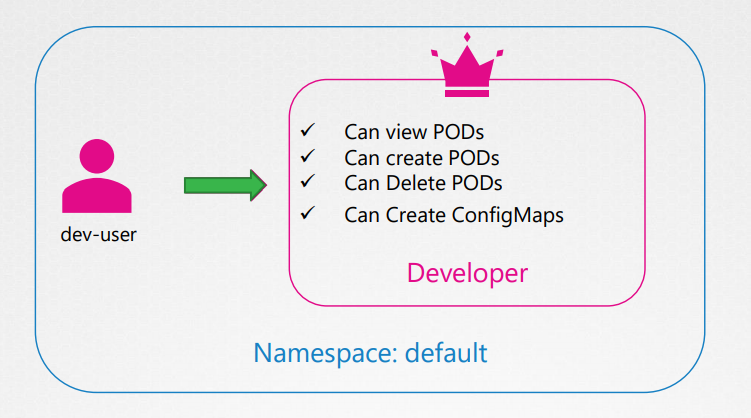
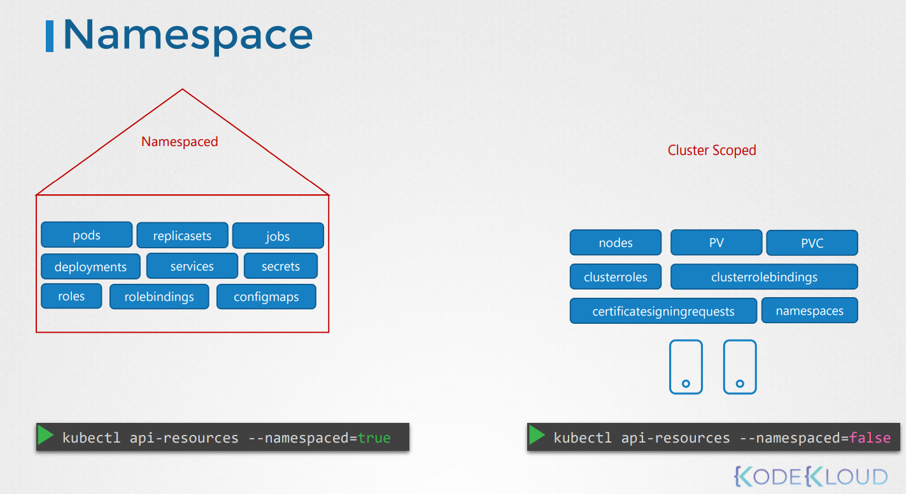

# Cluster Roles
Cluster role과 Cluster role binding에 대해서 알아본다.

role과 role-binding은 네임 스페이스 내에서 생성된다고 하였다.

만약 namespace를 지정하지 않는다면, default namespace에 생성되며, default namespace 에만 접근 가능하다.



namespace는 pods, deployment, service 같은 자원을 그룹화하거나 격리시킨다.

하지만 node같은 다른 리스소의 경우는 어떤가?

namespace 내부에 노드를 그룹화하거나 격리 시킬수 있을까??

node01이 dev namespace에 속해있다고 할 수 있는가???

정답은 node같은 리소스 (cluster wide or cluster scoped resource)는 namespace에 그룹화되거나 격리될 수 없다.

위와 같은 cluster wide or cluster scoped resource의 경우 특정 네임스페이스에 속할 수 없다.

그래서 이같은 리소스들은 namespaced또는 cluster scoped로 카테고리화 된다.

namespace resource는 지금까지 많이 알아보았다.
* pod
* replicasets
* jobs
* deployments
* services
* secrets
* roles
* rolebindings
* configmaps

Cluster scope는 namespace에 정의되지 않는 것들이다.
* Nodes
* Persistent Volumes
* Persistent Clusterroles
* Clusterrolebindings



위에 적은 정보는 모든 resource를 보여준 것이 아니다. 

모든 resource를 알고 싶다면 아래와 같이 알아본다.
```
### namespace resource
$ kubectl api-resources --namespaced=true
### Cluster Scoped
$ kubectl api-resources --namespaced=false
```

## Cluster scoped 에 권한 바인딩
Cluster role과 Cluster role binding을 사용한다.

### Cluster Admin
클러스터에 있는 node에 view, create, delete 권한을 주고자한다면 아래와 같이 설정한다.
```
apiVersion: rbac.authorization.k8s.io/v1
kind: ClusterRole
metadata:
  name: cluster-administrator
rules:
- apiGroups: [""] 
  resources: [“nodes"]
  verbs: ["list“, "get", “create“, “delete"]
```

```
kubectl create -f cluster-admin-role.yaml
```

### Storage Admin
PV에 view, create, delete 권한을 준다.


## User를 Cluster role에 바인딩

cluster-admin-role-binding.yaml
```
apiVersion: rbac.authorization.k8s.io/v1
kind: ClusterRoleBinding
metadata:
  name: cluster-admin-role-binding
subjects:
- kind: User
  name: cluster-admin
  apiGroup: rbac.authorization.k8s.io
roleRef:
  kind: ClusterRole
  name: cluster-administrator
  apiGroup: rbac.authorization.k8s.io
```
subject : user detail  
roleRef : Cluster Role detail

```kubectl create -f cluster-admin-role-binding.yaml```


