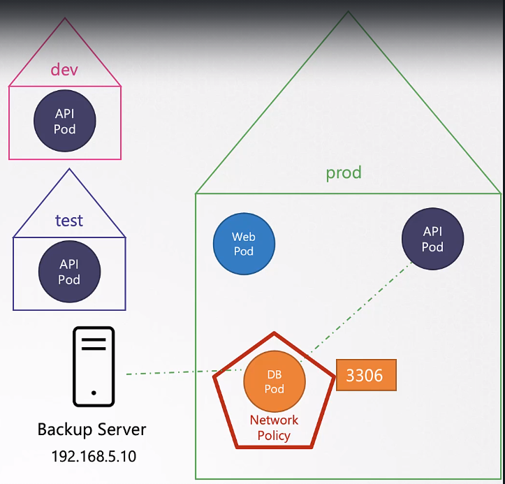

# Network Policies

이렇게 network policy를 생성할 경우, ingress role만 설정하면된다. reponse rule은 알아서 설정이 된다.

### Ingress


[network_policy.yaml](../demo/security/network-policy.yaml)


namespace 별로 접근 권한을 나누고자 할 경우 namespaceSelector를 추가해준다.

```
  ingres:
    - from:
        - podSelector:
            matchLabels:
              name: api-pod
          namespaceSelector:
            matchLabels:
              name: prod
```
podSelector가 사라지고 namespaceSelector만 있다면, 해당 namespace의 모든 pod에서 접근 가능



ip로 권한 접근을 할 경우 ipblock을 사용한다.
```
  ingres:
    - from:
        - podSelector:
            matchLabels:
              name: api-pod
          namespaceSelector:
            matchLabels:
              name: prod
        - ipBlock:
            cidr: 192.168.5.10/32
```

### network policy elements

- from에서 `-`로 묶여 있는 단위는 and로 적용되며, `-`로 개별적으로 된 각 요소들은 or로 동작한다.

### Egress

