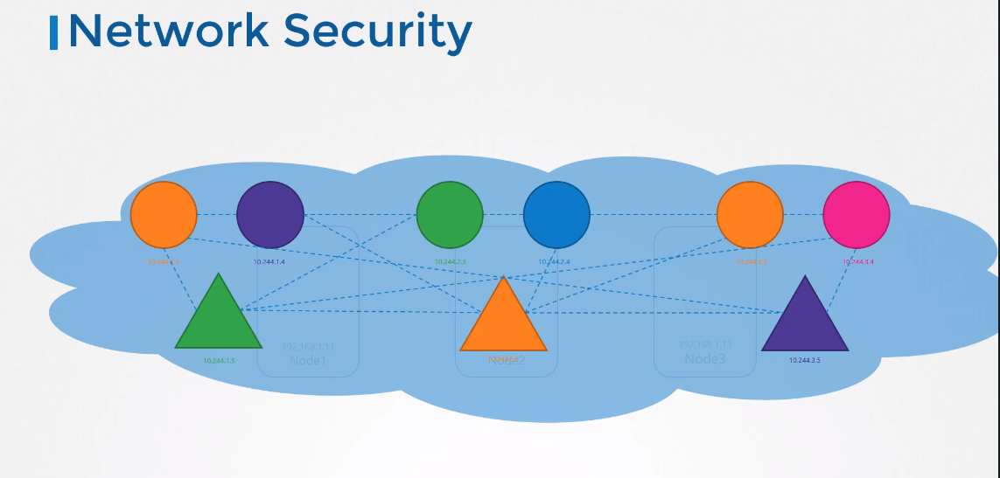

# Network Policy
## Traffic
네트워킹과 보안의 기본

### Ingress & Egress

Ingress : Client로 부터 들어오는 트래픽
Egress : 받은 요청을 다른 서버로 보내는 트래픽


### Network Security
쿠버네티스의 각 노드들은 IP 주소를 가지고 각 pod 와 service도 마찬가지다.

쿠버네티스의 네트워킹에서 전제 조건 중 하나가 구현하는 솔루션은 무엇이든 간에 라우터 같은 추가적인 설정없이도 pod들 끼리 통신이 가능해야한다.



예를 들어 이 네트워크 솔루션에서 모든 POD는 쿠버네티스 클러스터의 노드에 걸쳐 있는 가상 사설망에 있습니다.

그리고 기본적으로 IP와 pod name 또는 특정 목적에 따른 서비스 설정을 사용하여 접근이 가능하다.

쿠버네티스는 기본적으로 특정 pod에서 다른 pod나 서비스로 가는 트래픽이 모두 허용되는 정책을 가진다.


어플리케이션의 각 컴포넌트들에 대해 POD를 배포한다. Front-end 웹서버, API 서버, 그리고 데이터베이스 서버가 될 수 있다.

end user같이 POD끼리 통신이 가능하도록 service를 생성한다.

이전에 말했듯이 쿠버네티스 내부에서는 모든 pod들끼리 통신이 가능하다.

이때 Front-end 서버가 데이터 베이스 서버와 통신을 하지 못하게 만들려면 어떻게 해야할까??

API서버에서만 데이터베이스 서버에 접근 가능하도록 제한을 거는 걸게 하려면 Network Policy를 생성해야한다.

Network Policy는 쿠버네티스 네임스페이스에서 pod나 replicaset이나 service와 같이 하나의 다른 오브젝트이다.

이 경우 Network policy는 다음과 같이 설정할 수 있다.  
`API Pod에서부터 3306포트로 Ingress 트래픽을 허용한다.`

이런식으로 Network policy를 만들면, 다른 모든 Pod의 트래픽을 막고, 정의된 정책만 허용시킨다.

## Network policy 생성
Pod에 ReplicaSets 또는 Service를 연결 시키는 것과 같은 기술을 사용한다.

* labels의 Role을 사용한다.
```
labels:
  role: db
```

```
podSelector:
  matchLabels:
    role: db
```

### 에제
위에서 말했듯이, `API Pod에서부터 3306포트로 Ingress 트래픽을 허용한다.` 일 경우를 생각해본다.
```
policyTypes:
- Ingress
ingress:
- from:
  - podSelector:
      matchLabels:
        name: api-pod
  ports:
  - protocol: TCP
    port: 3306
```

### Network Policy manifest 
spec 부분에 위에서 설정한 값들을 넣어준다.

policy-definition.yaml
```
apiVersion: networking.k8s.io/v1
kind: NetworkPolicy
metadat:
    name: db-policy
spec:
    podSelector:
      matchLabels:
        role: db
    policyTypes:
    - Ingress
    ingress:
    - from:
      - podSelector:
          matchLabels:
            name: api-pod
      ports:
      - protocol: TCP
        port: 3306
```
```
kubectl create -f poliocy-definition.yaml
```

### 기억할 점
Network Policy는 쿠버네티스 클러스에서 구현된 네트워크 솔루션에 적용이 되는 것이다.  
다른 모든 네트워크 솔루션에서 적용되는 것이 아니다.

Network policy가 적용되는 솔루션
* Kube-router
* Calico
* Romana
* Weave-net

Network policy가 적용 안되는 솔루션
* Flannel
