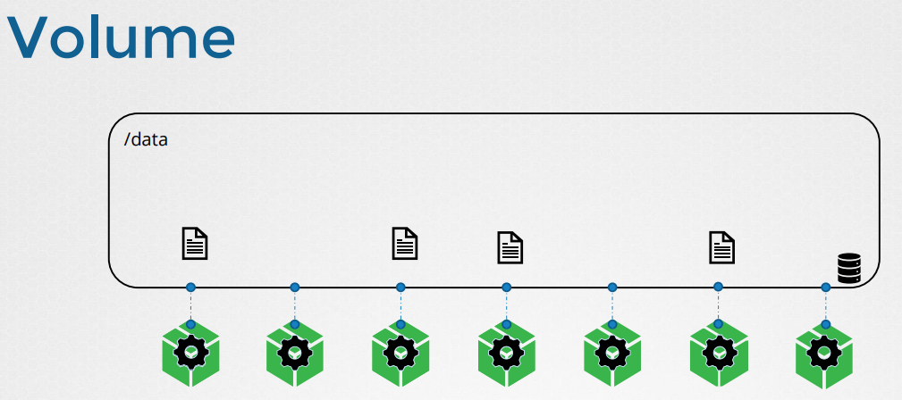
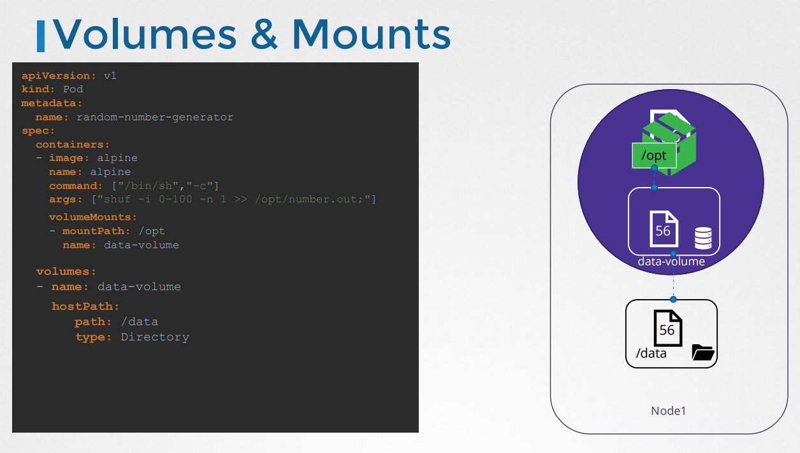
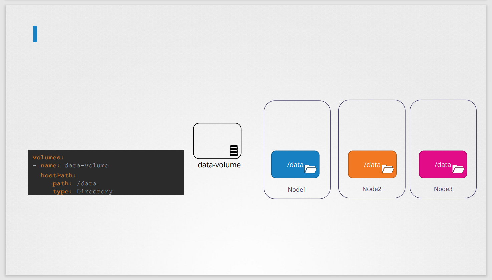
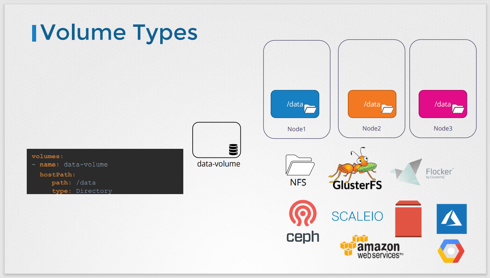

#Volumes
쿠버네티스에서 volume에 대해서 알아본다.

## Docker volume

도커는 일시적으로 컨테이너를 생성하고 컨테이너가 중단될 때, 생성된 데이터가 삭제되기 때문에,
volume을 통해 영속적으로 저장을 할 수 이싿.

## Kubernetes volume
도커와 마찬가지로 쿠버네티스에서 POD는 기본적으로 일시적이다.

POD가 생성되면 프로세스 데이터가 생성되지만, 삭제가 될때 이는 모두 삭제된다.

여기서 POD에 volume을 연결시켜준다. POD에서 생성된 데이터는 이제 volume에 저장되게 되고, pod가 삭제되더라도 데이터는 남아있게 된다.

[volume-definition.yaml](../demo/storage/volume-definition.yaml)



위처럼 volume을 만들 때 주의 사항이 있다.

만약 단일 노드에서 volume을 만들때는 문제가 없다.
```
  volumes:
    - name: data-volume
      hostPath:
        path: /data
        type: Directory
```

하지만 multi-node일 경우, 문제가 생길 수 있다.


모든 노드에 다음과 같이 /data 디렉터리가 생성되고 모두 같은 데이터가 저장되는 것을 예상할 것이다.

**하지만, 같은 데이터가 저장되지 않늗다.**
그러므로 다음과같은 외부 replicated cluster storage 솔루션을 설정해줘야한다.


예를들어 AWS Elastic Block Store 볼륨을 사용하려면,  
hostPath field에 awsElasticBlockStore  
volumeID field에 volumeID를 적어준다.
```
  volumes:
    - name: data-volume
      awsElasticBlockStore:
        volumeID: <volume-id>
        fsType: ext4
```
