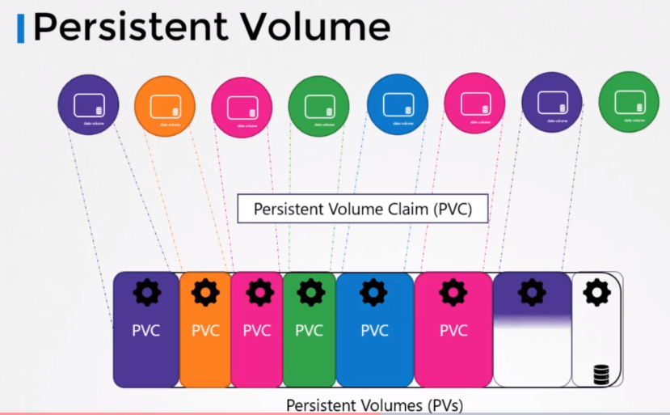

# Persistent Volumes
쿠버네티스에서 Persistent Volume에 대해서 알아본다.

이전 강의에서 볼륨을 만들때, 볼륨 설정을 pod definition 파일에서 해줬다.  
즉, 모든 설정 정보는 볼륨을 위한 스토리지 설정을 pod 정의 파일 내에 있어야 한다. 

사용자가 많은 POD를 배포하는 대규모 환경에 있는 경우, 그 사용자들은 매번 각 pod에 스토리지 설정을 해야할지도 모른다.

어느 스토리지 솔루션을 사용하든 간에, pod를 배포하는 유저는 모든 스토리지 솔루션을 자신의 환경에있는 모든 pod definition 파일에 설정을 해야할지도 모른다.

변경사항이 생길때 마다, 유저는 pod의 모든 곳에 변경 내용을 적용해야만 한다.

그 대신에 스토리지를 좀 더 중앙화 하여 관리할 수 있다.

## Persistent volume 구성

다음과 같은 방식으로 구성을 할 수 있다.
* 관리자가 큰 스토리지 풀을 생성한다.
* 사용자가 필요할 때, 작은 조각하여 사용한다.

Persistent Volumes를 이용하여 이렇게 설정할 수 있다.

Persistent volume은 관리자에 의해서 구성되는 유저가 클러스터에 어플리케이션을 배포하는데 사용하는 클러스터 전체에 걸치 스토리지 폴륨 풀이다.

persistent volume claims를 이용하여 이 pool로 부터 스토리지를 선택할 수 있다.




## Create Persistent volume
pv-definition.yaml
```
apiVersion: v1
kind: PersistentVolume
metadata:
  name: pv-vol1
spec:
  accessModes:
    - ReadWriteOnce
  capacity:
    storage: 1Gi
  hostPath: ## volume type
    path: /tmp/data
```

accessModes : 어떻게 볼륨이 host에 마운트될지에 대해서 정의
* ReadOnlyMany
* ReadWriteOnce
* ReadWriteMany

```
kubectl create -f pv-definition.yaml
```

```
kubectl get persistentvolume
```

hostPath는 운영환경에서는 단일 노드일 경우에만 사용한다.

이전 장에서 설명했듯이 이는 클라우드 저장소를 사용해야한다.

```
apiVersion: v1
kind: PersistentVolume
metadata:
  name: pv-vol1
spec:
  accessModes:
    - ReadWriteOnce
  capacity:
    storage: 1Gi
  awsElasticBlockStore:
    volumeID: <volume-id>
    fsType: ext4
```


