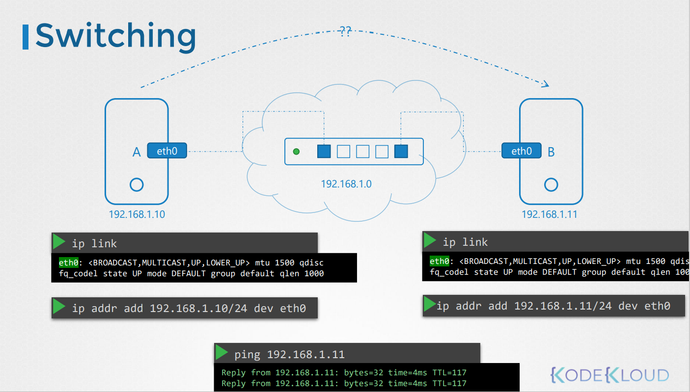
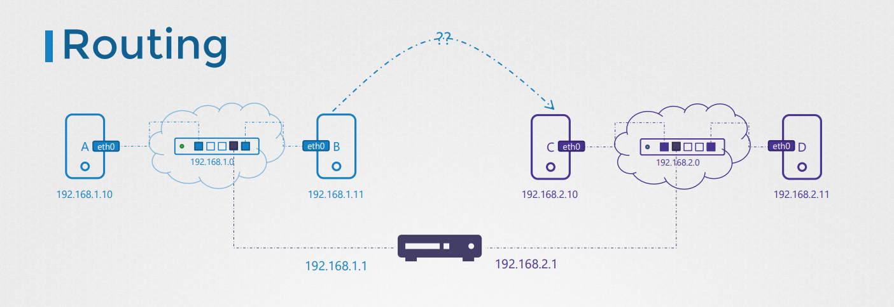

# Prerequisite - Switching Routing
네트워크 기초에 대해서 알아본다.

Switching, Routing, Gateways 등에 대해서 알아본다.

DNS에 대해서 이해하고, core DNS에 대한 기초 설명을 한다.

* Switching and Routing
  * Switching
  * Routing
  * Default Gateway
* DNS
  * DNS Configuration on Linux
  * CoreDNS Introduction
* Network Namespaces
* Docker Networking


## Network 기초
어떻게 두개의 컴퓨터 A, B (laptops, desktop, cloud의 VM 등) 가 연결될까? 


컴퓨터 A, B를 스위치에 연결하고, 스위치는 두개의 시스템을 포함하는 네트워크를 생성한다.

스위치에 연결하기 위해서는 각 호스트 서버에 인터페이스가 필요로 한다.  
호스트 머신에 따라 물리적이거나 가상화된 인터페이스를 가진다.

인터페이스를 확인하기 위해서는 다음 명령어를 사용한다.
```
ip link
```
위 예시의 경우, 스위치에 연결하기 위하여 etho0라는 인터페이스를 사용한다.

예를 들어, `192.168.1.0` 망의 네트워크라고 가정하자.

그리고 같은 네트워크에서 IP 주소로 시스템을 할당한다.

ip addr 명령을 사용
```
ip addr add 192.168.1.10/24 dev eth0
```

한번 링크가 연결되면 IP 주소가 할당되며, 컴퓨터들끼리 서로 스위치를 통해서 통신이 가능해진다.

스위치는 같은 네트워크에서만 통신이 가능하다. 즉, 호스트로 부터 패킷을 받고 같은 네트워크에 있는 다른 시스템으로 패킷을 전달해줄 수 있다.

### 이전 예시와 다른 네트워크에 존재하는 컴퓨터들
C와 D가 `192.168.2.0` 네트워크에 있다.


시스템은 각 `192.168.2.10`, `192.168.2.11`을 가지고 있다.

하나의 네트워크에서 다른 네트워크로 연결은 어떻게 할 수 있을까?  
예를 들어 `192.168.1.11` IP를 가진 B 서버에서 `192.168.2.10` IP를 가진 C 서버로 어떻게 통신을 할까??

여기서 라우터 계념이 나온다. 라우터는 두개의 네트워크를 연결해주는 역할을 한다.

라우터는 지능형 장치로, 네트워크 포트가 많은 또 다른 서버라고 생각하면된다.  
이는 두 개의 별도 네트워크에 연결되기 때문에 두 개의 IP가 할당된다.

`192.168.1.1`, `192.168.2.1` 두 개의 IP가 할당되었다고 치자.


