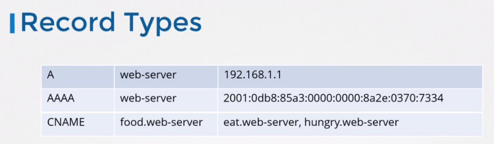

# DNS
```
cat /etc/resolv.conf
```
DNS 서버 보다 local host 파일을 먼저본다.

원하는 사이트가 nameserver에 없을 경우 다른 nameserver를 등록할 수 있다.

```
cat >> /etc/resolv.conf
nameserver      192.168.1.100
nameserver      8.8.8.8
```

## Domain name
.com .net => TOP level domain

ex> www.google.com

. => root

.com => TOP level domain

google => domain nmae

www => sub-domain

```
cat >> /etc/resolv.conf
nameserver      192.168.1.100
search          mycompany.com   prod.mycompany.com
```
```
ping web
ping web.mycompany.com
```

### Record Types

Storing IPv6 호스트네임은 AAAA Records라고 불린다.


도메인 이름에 여러가지 별명이 있을 경우 이를 C name record를 사용한다.
