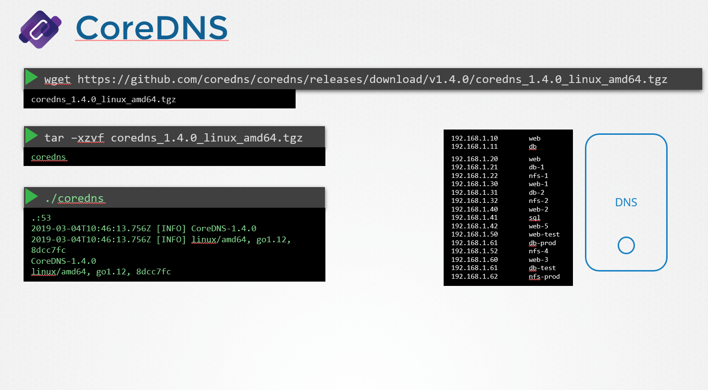
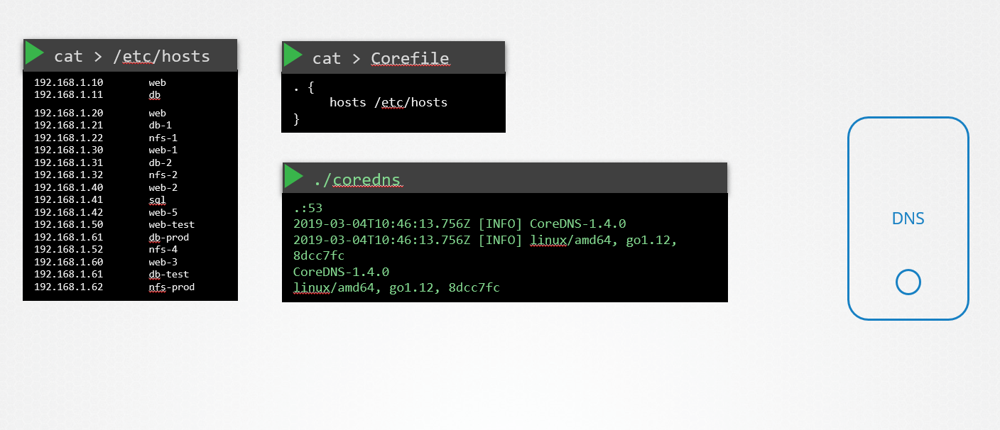

# CoreDNS
host를 어떻게 DNS 서버로 설정하는지에 대해 알아본다.

DNS 서버 전용 서버와 서버의 항목으로 구성 할 Ips 세트가 제공됩니다.

CoreDNS를 어떻게 설정할까?

### Install CoreDNS

기본적으로 실행하면 포트는 53번으로 설정된다.

이제 호스트 이름 매핑에 대한 IP를 지정하지 않았습니다.

이를 위해 몇 가지 구성을 제공해야합니다.

먼저 모든 항목을 DNS 서버 / etc / hosts 파일에 넣습니다.

그런 다음 해당 파일을 사용하도록 CoreDNS를 구성합니다.

CoreDNS는 Corefile이라는 파일을 통해 설정파일을 로드한다.

음은 CoreDNS가 / etc / hosts 파일에서 IP 대 호스트 이름 매핑을 가져 오도록 지시하는 간단한 구성입니다.

DNS 서버가 실행되면 이제 서버의 /etc/hosts/ 파일에서 IPs와 이름을 선택한다.

