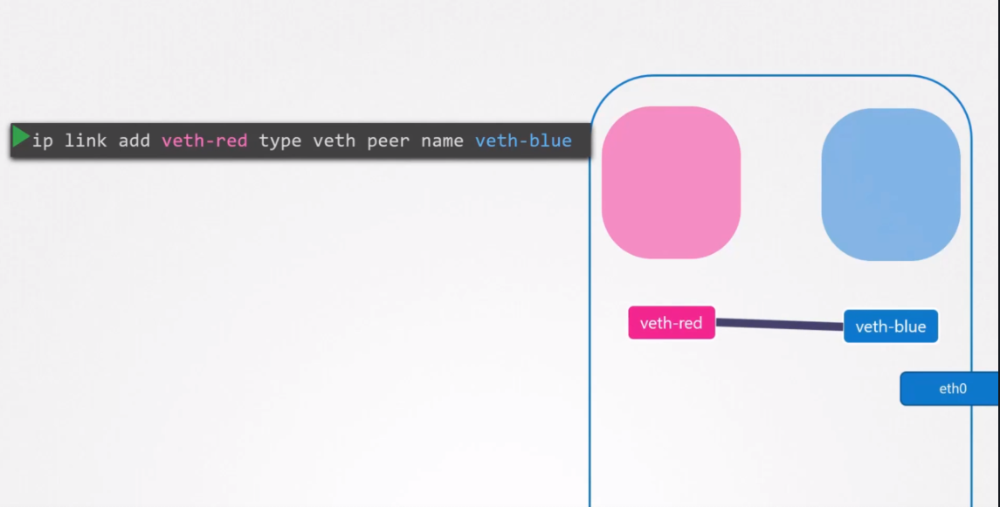

# Network Namespaces
## Create Network namespace
```
$ ip netns add red
$ ip netns add blue
$ ip netns
red
blue
```

```
ip netns exec red ip link
```

```
ip -n red link
```

```
$ arp
$ ip netns exec red arp
```

```
$ route
$ ip netns exec red route
```


## 두 개의 네임스페이스 연동
물리적으로는 인터넷 인터페이스에 케이블을 각 머신에서 연결해서 연결한다.

네임스페이스를 서로 연결하기 위해서는 가상 Ethernet 쌍 또는 가상 케이블을 사용한다.

종종 파이프라고 부르지만 두개의 인터페이스가 있는 가상 케이블이라고 여기서는 부르기로 한다.


### 가상 케이블 연결

```
 ip link add veth-red type veth peer name veth-blue
```
방문할 유형의 설정된 명령을 추가하고 두 끝을 red와 blue로 지정한다.


### 적절한 Namespace에 각 인터페이스 연결
```
$ ip link set veth-red netns red
$ ip link set veth-blue netns blue
```


### IP 할당
```
$ ip -n red addr add 192.168.15.1 dev veth-red
$ ip -n blue addr add 192.168.15.1 dev veth-blue
```

### ip 링크를 사용하여 인터페이스를 불러오고 각 장치 내의 각 장치에 대한 명령을 설정한다.
```
$ ip -n red link set veth-red up
$ ip -n blue link set veth-blue up
```

### 확인
핑을 날려본다
```
$ ip netns exec red ping 192.168.15.2
```

blue의 ip가 arp table에 적혀있다.
```
$ ip netns exec red arp
```


## 여러 네임스페이스가 다 통신을 하려면 어떻게 해야할까??
물리머신에서는 여러 서버가 통신하게 하려면 중간에 물리 스위치가 필요로 한다.

가상 네트워크에서는 가상 스위치가 필요하다.

가상 스위치 솔루션
* Linux bridge
* Open vSwitch


### Linux Bridge
```
$ ip link add v-net-0 type bridge
```

```
$ip link
```

```
ip link set dev v-net-0 up
```

브릿지 네트워크 ( 브릿지로 연결된 상태 )

가상 케이블 끊기 ( 한쪽에서 끊으면 연결된 반대 서버도 자동으로 끊김 )
```
ip -n red link del veth-red
```

새로운 케이블을 namespace와 브릿지에 연결한다.
```
ip link add veth-red type veth peer name veth-red-br
```

```
ip link add veth-blue type veth peer name veth-blue-br
```

새로운 케이블을 namespace에 연결한다.
```
ip link set veth-red netns red
ip link set veth-red-br master v-net-0
```

```
ip link set veth-blue netns blue
ip link set veth-blue-br master v-net-0
```

ip 할당
```
ip -n red addr add 192.168.15.1 dev veth-red
ip -n blue addr add 192.168.15.1 dev veth-blue
```

시작
```
ip -n red link set veth-red up
ip -n blue link set veth-blue up
```

## 내부 네트워크에서 외부 네트워크로 연결
1. 내부 네트워크에서 라이팅 테이블 확인
```
ip netns exec blue route
```

2. 내부망에서 게이트웨이에 먼저 연결
```
$ ip netns exec blue ip route add 192.168.1.0/24 via 192.168.15.5
```

게이트웨이에서 iptables 설정
```
iptables -t nat -A POSTROUTING -s 192.168.15.0/24 -j MASQUERADE
```

3. 확인
```
ip netns exec blue ping 8.8.8.8
```

## 외부에서 내부 네트워크로 연결하기
첫 번째. 사설 네트워크의 ID를 두 번째 호스트에 제공하는 것

두 번째. 포트포워딩
```
iptables -t nat -A PREROUTING --dport 80 --to-destination 192.168.15.2:80 -j DNAT
```
