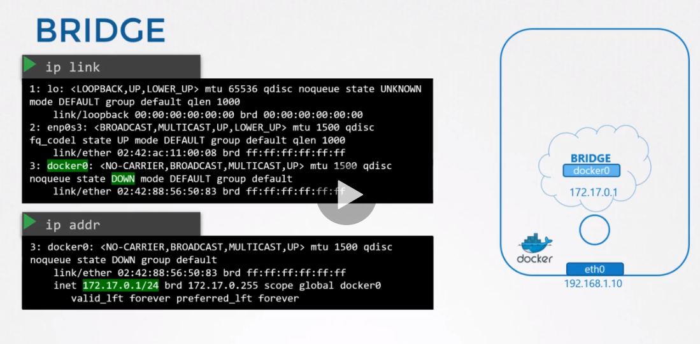
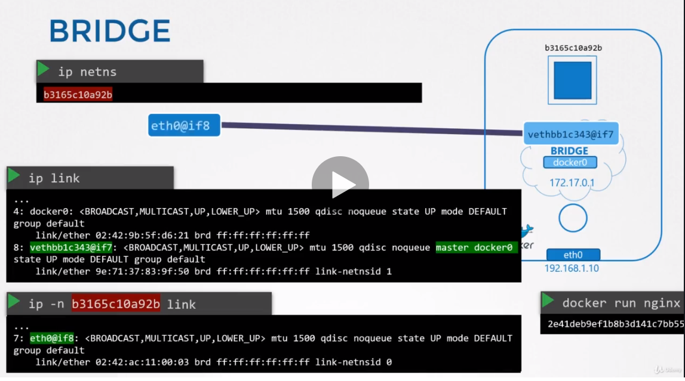
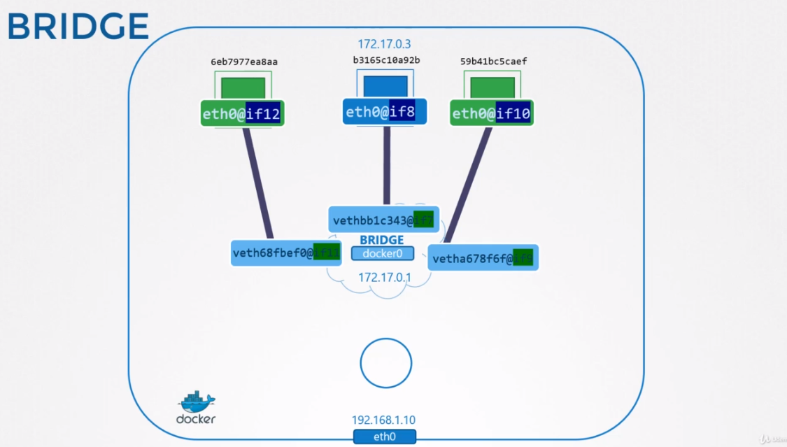
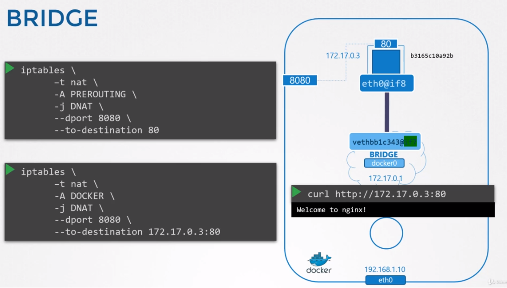

# Docker Networking

## No Network
네트워크 없이 도커 컨테이너 운영
```
docker run --network none nginx
```

## Host Network
host network는 컨테이너가 host 네트워크에 붙는다. 즉, host와 도커 컨테이너에 네트워크 격리가 없는 상태이다.

```
docker run --network host nginx
```
만약, 80포트로 어플리케이션을 배포했을 때, 다른 포트 매핑없이 호스트에서 80포트로 접속 가능하다.

`같은 포트로 컨테이너를 실행한다면, 정상동작하지 않는다.`


## Bridge Network
```
docekr run nginx
```
내부적으로 도커 호스트와 컨테이너가 연결되는 사설망이 생성된다.

네트워크는 172.17.0.0 을 기본 주소로 가지며 각 디바이스는 네트워크 내에서 내부 사설망 주소를 가지고 네트워크에 접속하게 된다.

이것이 우리가 가장 관심있어하는 네트워크이다. 

### 심화해서 알아보기
도커가 호스트 머신에 설치되면, 기본적으로 브릿지라고 불리는 내부 사설 내트워크를 생성한다.

* `docker network ls` 명령으로 확인할 수 있다.
```
docker network ls
NETWORK ID      NAME        DRIVER      SCOPE
0aas99da9w      bridge      bridge      local
...
```
도커는 "bridge"라는 이름으로 네트워크를 생성하지만, 호스트에서는 "docker0"라는 이름으로 네트워크가 생성된다.
* `ip link` 명령어로 확인 할 수 있다.

```
ip link
...
3: docker0: <NO-CARRIER,BRODCAST,MULTICAST,UP> mtu 1500 qdisc
...
```

도커는 유형이 브릿지로 설정된 `ip link add docker0 type bridge` 명령을 실행하여 네임스페이스에 대한 강의에서 본 것과 유사한 기술을 내부적으로 사용한다.

따라서 docker network ls 출력에서 bridge는 호스트의 docker0이라는 이름을 말한다.

브릿지 네트워크는 호스트에서 인터페이스와 유사하다. 하지만 호스트에서 네임스페이스 또는 컨테이너를 스위치한다.

호스트에 인터페이스 docker0는 IP 172.17.0.1을 할당 받는다.



컨테이너가 생성될때마다 도커는 네트워크 네임스페이스를 생성한다.

`ip netns` 명령어로 네임스페이스의 리스트를 확인한다.

`docker inspect <container_id>`의 출력에서 각 컨테이너와 연관된 네임스페이스를 볼수 있다.

어떻게 도커가 컨테이너 또는 네트워크 네임스페이스에서 브릿지 네트워크에 붙을까?

`컨테이너와 네트워크 네임스페이스는 같은 의미로 사용된다.`

컨테이너를 이야기할때, 컨테이너를 생성하기위해서 도커로 인해 생성된 네트워크 네임스페이스를 말한다.

도커호스트에 `ip link` 명령을 실행하면, docker0라고 불리는 로컬 브릿지에 연결된 인터페이스를 확인할 수 있다.

만약 같은 명령어를 실행할 때 -n <namespace값> 옵션을 주어서 실행할 경우, 컨테이너 네임스페이스에 다른 인터페이스의 리스트를 보여준다.


인터페이스 또한 네트워크에서 IP를 할당 받는다.

`ip -n b3165c10a91b addr` 명령을 통해 확인 가능

컨테이너가 생성될 때 마다 동일한 과정이 반복된다. 도커는 네임스페이스를 생성하고, 인터페이스 쌍을 생성한다. 

한 끝을 컨테이너에 연결하고 나머지를 브릿지 네트워크에 연결한다.

인터페이스 쌍은 번호로 구별가능한데, 홀수와 짝수의 쌍으로 이뤄진다.

7-8, 9-10, 11-12 이런식으로 쌍으로 이뤄진다.


### 포트 매핑
```
docker run -p 8080:80 nginx
```

iptables에서 NAT 테이블을 만들어서 PREROUTING하는것과 동일하게 도커에서도 PREROUTING 규칙을 생성한다.



`iptables -nvL -t nat` 로 확인가능
