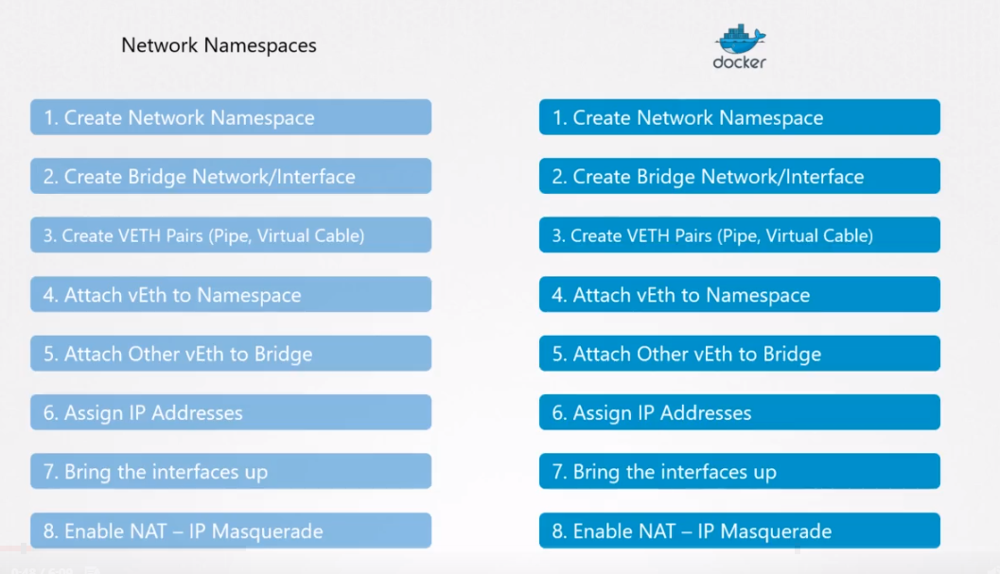
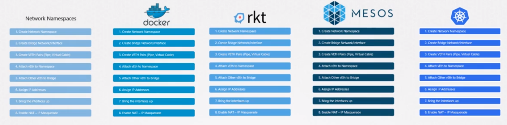
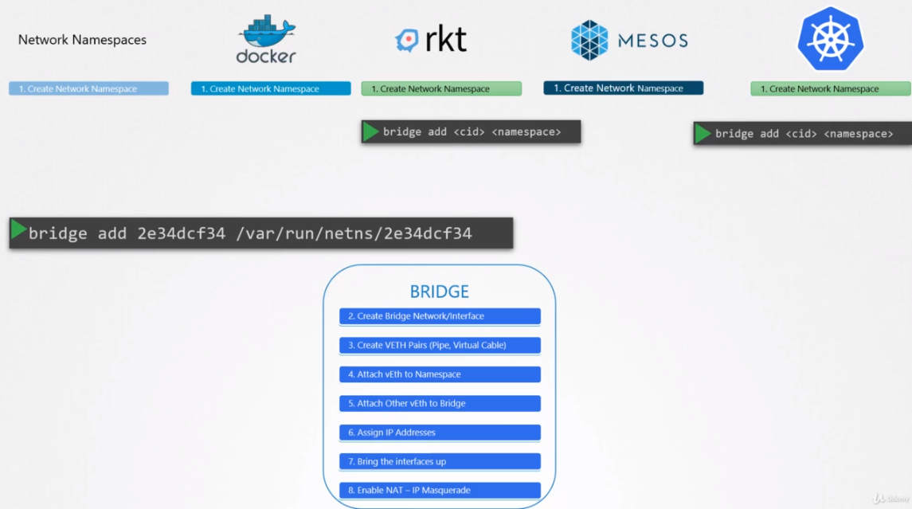
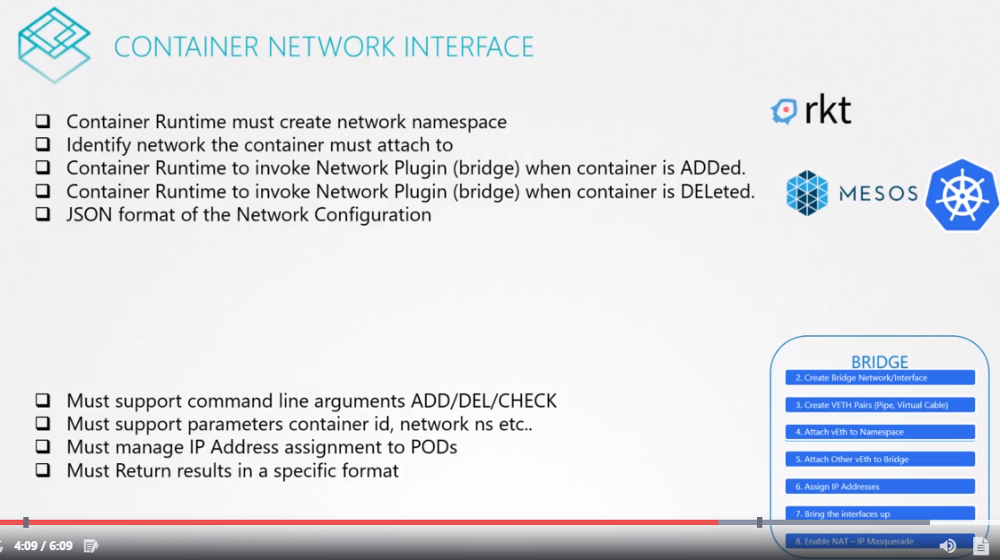
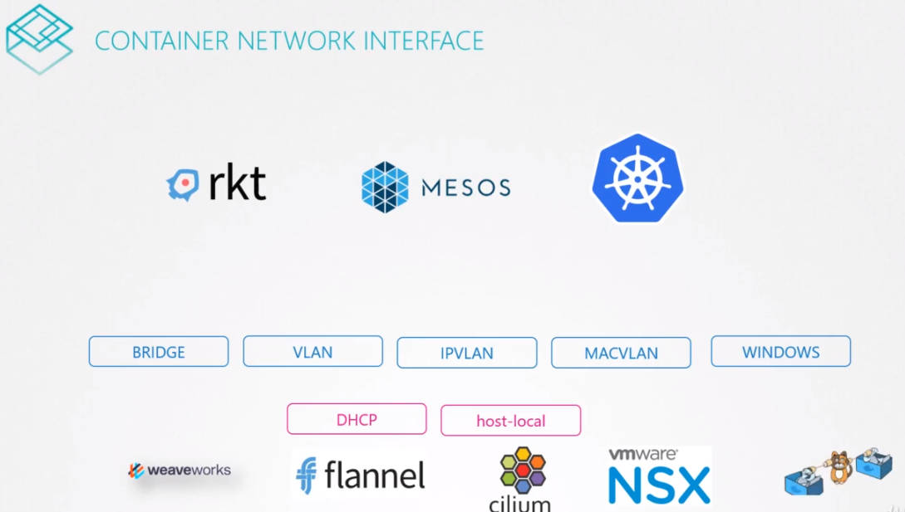

# Prerequisite CNI (Container Network Interface)



위 처럼 rocket, mesos, 혹은 다른 솔루션에서도 네트워크 챌린지들을 해결해야한다.

모두 동일한 네트워킹 문제를 해결하고 있다면, 왜 동일한 솔루션을 여러 번 코딩하고 개발하고있는가?

모두를 하나로 모을 수 있는 단일 표준 접근법을 사용하지 않는가??

그 결과, 모든 다른 솔루션들의 아이디어를 총합하고, 하나의 단일 프로그램 또는 코드로 모든 네트워크 부분을 연결시켰다.

이러한 브릿지 네트워크를 브릿지라고 부른다.

그래서 컨테이너를 브릿지 네트워크에 연결하는데 필요한 모든 작업을 수행하는 프로그램이나 스크립트를 만들었다.

예를 들어, 이 프로그램을 네임 브릿지를 사용하여 동작시킬 수 있고 특정 네트워크 네임스페이스에 이 컨테이너를 추가하도록 지정할 수 있다.

브릿지 프로그램이 나머지 일들을 담당하여 컨테이너 런타임 환경은 이 작업들을 신뢰하게 된다.

```
bridge add 2e34dcf34 /var/run/netns/2e34dcf34
```

예를 들어, 만약 rocket 또는 쿠버네티스가 새로운 컨테이너를 만들때마다, 브릿지 플러그인을 호출하고 컨테이너 id와 네임스페이스를 전달하여 해당 컨테이너에 대한 구성된 네트워킹을 가져온다.



```
bridge add <cid> <namespace>
```

여기에서 몇가지 표준을 정의해야한다.

* 프로그램의 모습
* 어떻게 컨테이너 런타임이 그들을 호출하는지
* 모든 사람이 단일 표준 세트를 준수하고 솔루션을 개발할 수 있도록 런타임에서 작동

## CNI
여기서 CNI가 나온것이다. 

CNI는 컨테이너 런타임 환경에서 네트워킹 챌린지를 해결하기 위해서  어떻게 프로그램이개발되어야 하는지에 대해서 정의한 것이다.

이 프로그램은 플러그인이라고 한다.


* 컨테이너 런타임에서 CNI는 각 컨테이너에 네트워크 네임스페이스 생성을 담당하도록 지정한다.
* 그런 다음 컨테이너가 컨테이너 런타임에 연결해야하는 네트워크를 식별 한 다음 플러그인을 호출해야합니다.
* ADD 명령으로 컨테이너가 생성 되거나 DEL 명령으로 컨테이너가 삭제될 때 플러그인은 호출된다.
* 컨테이너 런타임 환경에서 네트워크 플러그인을 어떻게 JSON 파일 포맷으로 설정하는지에 대해 지정한다.

플러그인 측면 
* ADD, DEL, CHECK 명령을 지원해야한다.
* 컨테이너와 네트워크 네임스페이스와 같은 파라미터를 허용하고 라인 arguments를 지원해야한다
* PODS에 할당된 IP 주소를 관리해야한다.
* 결과값을 특정 포맷을 제공해야한다.

위 표준을 모두 만족시키면, 어떤 런타임 (docker, rkt, mesos 등)도 플러그인을 사용할 수 있다.


### 플러그인들
Bridge, VLAN, IPVLAN< MACVLAN, WINDOWS 같은 것들이나, DHCP, host-local과 같은 것들이 있다.  
또한 3rd party application으로 weave, flannel, cilium, VMware NSX, Calico, infoblox 같은 것들이 있다.

이 중 어느것도 이러한 플러그인들을 사용해서 동작 가능하다. 

하지만 이 중 포함되지 않은 하나가 있다.

도커는 CNM ( Container Network Model )이라는 고유의 표준셋을 가지고 있다.

몇가지 차이점이 있는데, 이러한 차이점때문에 이러한 플러그인은 기본적으로 Docker와 통합되지 않는다.

이는 도커 컨테이너를 실행할 수 없고 사용할 네트워크 플러그인을 CNI로 지정하고 이러한 프러그인 중 하나를 지정할 수 없음을 의미한다.

하지만 이것이 도커와 CNI를 같이 사용할 수 없다는 말은 아니다.

이것을 스스로 해결해야한다.

예를들어, 네트워크 설정없이 도커 컨테이너를 생성하고 수동으로 브릿지 플러그인을 호출한다. 이것이 쿠버네티스가 하는 동작과 동일하다.

쿠버네티스가 도커 컨테이너를 생성할 때, 네트워크 없는 상태로 이를 생성한다.

그러면 쿠버네티스는 설정된 CNI플러그인을 호출하고 나머지 설정을 수행한다.
```
$ docker run --network=none nginx
$ bridge add 2e34dcf34 /var/run/netns/2e34dcf34
```



