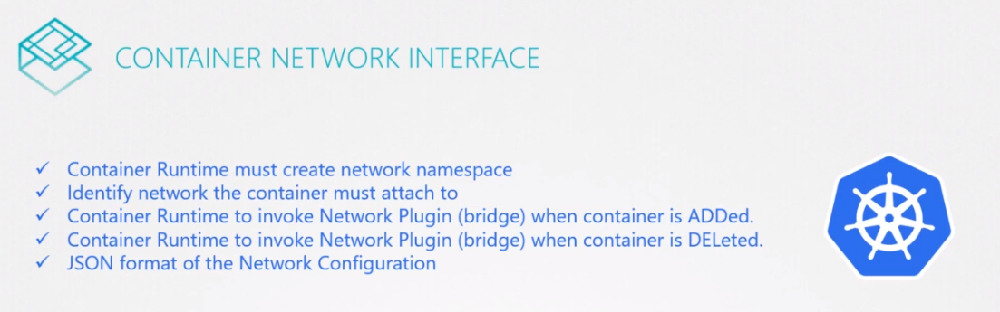
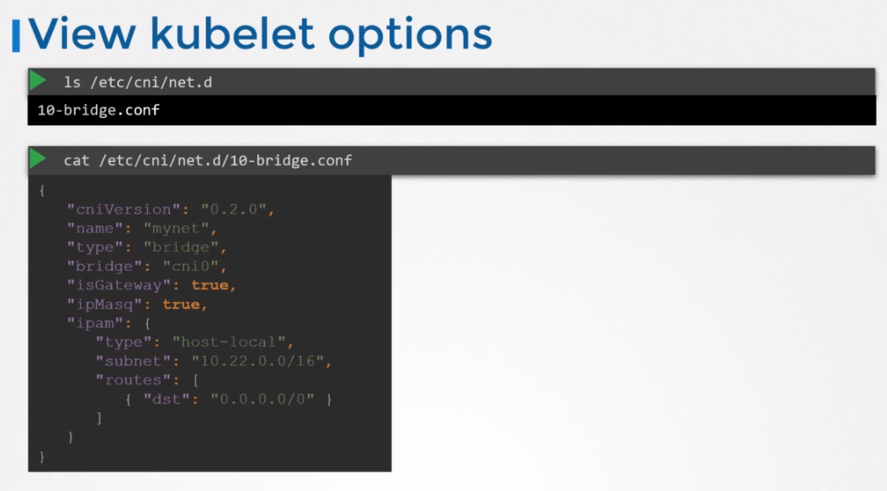

#CNI in Kubernetes


### Configuring CNI
cni 설정은 클러스터의 각 노드의 kubelet 서비스에 있다.

`kubelet.service`
```
ExecStart=/usr/local/bin/kubelet \\
    --config=/var/lib/kubelet/kubelet-config.yaml \\
    --container-runtime=remote  \\
    ...
    --network-plugin=cni    \\
    --cni-bin-dir=/opt/cni/bin  \\
    --cni-conf-dir=/etc/cni/net.d   \\
    ...
``` 

동작중인 kubelet service에서도 이 정보를 확인할 수 있다.
```
ps -aux | grep kubelet
```

CNI bin directory는 모든 지원가능한 CNI 플러그인들을 볼 수있다. 예를들면 bridge, dhcp, flannel, 등등
```
ls /opt/cni/bin
bridge dhcp ...
```

CNI config directory는 설정파일들의 모음이다.

어느 플러그인을 사용해야하는지 kubelet이 알아내는 곳이다.    
아래의 경우, 브릿지 설정 파일이다. 만약 이 디렉토리에 다중의 파일이 있다며 알파벳 순서로 선택된다.
```
ls /etc/cni/net.d
10-bridge.conf
```

브릿지 설정 파일을 보면 아래와 같다.


```
ls /etc/cni/net.d
10-bridge.conf
```

bridging, routing, Masquerading in NAT 설정등이 있다.

isGateway는 브릿지 네트워크가 인터페이스가 할당된 IP 주소를 가져올 수 있는지 없는지에 대한 설정이다. 그래서 게이트웨이로서 역할을 할 수 있다.

isMasquerade는 IP masquerading 을 위해 NAT 규칙을 추가해야 하는 경우 설정한다.

IPAM 섹션은 IPAM 설정을 한다.

여기에는 서브넷, pod가 생성되는 IP 주소 범위 그리고 필요로하는 라우트 설정을 한다.

타입 host-local은 호스트 머신에서 IP 주소를 로컬로 관리하게 한다.
```
cat /etc/cni/net.d/10-bridge.conf
{
    "cniVersion": "0.2.0",
    "name": "mynet",
    "type": "bridge",
    "bridge": "cni0",
    "isGateway": true,
    "isMasq": true,
    "ipam": {
        "type": "host-local",
        "subnet": "10.22.0.0/16",
        "routes": [
            { "dst": "0.0.0.0/0" }
        ]
    }
}
```
