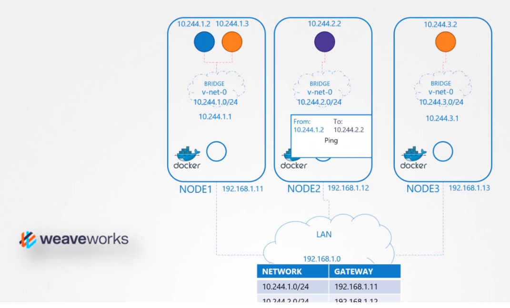
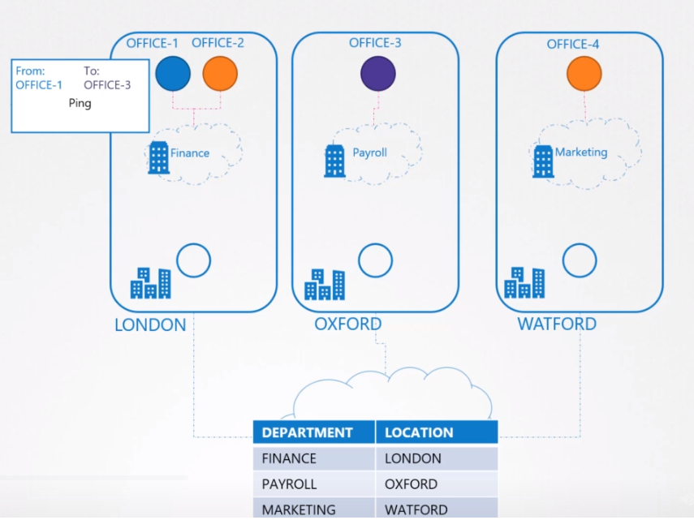
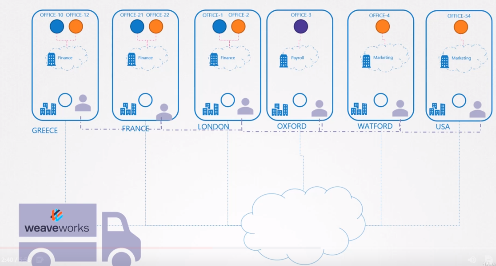
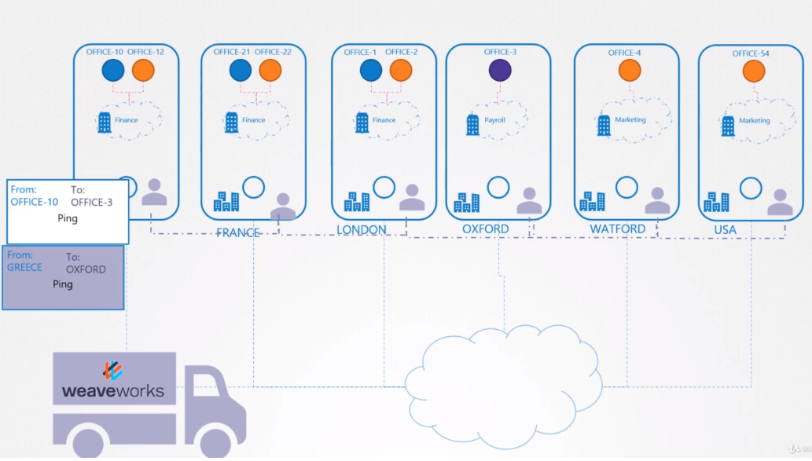
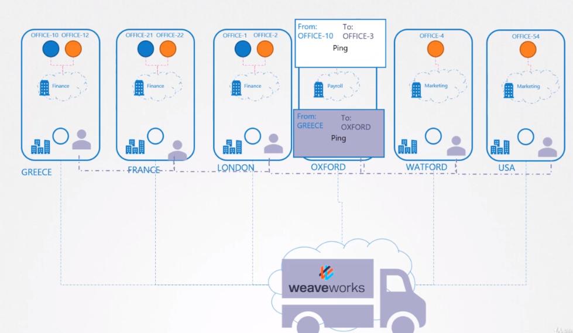
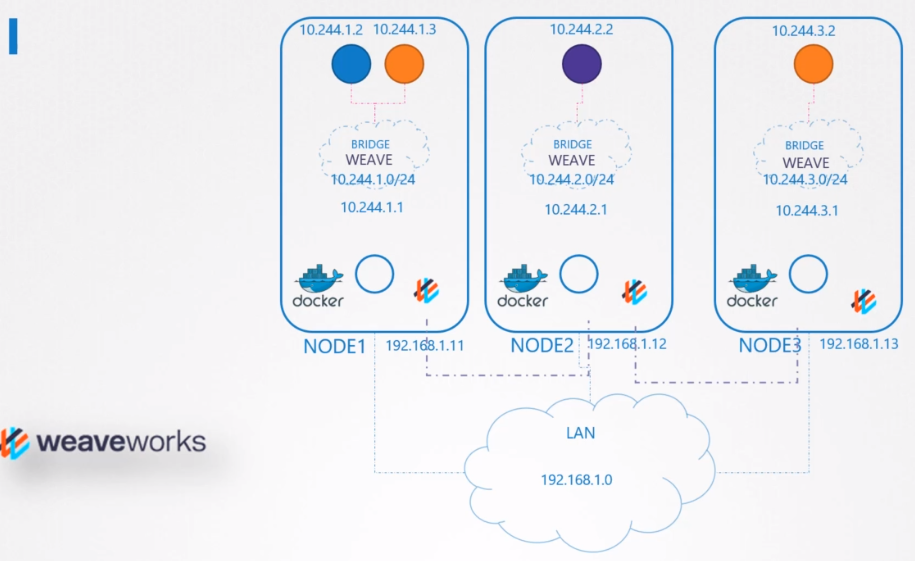
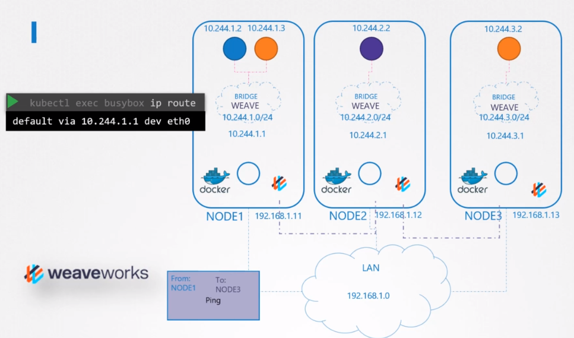

# WeaveWorks ( CNI )
WeaveWorksd에서 CNI를 기반으로 한 솔루션에 대해서 알아본다.


CNI플러그인을 어떻게 설정하는지에 대해서 알아본다.


이제 이것이 어떻게 동작하는지에 대해서 알아본다.

POD 네트워크 개념 섹션에서 중단한 부분부터 시작한다.

네트워크 연결을 위해서 custom cni 스크립트를 작성하였었다. 

이전 강의에서 스크립트대신에 weave 플러그인으로 이것을 설정하는 것에 대해서 알아봤다.

Weave solution이 어떻게 동작하는지에 대해서 알아본다.

적어도 하나의 솔루션이 어떻게 동작하는지에 대해서 이해하는 것이 중요하다.



따라서 수동으로 설정 한 네트워킹 솔루션에는 어떤 네트워크가 어떤 호스트에 있는지 매핑하는 라우팅 테이블이 있다.

그래서 패킷이 하나의 파드에서 다른 파드로 전송될때, 이는 네트워크를 나와서 라우터로 가고 도착지 pod가 있는 노드로 가는 길을 찾는다.

소규모의 환경과 단순한 네트워크에서는 가능하지만, 100개가 넘는 노드에 각 노드마다 100개가 넘는 파드가 있는 환경이라면, 단순하게 라우팅 테이블에 추가하는 방법으로는 불가능하다.



우리회사의 쿠버네티스 클러스터를 생각해보자. 노드들이 다른 오피스 사이트들에 있다고 하자

각 사이트들에는 다른 부서들이이 있고 부서마다 다른 사무실을 가진다.

office-1에 있는 누군가가  office-3에 패킷을 보내고자하고 office boy에게 이 패킷을 맡긴다.

office boy가 알야하는것은 office3로 가야하는 것이고 누가 어떻게 이 패킷을 전달하는지는 중요하지않ㄴ다.

office boy는 패키지를 차에 싣고 GPS에서 목표하는 office의 주소를 찾는다. 

작은 단위일 때는 이것이 가능하지만, 단위가 커지면 office boy가 대륙을 건너거나 너무 많은 오피스들을 다 찾아 다닐 수 없게 된다.

이때 운송 업체와 계약을 하게 된다.


제일 처음 각 회사의 사이트에 에이전트를 위치 시킨다.

이 에이전트들은 사이트사이에서 물류를 담당한다.

그리고 서로 소통을 할 수 있고 연결되어있기 떄문에 다른 사이트에 대해 서로 알고 있다.

그렇기 때문에 만약 사무실 10에서 사무실 3으로 패키지를 보내고자하면 에이전트가 패키지를 중간에 가로채서 목표 지점의 이름을 확인한다.

그는 다른 사이트의 동료들과 작은 내부 네트워크를 통해 사무실이 어느 사이트와 부서에 있는지 정확히 알고 있다.


그런 다음 대상 사이트 위치에 표시된 대상 주소를 사용하여 이 패키지를 자신의 새 패키지에 넣은 다음 패키지를 전송한다.


패키지가 목적지에 도착하면 다시 그 사이트에 있는 에이전트가 패키지를 가로챈다.

에이전트는 패킷을 열어 원래 패킷을 검색하여 올바른 부서로 전달한다.



쿠버네티스로 돌아와서, weave CNI 플러그인이 클러스터에 배포되면 각 노드에 에이전트나 서비스가 배포된다.

에이전트들은 서로 통신하며 노드나 네트워크나 POD 정보를 주고 받는다.

각 에이전트 또는 peer는 전체 설정의 토폴로지를 저장하여 다른 노드의 POD와 IP를 알 수 있다.

weave는 노드에다가 그들만의 브릿지를 생성하고 `weave`라고 부른다

그리고 나서 각 네트워크에 IP주소를 할당한다. ( 그림에 보이는 IP는 예시이다. )

시험문제중에서는 각 노드에 할당된 `weave`의 IP 주소의 범위를 알아내는 문제가 있을 것이다. 

IPAM과 어떻게 IP주소가 POD 및 컨테이너에 전달되는 방법에 대해서 다음 강의에서 알아보기로 한다.

기억할 점은 단일 POD가 여러 브릿지 네트워크에 연결될 수 있다.

```
$ kubectl exec busybox ip route
default via 10.244.1.1 dev eth0
```
예를 들어, weave 브릿지에 연결된 pod가 있고 Docker로 부터 생성된 docker bridge도 있을 수 있다.

패킷이 목적지에 도달하는데 걸리는 경로는 컨테이너에 구성된 경로에 따라 다르다.

Weave는 에이전트에 도달하기 위해서 POD가 올바른 라우트설정을 하게 한다. 그리고 에이전트는 다른 POD들을 관리한다.

패킷이 하나의 파드에서 다른 노드로 보내질 때, weave는 패킷을 가로채서 별도의 네트워크에 있음을 식별한다.

패킷을 새로운 출발지와 목적지를 설정한 것으로 캡슐화 하고 네트워크를 통해 이를 전송한다.



목적지에서는 다른 weave agent가 패킷을 검색하고 패킷의 캡슐을 해제하고 올바른 POD로 라우팅한다.

## Deploy Weave on Kubernetes
Weave와 weave peer는 클러스터의 각 노드에 수동으로 서비스 또는 데몬으로 배포할 수 있다.

만약, 이미 쿠버네티스가 구축되었다면, 클러스터에 pod형태로 쉽게 배포할 수 있다.

기본 쿠버네티스 시스템이 이미 노드와 네트워크 설정을 노드와 기본 컨트롤 플레인 컴포넌트 사이에서 잘 설정되었다면 weave는 간단한 `kubectl apply` 명령어를 통해서 클러스터에 배포 가능한다.

```
$ kubectl apply -f "https://cloud.weave.works/k8s/net?k8s-version=$(kubectl version | base64 | tr -d '\n')"
serviceaccount/weave-net created
...
...
daemonset.extensions/weave-net created
```
이 명령은 클러스터에 필요로하는 모든 요구되는 weave component를 배포한다.

가장 중요한 점은 weave peers는 데몬셋으로 배포된다. 

데몬셋은 지정된 종류의 POD 하나가 클러스터의 모든 노드에 배포되도록 한다.

이는 weave peers를 위해서 최적의 방법이다.

## Weave Peers
kubeadm 도구 및 weave 플러그인을 사용하여 클러스터를 배포한 경우, weave 피어를 각 노드에 배포된 POD로 볼 수 있다.
```
$ kubectl get pods -n kube-system
...
...
weave-net-5gcmb ...
```

트러블 슈팅 목적으로 로그를 본다면 kubectl logs를 사용한다.

```
$ kubectl logs weave-net-5gcmb weave -n kube-system
```
