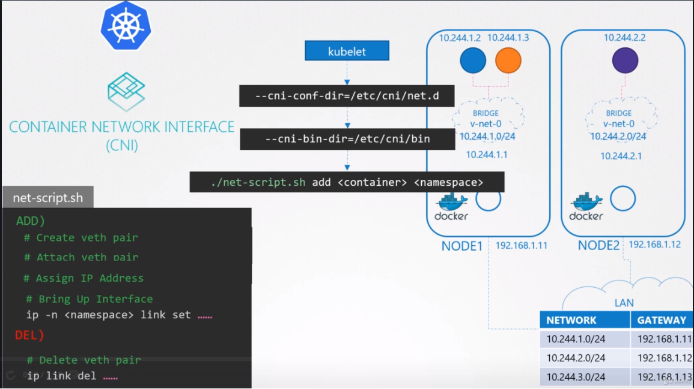

# WeaveWorks ( CNI )
WeaveWorksd에서 CNI를 기반으로 한 솔루션에 대해서 알아본다.

CNI플러그인을 어떻게 설정하는지에 대해서 알아본다.

이제 이것이 어떻게 동작하는지에 대해서 알아본다.

POD 네트워크 개념 섹션에서 중단한 부분부터 시작한다.

네트워크 연결을 위해서 custom cni 스크립트를 작성하였었다. 

이전 강의에서 스크립트대신에 weave 플러그인으로 이것을 설정하는 것에 대해서 알아봤다.

Weave solution이 어떻게 동작하는지에 대해서 알아본다.

적어도 하나의 솔루션이 어떻게 동작하는지에 대해서 이해하는 것이 중요하다.

패킷이 하나의 파드에서 다른 파드로 전송될때, 이는 네트워크를 나와서 라우터로 가고 도착지 pod가 있는 노드로 가는 길을 찾는다.

